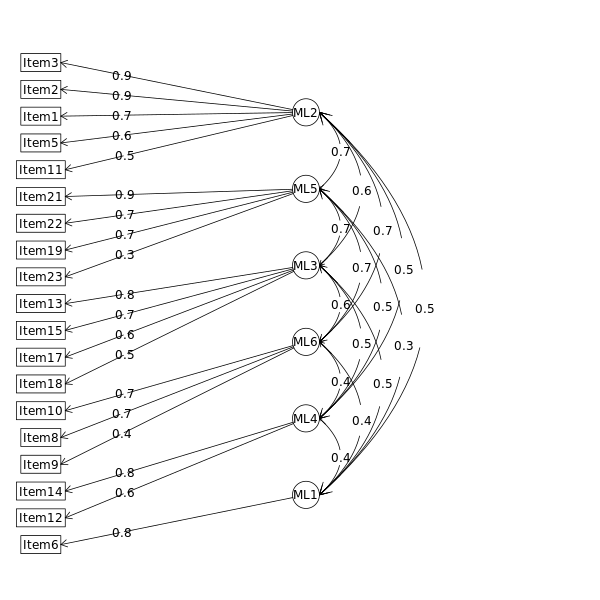

# 2020-CIEB-questionnaire-validation


**Conteúdo**

* [Identifying and removing careless responses](#identifying-and-removing-careless-responses)
* [Exploratory and Confirmatory Factor Analysis (EFA / CFA)](#exploratory-and-confirmatory-factor-analysis-efa--cfa)
  * [Checking assumptions](#checking-assumptions)
    * [Normality test](#normality-test)
    * [Kaiser-Meyer-Olkin factor adequacy](#kaiser-meyer-olkin-factor-adequacy)
    * [Bartlett’s Test of Sphericity](#bartletts-test-of-sphericity)
  * [Parallel Factor Analysis](#parallel-factor-analysis)
  * [Exploratory Factor Analysis (EFA)](#exploratory-factor-analysis-efa)
    * [Performing EFA with n=6 factors](#performing-efa-with-n6-factors)
    * [Performing EFA with n=5 factors](#performing-efa-with-n5-factors)
    * [Performing EFA with n=4 factors](#performing-efa-with-n4-factors)
    * [Performing EFA with n=3 factors](#performing-efa-with-n3-factors)
    * [Observations in the final structure](#observations-in-the-final-structure)
  * [Confirmatory Factor Analysis (CFA)](#confirmatory-factor-analysis-cfa)
    * [CFA of the multimodal model (EFA model)](#cfa-of-the-multimodal-model-efa-model)
    * [CFA of the second order model](#cfa-of-the-second-order-model)
    * [CFA of the orthogonal model](#cfa-of-the-orthogonal-model)
    * [Definition of the final model](#definition-of-the-final-model)
  * [Reliability Test](#reliability-test)
  * [Multi-Group Confirmatory Factor Analysis (MGCFA)](#multi-group-confirmatory-factor-analysis-mgcfa)

***

**Testes de Hipóteses sobre a médias**

* [ANOVA test: `pedagogica` ~ `unidade`](anova-by-unidade/pedagogica/factorialAnova.md)
* [ANOVA test: `cidadania` ~ `unidade`](anova-by-unidade/cidadania/factorialAnova.md)
* [ANOVA test: `desenvolvimento` ~ `unidade`](anova-by-unidade/desenvolvimento/factorialAnova.md)

* [ANOVA test: `pedagogica` ~ `area.de.conhecimento`](anova-by-area/pedagogica/factorialAnova.md)
* [ANOVA test: `cidadania` ~ `area.de.conhecimento`](anova-by-area/cidadania/factorialAnova.md)
* [ANOVA test: `desenvolvimento` ~ `area.de.conhecimento`](anova-by-area/desenvolvimento/factorialAnova.md)


* [Kruskal–Wallis test: `pedagogica` ~ `formacao.continuada`](kruskal-by-formacao/pedagogica/kruskal.md)
* [Kruskal–Wallis test: `cidadania` ~ `formacao.continuada`](kruskal-by-formacao/cidadania/kruskal.md)
* [Kruskal–Wallis test: `desenvolvimento` ~ `formacao.continuada`](kruskal-by-formacao/desenvolvimento/kruskal.md)


***

## Identifying and removing careless responses

> file: [00-anonymize-careless.R](00-anonymize-careless.R)

Boxplot of Longstring index based on the responses from Item1 to Item 23. 

_

The boxplot shows that observations in the row positions <27, 59> have high Longstring values,


Based on the boxplot, these both responses <27, 59> were remove and the responses without careless are located in the CSV-file:
[data/response.csv](data/response.csv)


## Exploratory and Confirmatory Factor Analysis (EFA / CFA)

> file: [01-factor-analysis.R](01-factor-analysis.R)

### Checking assumptions

#### Normality test

```r
(mvn_mod <- mvn(select(dat, starts_with("Item"))))  
```

```
$multivariateNormality
             Test        Statistic              p value Result
1 Mardia Skewness  3940.7371584358 7.26918169967075e-90     NO
2 Mardia Kurtosis 17.3961343359383                    0     NO
3             MVN             <NA>                 <NA>     NO

$univariateNormality
           Test  Variable Statistic   p value Normality
1  Shapiro-Wilk   Item1      0.9072  <0.001      NO    
2  Shapiro-Wilk   Item2      0.8361  <0.001      NO    
3  Shapiro-Wilk   Item3      0.8410  <0.001      NO    
4  Shapiro-Wilk   Item4      0.8590  <0.001      NO    
5  Shapiro-Wilk   Item5      0.8226  <0.001      NO    
6  Shapiro-Wilk   Item6      0.7948  <0.001      NO    
7  Shapiro-Wilk   Item7      0.8784  <0.001      NO    
8  Shapiro-Wilk   Item8      0.8246  <0.001      NO    
9  Shapiro-Wilk   Item9      0.8904  <0.001      NO    
10 Shapiro-Wilk  Item10      0.8665  <0.001      NO    
11 Shapiro-Wilk  Item11      0.8427  <0.001      NO    
12 Shapiro-Wilk  Item12      0.8913  <0.001      NO    
13 Shapiro-Wilk  Item13      0.8437  <0.001      NO    
14 Shapiro-Wilk  Item14      0.8898  <0.001      NO    
15 Shapiro-Wilk  Item15      0.8199  <0.001      NO    
16 Shapiro-Wilk  Item16      0.8704  <0.001      NO    
17 Shapiro-Wilk  Item17      0.8707  <0.001      NO    
18 Shapiro-Wilk  Item18      0.7814  <0.001      NO    
19 Shapiro-Wilk  Item19      0.9027  <0.001      NO    
20 Shapiro-Wilk  Item20      0.8944  <0.001      NO    
21 Shapiro-Wilk  Item21      0.8752  <0.001      NO    
22 Shapiro-Wilk  Item22      0.8374  <0.001      NO    
23 Shapiro-Wilk  Item23      0.8931  <0.001      NO    

$Descriptives
         n     Mean   Std.Dev Median Min Max 25th 75th        Skew    Kurtosis
Item1  380 2.926316 1.0601150      3   1   5    2    4  0.10669961 -0.78236879
Item2  380 2.778947 0.9952812      2   1   5    2    3  0.67550456 -0.48230495
Item3  380 2.531579 1.2630543      2   1   5    2    3  0.75580527 -0.49557423
Item4  380 2.300000 1.2218330      2   1   5    1    3  0.52301335 -0.90250280
Item5  380 2.139474 1.1618472      2   1   5    1    3  0.52334346 -0.83787326
Item6  380 1.923684 1.0735324      2   1   5    1    2  1.09577539  0.43360900
Item7  380 2.307895 1.0980630      2   1   5    1    3  0.46869552 -0.72061582
Item8  380 2.634211 0.7826537      3   1   5    2    3  0.70458186  0.88289937
Item9  380 2.771053 1.0590502      3   1   5    2    4  0.18504574 -0.91065371
Item10 380 2.681579 0.9478083      3   1   5    2    3  0.63206971  0.27537420
Item11 380 2.694737 0.8695819      3   1   5    2    3  0.62938642  0.82217389
Item12 380 3.426316 1.0438118      4   1   5    3    4 -0.51269047 -0.23124809
Item13 380 2.065789 0.9655754      2   1   5    1    3  0.79847269  0.11803777
Item14 380 2.834211 0.9081212      3   1   5    2    3  0.26770989 -0.13011652
Item15 380 2.071053 0.9001342      2   1   5    1    2  1.02981433  1.33954758
Item16 380 3.802632 0.9775816      4   1   5    3    5 -0.34257870 -0.63795950
Item17 380 2.423684 1.1097872      2   1   5    2    3  0.54445135 -0.63238640
Item18 380 2.026316 1.2516341      2   1   5    1    3  1.03760160 -0.07252211
Item19 380 2.944737 1.1552787      3   1   5    2    4 -0.21004819 -0.76259339
Item20 380 2.639474 0.9955149      3   1   5    2    3  0.23754176 -0.67948505
Item21 380 2.265789 1.0628722      2   1   5    1    3  0.48318984 -0.39931785
Item22 380 2.455263 1.0353125      2   1   5    2    3  0.67419807 -0.39399113
Item23 380 2.936842 0.9224326      3   1   5    2    3 -0.09656841 -0.08854457
```


#### Kaiser-Meyer-Olkin factor adequacy

```
Overall MSA =  0.95
MSA for each item = 
 Item1  Item2  Item3  Item4  Item5  Item6  Item7  Item8  Item9 Item10 Item11 Item12 Item13 Item14 Item15 Item16 Item17 Item18 Item19 Item20 Item21 Item22 Item23 
  0.95   0.94   0.93   0.94   0.95   0.94   0.97   0.96   0.96   0.96   0.95   0.90   0.94   0.89   0.94   0.93   0.94   0.95   0.95   0.97   0.93   0.95   0.97 
```

> obs: 0.90s (marvelous), 0.80s (meritorious), 0.70s (middling), 0.60s (mediocre), 0.50s (miserable), < 0.50 (unacceptable)

#### Bartlett’s Test of Sphericity

* H(null): Variables are orthogonal, i.e. not correlated. 
* H(alt): The variables are not orthogonal, i.e. the correlation diverges significantly from the identity matrix. 

There is sufficient significant correlation in the data for factor analaysis

```
  Bartlett's test of sphericity:
Chisq(253) = 4042.93, p < .001
```


### Parallel Factor Analysis


Six (06) factors are suggested to build the structures

### Exploratory Factor Analysis (EFA)

#### Performing EFA with n=6 factors

```r
fa(r = datItem, nfactors = 6, rotate = "promax", fm = "ml", cor = "poly")
```

```
Standardized loadings (pattern matrix) based upon correlation matrix
         ML1   ML3   ML2   ML6   ML4   ML5     h2   u2 com
Item1   0.61  0.02 -0.15 -0.03  0.26  0.09   0.55 0.45 1.5
Item2   0.75  0.16 -0.01 -0.04 -0.04 -0.06   0.64 0.36 1.1
Item3   0.97 -0.26  0.02  0.00 -0.05  0.14   0.74 0.26 1.2
Item4   0.55  0.09 -0.09 -0.05 -0.02  0.44   0.66 0.34 2.1
Item5   0.58 -0.09  0.09 -0.03  0.00  0.37   0.64 0.36 1.8
Item6   0.04 -0.03  0.15  0.18  0.03  0.68   0.78 0.22 1.3
Item7  -0.01  0.37 -0.02  0.19 -0.07  0.46   0.61 0.39 2.4
Item8  -0.03 -0.03 -0.02  0.74  0.00  0.20   0.60 0.40 1.2
Item9   0.19  0.15 -0.09  0.43  0.07  0.06   0.53 0.47 1.9
Item10  0.00 -0.18  0.14  0.80 -0.09  0.10   0.58 0.42 1.2
Item11  0.51  0.13  0.26  0.24 -0.21 -0.22   0.64 0.36 3.0
Item12 -0.05  0.00  0.09 -0.02  0.62  0.05   0.42 0.58 1.1
Item13  0.08 -0.14  0.85 -0.01  0.08  0.02   0.71 0.29 1.1
Item14  0.02 -0.07  0.17 -0.13  0.83 -0.03   0.67 0.33 1.1
Item15 -0.12 -0.03  0.66  0.02  0.29  0.02   0.61 0.39 1.4
Item16  0.07  0.12 -0.11  0.26  0.36 -0.11   0.34 0.66 2.6
Item17 -0.09  0.11  0.57  0.22 -0.05  0.01   0.54 0.46 1.4
Item18  0.10  0.25  0.49 -0.13  0.00  0.16   0.56 0.44 2.0
Item19  0.11  0.70 -0.07  0.00  0.09 -0.09   0.59 0.41 1.1
Item20  0.08  0.25  0.17  0.12  0.10  0.12   0.46 0.54 3.4
Item21 -0.19  0.98 -0.09 -0.11 -0.04  0.16   0.59 0.41 1.2
Item22  0.00  0.73  0.18 -0.12 -0.06  0.01   0.55 0.45 1.2
Item23  0.18  0.34  0.14  0.08  0.03 -0.08   0.42 0.58 2.2

                       ML1  ML3  ML2  ML6  ML4  ML5
SS loadings           3.27 2.57 2.45 1.88 1.52 1.73
Proportion Var        0.14 0.11 0.11 0.08 0.07 0.08
Cumulative Var        0.14 0.25 0.36 0.44 0.51 0.58
Proportion Explained  0.24 0.19 0.18 0.14 0.11 0.13
Cumulative Proportion 0.24 0.44 0.62 0.76 0.87 1.00

 With factor correlations of 
     ML1  ML3  ML2  ML6  ML4  ML5
ML1 1.00 0.72 0.57 0.76 0.53 0.46
ML3 0.72 1.00 0.66 0.76 0.55 0.40
ML2 0.57 0.66 1.00 0.63 0.48 0.48
ML6 0.76 0.76 0.63 1.00 0.54 0.40
ML4 0.53 0.55 0.48 0.54 1.00 0.31
ML5 0.46 0.40 0.48 0.40 0.31 1.00

Mean item complexity =  1.7
Test of the hypothesis that 6 factors are sufficient.

The degrees of freedom for the null model are  253  and the objective function was  12.87 with Chi Square of  4768.79
The degrees of freedom for the model are 130  and the objective function was  0.65 

The root mean square of the residuals (RMSR) is  0.02 
The df corrected root mean square of the residuals is  0.03 

The harmonic number of observations is  380 with the empirical chi square  90.97  with prob <  1 
The total number of observations was  380  with Likelihood Chi Square =  239.64  with prob <  1.6e-08 

Tucker Lewis Index of factoring reliability =  0.952
RMSEA index =  0.047  and the 90 % confidence intervals are  0.038 0.056
BIC =  -532.58
Fit based upon off diagonal values = 1
Measures of factor score adequacy             
                                                   ML1  ML3  ML2  ML6  ML4  ML5
Correlation of (regression) scores with factors   0.95 0.94 0.93 0.92 0.89 0.90
Multiple R square of scores with factors          0.91 0.88 0.87 0.85 0.80 0.81
Minimum correlation of possible factor scores     0.82 0.76 0.74 0.69 0.59 0.61
```

Observations:

* Based on Hair et al. (2010), with a sample size n>350 - the minimal loading should be 0.3, so that the following items should be removed:
```
         ML1   ML3   ML2   ML6   ML4   ML5     h2   u2 com
Item20  0.08  0.25  0.17  0.12  0.10  0.12   0.46 0.54 3.4
```

* Cross-loading problems (difference less than 0.20)
```
         ML1   ML3   ML2   ML6   ML4   ML5     h2   u2 com
Item4   0.55  0.09 -0.09 -0.05 -0.02  0.44   0.66 0.34 2.1
Item7  -0.01  0.37 -0.02  0.19 -0.07  0.46   0.61 0.39 2.4
Item16  0.07  0.12 -0.11  0.26  0.36 -0.11   0.34 0.66 2.6
```

Removing the cross-loading problems and itens that loading less than 0.30, we obtain the following structure diagram: 



Based on this result, there are incosistences:

 * for the factor ML1, only one item loaded in this factor
 * for the factor ML4, two items (minimal required is 3 itens for each latent factor)

#### Performing EFA with n=5 factors

```r
fa(r = datItem, nfactors = 5, rotate = "promax", fm = "ml", cor = "poly")
```
```
Standardized loadings (pattern matrix) based upon correlation matrix
         ML3   ML5   ML2   ML1   ML4     h2   u2 com
Item1   0.62  0.00 -0.19  0.12  0.25   0.54 0.46 1.6
Item2   0.78  0.11 -0.04 -0.05 -0.03   0.63 0.37 1.1
Item3   0.98 -0.32 -0.01  0.18 -0.04   0.73 0.27 1.3
Item4   0.47  0.02 -0.13  0.50 -0.01   0.64 0.36 2.1
Item5   0.52 -0.16  0.07  0.42  0.02   0.63 0.37 2.2
Item6  -0.01  0.00  0.17  0.77  0.02   0.79 0.21 1.1
Item7   0.00  0.41  0.01  0.51 -0.08   0.61 0.39 2.0
Item8   0.26  0.21  0.13  0.22 -0.02   0.47 0.53 3.5
Item9   0.38  0.29 -0.01  0.08  0.04   0.48 0.52 2.0
Item10  0.31  0.08  0.30  0.12 -0.09   0.43 0.57 2.6
Item11  0.66  0.16  0.31 -0.23 -0.20   0.64 0.36 2.1
Item12 -0.06  0.03  0.09  0.06  0.58   0.41 0.59 1.1
Item13  0.04 -0.21  0.89  0.02  0.09   0.70 0.30 1.1
Item14 -0.02 -0.08  0.15 -0.04  0.83   0.69 0.31 1.1
Item15 -0.14 -0.05  0.73  0.02  0.28   0.61 0.39 1.4
Item16  0.21  0.24 -0.06 -0.11  0.32   0.31 0.69 3.1
Item17 -0.02  0.13  0.66  0.01 -0.04   0.54 0.46 1.1
Item18  0.00  0.15  0.48  0.18  0.01   0.54 0.46 1.5
Item19  0.15  0.71 -0.08 -0.10  0.08   0.59 0.41 1.2
Item20  0.11  0.28  0.20  0.14  0.09   0.46 0.54 3.0
Item21 -0.25  0.93 -0.12  0.16 -0.03   0.57 0.43 1.3
Item22 -0.06  0.66  0.16  0.02 -0.05   0.52 0.48 1.1
Item23  0.24  0.36  0.16 -0.09  0.03   0.42 0.58 2.4

                       ML3  ML5  ML2  ML1  ML4
SS loadings           3.78 2.76 2.78 2.15 1.47
Proportion Var        0.16 0.12 0.12 0.09 0.06
Cumulative Var        0.16 0.28 0.41 0.50 0.56
Proportion Explained  0.29 0.21 0.22 0.17 0.11
Cumulative Proportion 0.29 0.51 0.72 0.89 1.00

 With factor correlations of 
     ML3  ML5  ML2  ML1  ML4
ML3 1.00 0.74 0.64 0.60 0.51
ML5 0.74 1.00 0.71 0.53 0.51
ML2 0.64 0.71 1.00 0.59 0.48
ML1 0.60 0.53 0.59 1.00 0.37
ML4 0.51 0.51 0.48 0.37 1.00

Mean item complexity =  1.8
Test of the hypothesis that 5 factors are sufficient.

The degrees of freedom for the null model are  253  and the objective function was  12.87 with Chi Square of  4768.79
The degrees of freedom for the model are 148  and the objective function was  0.87 

The root mean square of the residuals (RMSR) is  0.03 
The df corrected root mean square of the residuals is  0.04 

The harmonic number of observations is  380 with the empirical chi square  144.83  with prob <  0.56 
The total number of observations was  380  with Likelihood Chi Square =  318.18  with prob <  1.7e-14 

Tucker Lewis Index of factoring reliability =  0.935
RMSEA index =  0.055  and the 90 % confidence intervals are  0.047 0.063
BIC =  -560.97
Fit based upon off diagonal values = 1
Measures of factor score adequacy             
                                                   ML3  ML5  ML2  ML1  ML4
Correlation of (regression) scores with factors   0.96 0.94 0.94 0.93 0.89
Multiple R square of scores with factors          0.91 0.88 0.88 0.86 0.79
Minimum correlation of possible factor scores     0.83 0.76 0.77 0.71 0.59
```

Observations:

* Items without loading factor greather than 0.3
```
         ML3   ML5   ML2   ML1   ML4     h2   u2 com
Item8   0.26  0.21  0.13  0.22 -0.02   0.47 0.53 3.5
Item20  0.11  0.28  0.20  0.14  0.09   0.46 0.54 3.0
```


* Cross-loading problems (difference less than 0.20)
```
         ML3   ML5   ML2   ML1   ML4     h2   u2 com
Item4   0.47  0.02 -0.13  0.50 -0.01   0.64 0.36 2.1
Item5   0.52 -0.16  0.07  0.42  0.02   0.63 0.37 2.2
Item7   0.00  0.41  0.01  0.51 -0.08   0.61 0.39 2.0
Item9   0.38  0.29 -0.01  0.08  0.04   0.48 0.52 2.0
Item10  0.31  0.08  0.30  0.12 -0.09   0.43 0.57 2.6
Item16  0.21  0.24 -0.06 -0.11  0.32   0.31 0.69 3.1
Item23  0.24  0.36  0.16 -0.09  0.03   0.42 0.58 2.4
```


Removing the cross-loading problems and itens that loading less than 0.30, we obtain the following structure diagram: 


Based on this result, there are incosistences:

 * for the factor ML1, only one item loaded in this factor
 * for the factor ML4, two items (minimal required is 3 itens for each latent factor)
 
 
#### Performing EFA with n=4 factors

```r
fa(r = datItem, nfactors = 4, rotate = "promax", fm = "ml", cor = "poly")
```
```
Standardized loadings (pattern matrix) based upon correlation matrix
         ML1   ML4   ML2   ML3     h2   u2 com
Item1   0.57  0.18 -0.19  0.24   0.55 0.45 1.9
Item2   0.50  0.48 -0.19  0.01   0.62 0.38 2.3
Item3   0.84  0.06 -0.12  0.01   0.67 0.33 1.1
Item4   0.77 -0.06  0.14 -0.04   0.64 0.36 1.1
Item5   0.76 -0.15  0.20  0.02   0.65 0.35 1.2
Item6   0.58 -0.27  0.57 -0.02   0.70 0.30 2.4
Item7   0.36  0.14  0.40 -0.13   0.54 0.46 2.4
Item8   0.31  0.24  0.25 -0.03   0.47 0.53 2.8
Item9   0.29  0.42  0.03  0.04   0.49 0.51 1.8
Item10  0.26  0.23  0.28 -0.06   0.42 0.58 3.1
Item11  0.22  0.59  0.04 -0.10   0.55 0.45 1.3
Item12  0.03 -0.02  0.15  0.56   0.40 0.60 1.1
Item13  0.00  0.02  0.66  0.17   0.59 0.41 1.1
Item14  0.01 -0.09  0.16  0.79   0.67 0.33 1.1
Item15 -0.13  0.01  0.66  0.33   0.60 0.40 1.6
Item16  0.02  0.39 -0.09  0.30   0.32 0.68 2.0
Item17 -0.09  0.25  0.60  0.00   0.52 0.48 1.4
Item18  0.08  0.17  0.53  0.03   0.53 0.47 1.3
Item19 -0.04  0.74  0.02  0.05   0.55 0.45 1.0
Item20  0.13  0.28  0.31  0.08   0.46 0.54 2.5
Item21 -0.09  0.57  0.26 -0.10   0.42 0.58 1.5
Item22 -0.14  0.63  0.29 -0.08   0.52 0.48 1.6
Item23  0.03  0.52  0.13  0.04   0.43 0.57 1.1

                       ML1  ML4  ML2  ML3
SS loadings           3.89 3.54 3.42 1.45
Proportion Var        0.17 0.15 0.15 0.06
Cumulative Var        0.17 0.32 0.47 0.54
Proportion Explained  0.32 0.29 0.28 0.12
Cumulative Proportion 0.32 0.60 0.88 1.00

 With factor correlations of 
     ML1  ML4  ML2  ML3
ML1 1.00 0.70 0.60 0.41
ML4 0.70 1.00 0.62 0.50
ML2 0.60 0.62 1.00 0.38
ML3 0.41 0.50 0.38 1.00

Mean item complexity =  1.7
Test of the hypothesis that 4 factors are sufficient.

The degrees of freedom for the null model are  253  and the objective function was  12.87 with Chi Square of  4768.79
The degrees of freedom for the model are 167  and the objective function was  1.27 

The root mean square of the residuals (RMSR) is  0.03 
The df corrected root mean square of the residuals is  0.04 

The harmonic number of observations is  380 with the empirical chi square  229.1  with prob <  0.001 
The total number of observations was  380  with Likelihood Chi Square =  467.45  with prob <  2.9e-30 

Tucker Lewis Index of factoring reliability =  0.898
RMSEA index =  0.069  and the 90 % confidence intervals are  0.062 0.076
BIC =  -524.56
Fit based upon off diagonal values = 0.99
Measures of factor score adequacy             
                                                   ML1  ML4  ML2  ML3
Correlation of (regression) scores with factors   0.95 0.94 0.93 0.88
Multiple R square of scores with factors          0.91 0.88 0.87 0.77
Minimum correlation of possible factor scores     0.82 0.76 0.74 0.54
```
 
Observations:

* Itens with less than 0.30 in the loading factor
```
         ML1   ML4   ML2   ML3     h2   u2 com
Item10  0.26  0.23  0.28 -0.06   0.42 0.58 3.1
```

* Crossloading problems
```
         ML1   ML4   ML2   ML3     h2   u2 com
Item2   0.50  0.48 -0.19  0.01   0.62 0.38 2.3
Item6   0.58 -0.27  0.57 -0.02   0.70 0.30 2.4
Item7   0.36  0.14  0.40 -0.13   0.54 0.46 2.4
Item8   0.31  0.24  0.25 -0.03   0.47 0.53 2.8
Item16  0.02  0.39 -0.09  0.30   0.32 0.68 2.0
Item20  0.13  0.28  0.31  0.08   0.46 0.54 2.5
```


Removing the crossloading problems and itens that loading less than 0.30, we obtain the following structure diagram: 


Based on this result, there are incosistences:

 * for the factor ML4, two items (minimal required is 3 itens for each latent factor)
 
 
#### Performing EFA with n=3 factors

```r
fa(r = datItem, nfactors = 3, rotate = "promax", fm = "ml", cor = "poly")
```

```
         ML1   ML2   ML3     h2   u2 com
Item1   0.46 -0.15  0.41   0.49 0.51 2.2
Item2   0.41 -0.22  0.60   0.62 0.38 2.1
Item3   0.78 -0.23  0.23   0.65 0.35 1.4
Item4   0.81  0.00 -0.01   0.65 0.35 1.0
Item5   0.79  0.09 -0.07   0.65 0.35 1.0
Item6   0.70  0.49 -0.35   0.71 0.29 2.3
Item7   0.46  0.32  0.01   0.52 0.48 1.8
Item8   0.34  0.22  0.21   0.47 0.53 2.4
Item9   0.26  0.04  0.46   0.49 0.51 1.6
Item10  0.29  0.25  0.18   0.41 0.59 2.6
Item11  0.18  0.02  0.58   0.54 0.46 1.2
Item12 -0.03  0.35  0.17   0.22 0.78 1.5
Item13  0.06  0.77 -0.06   0.59 0.41 1.0
Item14 -0.05  0.41  0.20   0.28 0.72 1.5
Item15 -0.09  0.83 -0.02   0.58 0.42 1.0
Item16 -0.07  0.05  0.53   0.27 0.73 1.0
Item17 -0.02  0.66  0.10   0.51 0.49 1.0
Item18  0.15  0.58  0.05   0.53 0.47 1.2
Item19 -0.07  0.09  0.72   0.54 0.46 1.1
Item20  0.16  0.35  0.25   0.46 0.54 2.3
Item21 -0.02  0.27  0.40   0.37 0.63 1.7
Item22 -0.08  0.34  0.47   0.47 0.53 1.9
Item23  0.01  0.18  0.50   0.42 0.58 1.3

                       ML1  ML2  ML3
SS loadings           4.02 3.82 3.59
Proportion Var        0.17 0.17 0.16
Cumulative Var        0.17 0.34 0.50
Proportion Explained  0.35 0.33 0.31
Cumulative Proportion 0.35 0.69 1.00

 With factor correlations of 
     ML1  ML2 ML3
ML1 1.00 0.65 0.7
ML2 0.65 1.00 0.7
ML3 0.70 0.70 1.0

Mean item complexity =  1.6
Test of the hypothesis that 3 factors are sufficient.

The degrees of freedom for the null model are  253  and the objective function was  12.87 with Chi Square of  4768.79
The degrees of freedom for the model are 187  and the objective function was  1.71 

The root mean square of the residuals (RMSR) is  0.05 
The df corrected root mean square of the residuals is  0.05 

The harmonic number of observations is  380 with the empirical chi square  413.78  with prob <  3.4e-19 
The total number of observations was  380  with Likelihood Chi Square =  628.59  with prob <  3.8e-49 

Tucker Lewis Index of factoring reliability =  0.867
RMSEA index =  0.079  and the 90 % confidence intervals are  0.072 0.086
BIC =  -482.22
Fit based upon off diagonal values = 0.99
Measures of factor score adequacy             
                                                   ML1  ML2  ML3
Correlation of (regression) scores with factors   0.95 0.94 0.94
Multiple R square of scores with factors          0.91 0.89 0.88
Minimum correlation of possible factor scores     0.82 0.79 0.76
```

Observations:

* Itens with less than 0.30 as loading in any latent factor
```
         ML1   ML2   ML3     h2   u2 com
Item10  0.29  0.25  0.18   0.41 0.59 2.6
```

* Crossloading itens with less than 0.20 of difference between factors
```
         ML1   ML2   ML3     h2   u2 com
Item1   0.46 -0.15  0.41   0.49 0.51 2.2
Item7   0.46  0.32  0.01   0.52 0.48 1.8
Item8   0.34  0.22  0.21   0.47 0.53 2.4
Item20  0.16  0.35  0.25   0.46 0.54 2.3
Item22 -0.08  0.34  0.47   0.47 0.53 1.9
```

Removing the crossloading problems and itens that loading less than 0.30, we obtain the following structure diagram: 


### Observations in the final structure

```
Standardized loadings (pattern matrix) based upon correlation matrix
         ML2   ML1   ML3     h2   u2 com
Item15  0.85 -0.05 -0.06   0.62 0.38 1.0
Item13  0.77  0.10 -0.06   0.63 0.37 1.0
Item17  0.61  0.03  0.11   0.50 0.50 1.1
Item18  0.54  0.18  0.07   0.52 0.48 1.3
Item14  0.48 -0.06  0.17   0.32 0.68 1.3
Item12  0.40 -0.07  0.18   0.24 0.76 1.4
Item4  -0.03  0.81  0.05   0.67 0.33 1.0
Item5   0.11  0.77 -0.04   0.66 0.34 1.0
Item3  -0.18  0.73  0.25   0.65 0.35 1.4
Item6   0.41  0.66 -0.24   0.64 0.36 2.0
Item19  0.06 -0.05  0.72   0.53 0.47 1.0
Item2  -0.18  0.37  0.61   0.61 0.39 1.8
Item11  0.01  0.17  0.60   0.55 0.45 1.2
Item16  0.05 -0.11  0.55   0.27 0.73 1.1
Item9   0.03  0.22  0.49   0.47 0.53 1.4
Item23  0.15  0.05  0.48   0.40 0.60 1.2
Item21  0.17  0.03  0.43   0.34 0.66 1.3

                       ML2  ML1  ML3
SS loadings           2.93 2.91 2.80
Proportion Var        0.17 0.17 0.16
Cumulative Var        0.17 0.34 0.51
Proportion Explained  0.34 0.34 0.32
Cumulative Proportion 0.34 0.68 1.00

 With factor correlations of 
     ML2  ML1  ML3
ML2 1.00 0.60 0.68
ML1 0.60 1.00 0.67
ML3 0.68 0.67 1.00

Mean item complexity =  1.3
Test of the hypothesis that 3 factors are sufficient.

The degrees of freedom for the null model are  136  and the objective function was  8.68 with Chi Square of  3232.59
The degrees of freedom for the model are 88  and the objective function was  0.93 

The root mean square of the residuals (RMSR) is  0.05 
The df corrected root mean square of the residuals is  0.06 

The harmonic number of observations is  380 with the empirical chi square  219.34  with prob <  3.4e-13 
The total number of observations was  380  with Likelihood Chi Square =  345.45  with prob <  3.4e-32 

Tucker Lewis Index of factoring reliability =  0.871
RMSEA index =  0.088  and the 90 % confidence intervals are  0.078 0.098
BIC =  -177.28
Fit based upon off diagonal values = 0.99
Measures of factor score adequacy             
                                                   ML2  ML1  ML3
Correlation of (regression) scores with factors   0.94 0.94 0.93
Multiple R square of scores with factors          0.88 0.89 0.86
Minimum correlation of possible factor scores     0.75 0.78 0.72
```

Observation:

 * Itens that load in the ML2 factor correspond to the ```Cidadania Digital```.
 * Itens that load in the ML1 factor correspond to the ```Pedagógica```.
 * Itens that load in the ML3 factor correspond to the ```Desenvolvimento Profissional```.
 * The Item2:"Como incorporo tecnologias digitais às minhas práticas pedagógicas", Item9:"Como utilizo meus conhecimentos para criar conteúdos e recursos digitais?", and Item11:"Em que medida trabalho a criação de conteúdos e recursos digitais com meus alunos?" were initially proposed to measure the pedagogical aspect of of digital competency, but after the EFA, it is aligned into professional development.
 One possible explannation is that the options in these itens are more related to the ability to use of technology rather than pedagogical abilities or practices with the use of technology.
 For example, in the Item2, one option indicate that "Além de editores de textos e de apresentações, uso ferramentas como softwares educacionais, jogos, vídeos e outros recursos digitais, e envolvo os alunos em atividades/projetos, individuais ou colaborativos, buscando complementar a aprendizagem de conteúdos trabalhados nas aulas com pesquisas na internet" are related to the ability of the use text editors ans software rather than how to use them in the pedagogical practices. 
 * The same situation happened with the Item16:"Em que medida consigo usar as tecnologias digitais de modo crítico?" that was initially proposed to measure digital citizen, it is aligned to measure professional development because their options are associated with the ability to use digital technology in the professional development.


**Alternative EFA** without Item2, Item9, Item11 and Item16 that don't fall in the proper factors


```
Standardized loadings (pattern matrix) based upon correlation matrix
         ML2   ML1   ML3   h2   u2 com
Item3  -0.04  0.84 -0.06 0.60 0.40 1.0
Item4  -0.20  0.90  0.15 0.76 0.24 1.2
Item5   0.09  0.75 -0.03 0.63 0.37 1.0
Item6   0.31  0.58 -0.07 0.60 0.40 1.6
Item12  0.45 -0.02  0.05 0.23 0.77 1.0
Item13  0.91  0.04 -0.17 0.68 0.32 1.1
Item14  0.51 -0.01  0.08 0.31 0.69 1.0
Item15  0.88 -0.09 -0.07 0.61 0.39 1.0
Item17  0.62  0.00  0.11 0.50 0.50 1.1
Item18  0.57  0.11  0.09 0.52 0.48 1.1
Item19  0.03  0.02  0.71 0.55 0.45 1.0
Item21 -0.05 -0.04  0.81 0.57 0.43 1.0
Item23  0.22  0.13  0.33 0.36 0.64 2.1

                       ML2  ML1  ML3
SS loadings           3.01 2.53 1.38
Proportion Var        0.23 0.19 0.11
Cumulative Var        0.23 0.43 0.53
Proportion Explained  0.43 0.37 0.20
Cumulative Proportion 0.43 0.80 1.00

 With factor correlations of 
     ML2  ML1  ML3
ML2 1.00 0.67 0.69
ML1 0.67 1.00 0.63
ML3 0.69 0.63 1.00

Mean item complexity =  1.2
Test of the hypothesis that 3 factors are sufficient.

The degrees of freedom for the null model are  78  and the objective function was  6.15 with Chi Square of  2297.66
The degrees of freedom for the model are 42  and the objective function was  0.43 

The root mean square of the residuals (RMSR) is  0.04 
The df corrected root mean square of the residuals is  0.06 

The harmonic number of observations is  380 with the empirical chi square  107.89  with prob <  1e-07 
The total number of observations was  380  with Likelihood Chi Square =  158.62  with prob <  1.9e-15 

Tucker Lewis Index of factoring reliability =  0.902
RMSEA index =  0.085  and the 90 % confidence intervals are  0.072 0.1
BIC =  -90.87
Fit based upon off diagonal values = 0.99
Measures of factor score adequacy             
                                                   ML2  ML1  ML3
Correlation of (regression) scores with factors   0.94 0.95 0.89
Multiple R square of scores with factors          0.89 0.89 0.80
Minimum correlation of possible factor scores     0.78 0.79 0.60
```

This alternative EFA model presents the following structure diagram: 


 
 
This model presents only one  crossload with the Item23 but it was maintained to maintain 3 factors, and 
the crossloading fall with less than 0.3 in the factor ML2.

```
         ML2   ML1   ML3     h2   u2 com
 Item23  0.22  0.13  0.33   0.36 0.64 2.1
```


> Detailed result from EFA in the excel-file: [report/efa.xlsx](report/efa.xlsx)


### Confirmatory Factor Analysis (CFA)


#### CFA of the multimodal model (EFA model)

```
lavaan 0.6-5 ended normally after 19 iterations

  Estimator                                         ML
  Optimization method                           NLMINB
  Number of free parameters                         54
                                                      
  Number of observations                           380
                                                      
Model Test User Model:
                                              Standard      Robust
  Test Statistic                               362.546     326.862
  Degrees of freedom                               116         116
  P-value (Chi-square)                           0.000       0.000
  Scaling correction factor                                  1.109
    for the Yuan-Bentler correction (Mplus variant) 

Model Test Baseline Model:

  Test statistic                              2755.863    2424.527
  Degrees of freedom                               136         136
  P-value                                        0.000       0.000
  Scaling correction factor                                  1.137

User Model versus Baseline Model:

  Comparative Fit Index (CFI)                    0.906       0.908
  Tucker-Lewis Index (TLI)                       0.890       0.892
                                                                  
  Robust Comparative Fit Index (CFI)                         0.910
  Robust Tucker-Lewis Index (TLI)                            0.895

Loglikelihood and Information Criteria:

  Loglikelihood user model (H0)              -8266.895   -8266.895
  Scaling correction factor                                  1.076
      for the MLR correction                                      
  Loglikelihood unrestricted model (H1)      -8085.622   -8085.622
  Scaling correction factor                                  1.099
      for the MLR correction                                      
                                                                  
  Akaike (AIC)                               16641.789   16641.789
  Bayesian (BIC)                             16854.559   16854.559
  Sample-size adjusted Bayesian (BIC)        16683.227   16683.227

Root Mean Square Error of Approximation:

  RMSEA                                          0.075       0.069
  90 Percent confidence interval - lower         0.066       0.061
  90 Percent confidence interval - upper         0.084       0.078
  P-value RMSEA <= 0.05                          0.000       0.000
                                                                  
  Robust RMSEA                                               0.073
  90 Percent confidence interval - lower                     0.064
  90 Percent confidence interval - upper                     0.082

Standardized Root Mean Square Residual:

  SRMR                                           0.051       0.051

Parameter Estimates:

  Information                                      Observed
  Observed information based on                     Hessian
  Standard errors                        Robust.huber.white

Latent Variables:
                   Estimate  Std.Err  z-value  P(>|z|)   Std.lv  Std.all
  ML2 =~                                                                
    Item15            0.652    0.056   11.623    0.000    0.652    0.725
    Item13            0.718    0.038   19.038    0.000    0.718    0.745
    Item17            0.764    0.056   13.578    0.000    0.764    0.689
    Item18            0.842    0.061   13.890    0.000    0.842    0.674
    Item14            0.489    0.047   10.324    0.000    0.489    0.539
    Item12            0.485    0.051    9.468    0.000    0.485    0.465
  ML1 =~                                                                
    Item4             0.980    0.046   21.092    0.000    0.980    0.803
    Item5             0.892    0.047   19.073    0.000    0.892    0.769
    Item3             0.926    0.057   16.196    0.000    0.926    0.734
    Item6             0.751    0.054   13.826    0.000    0.751    0.701
  ML3 =~                                                                
    Item19            0.776    0.050   15.677    0.000    0.776    0.673
    Item2             0.722    0.043   16.875    0.000    0.722    0.726
    Item11            0.627    0.048   13.093    0.000    0.627    0.722
    Item16            0.453    0.045   10.018    0.000    0.453    0.464
    Item9             0.714    0.043   16.731    0.000    0.714    0.675
    Item23            0.550    0.045   12.193    0.000    0.550    0.597
    Item21            0.592    0.052   11.284    0.000    0.592    0.557

Covariances:
                   Estimate  Std.Err  z-value  P(>|z|)   Std.lv  Std.all
  ML2 ~~                                                                
    ML1               0.688    0.044   15.557    0.000    0.688    0.688
  ML1 ~~                                                                
    ML3               0.793    0.036   22.248    0.000    0.793    0.793
  ML2 ~~                                                                
    ML3               0.782    0.037   21.165    0.000    0.782    0.782

Intercepts:
                   Estimate  Std.Err  z-value  P(>|z|)   Std.lv  Std.all
   .Item15            2.071    0.046   44.910    0.000    2.071    2.304
   .Item13            2.066    0.049   41.760    0.000    2.066    2.142
   .Item17            2.424    0.057   42.629    0.000    2.424    2.187
   .Item18            2.026    0.064   31.600    0.000    2.026    1.621
   .Item14            2.834    0.047   60.919    0.000    2.834    3.125
   .Item12            3.426    0.053   64.072    0.000    3.426    3.287
   .Item4             2.300    0.063   36.743    0.000    2.300    1.885
   .Item5             2.139    0.060   35.944    0.000    2.139    1.844
   .Item3             2.532    0.065   39.123    0.000    2.532    2.007
   .Item6             1.924    0.055   34.977    0.000    1.924    1.794
   .Item19            2.945    0.059   49.754    0.000    2.945    2.552
   .Item2             2.779    0.051   54.500    0.000    2.779    2.796
   .Item11            2.695    0.045   60.488    0.000    2.695    3.103
   .Item16            3.803    0.050   75.927    0.000    3.803    3.895
   .Item9             2.771    0.054   51.073    0.000    2.771    2.620
   .Item23            2.937    0.047   62.146    0.000    2.937    3.188
   .Item21            2.266    0.054   41.610    0.000    2.266    2.135
    ML2               0.000                               0.000    0.000
    ML1               0.000                               0.000    0.000
    ML3               0.000                               0.000    0.000

Variances:
                   Estimate  Std.Err  z-value  P(>|z|)   Std.lv  Std.all
   .Item15            0.384    0.046    8.271    0.000    0.384    0.475
   .Item13            0.414    0.056    7.390    0.000    0.414    0.446
   .Item17            0.645    0.063   10.184    0.000    0.645    0.525
   .Item18            0.853    0.086    9.904    0.000    0.853    0.546
   .Item14            0.583    0.049   11.892    0.000    0.583    0.709
   .Item12            0.851    0.058   14.668    0.000    0.851    0.783
   .Item4             0.528    0.058    9.151    0.000    0.528    0.354
   .Item5             0.550    0.056    9.824    0.000    0.550    0.409
   .Item3             0.734    0.071   10.401    0.000    0.734    0.461
   .Item6             0.585    0.069    8.465    0.000    0.585    0.509
   .Item19            0.728    0.056   12.922    0.000    0.728    0.547
   .Item2             0.467    0.043   10.783    0.000    0.467    0.473
   .Item11            0.361    0.034   10.718    0.000    0.361    0.479
   .Item16            0.748    0.058   12.867    0.000    0.748    0.785
   .Item9             0.609    0.055   11.000    0.000    0.609    0.545
   .Item23            0.546    0.051   10.816    0.000    0.546    0.644
   .Item21            0.777    0.064   12.167    0.000    0.777    0.689
    ML2               1.000                               1.000    1.000
    ML1               1.000                               1.000    1.000
    ML3               1.000                               1.000    1.000
```


#### CFA of the alternative multimodal model (alternative EFA model)

```
lavaan 0.6-5 ended normally after 19 iterations

  Estimator                                         ML
  Optimization method                           NLMINB
  Number of free parameters                         42
                                                      
  Number of observations                           380
                                                      
Model Test User Model:
                                              Standard      Robust
  Test Statistic                               181.001     160.345
  Degrees of freedom                                62          62
  P-value (Chi-square)                           0.000       0.000
  Scaling correction factor                                  1.129
    for the Yuan-Bentler correction (Mplus variant) 

Model Test Baseline Model:

  Test statistic                              1912.046    1648.824
  Degrees of freedom                                78          78
  P-value                                        0.000       0.000
  Scaling correction factor                                  1.160

User Model versus Baseline Model:

  Comparative Fit Index (CFI)                    0.935       0.937
  Tucker-Lewis Index (TLI)                       0.918       0.921
                                                                  
  Robust Comparative Fit Index (CFI)                         0.939
  Robust Tucker-Lewis Index (TLI)                            0.923

Loglikelihood and Information Criteria:

  Loglikelihood user model (H0)              -6484.961   -6484.961
  Scaling correction factor                                  1.077
      for the MLR correction                                      
  Loglikelihood unrestricted model (H1)      -6394.460   -6394.460
  Scaling correction factor                                  1.108
      for the MLR correction                                      
                                                                  
  Akaike (AIC)                               13053.921   13053.921
  Bayesian (BIC)                             13219.408   13219.408
  Sample-size adjusted Bayesian (BIC)        13086.151   13086.151

Root Mean Square Error of Approximation:

  RMSEA                                          0.071       0.065
  90 Percent confidence interval - lower         0.059       0.053
  90 Percent confidence interval - upper         0.083       0.076
  P-value RMSEA <= 0.05                          0.002       0.019
                                                                  
  Robust RMSEA                                               0.069
  90 Percent confidence interval - lower                     0.056
  90 Percent confidence interval - upper                     0.082

Standardized Root Mean Square Residual:

  SRMR                                           0.047       0.047

Parameter Estimates:

  Information                                      Observed
  Observed information based on                     Hessian
  Standard errors                        Robust.huber.white

Latent Variables:
                   Estimate  Std.Err  z-value  P(>|z|)   Std.lv  Std.all
  ML2 =~                                                                
    Item15            0.659    0.055   11.914    0.000    0.659    0.733
    Item13            0.714    0.038   18.736    0.000    0.714    0.740
    Item17            0.768    0.056   13.748    0.000    0.768    0.693
    Item18            0.832    0.061   13.668    0.000    0.832    0.666
    Item14            0.492    0.047   10.394    0.000    0.492    0.542
    Item12            0.483    0.052    9.364    0.000    0.483    0.464
  ML1 =~                                                                
    Item4             0.988    0.047   21.014    0.000    0.988    0.809
    Item5             0.894    0.047   19.061    0.000    0.894    0.771
    Item3             0.898    0.059   15.191    0.000    0.898    0.712
    Item6             0.766    0.054   14.059    0.000    0.766    0.714
  ML3 =~                                                                
    Item19            0.826    0.056   14.666    0.000    0.826    0.716
    Item23            0.562    0.048   11.598    0.000    0.562    0.610
    Item21            0.687    0.054   12.792    0.000    0.687    0.647

Covariances:
                   Estimate  Std.Err  z-value  P(>|z|)   Std.lv  Std.all
  ML2 ~~                                                                
    ML1               0.688    0.045   15.408    0.000    0.688    0.688
  ML1 ~~                                                                
    ML3               0.679    0.049   13.987    0.000    0.679    0.679
  ML2 ~~                                                                
    ML3               0.744    0.046   16.335    0.000    0.744    0.744

Intercepts:
                   Estimate  Std.Err  z-value  P(>|z|)   Std.lv  Std.all
   .Item15            2.071    0.046   44.910    0.000    2.071    2.304
   .Item13            2.066    0.049   41.760    0.000    2.066    2.142
   .Item17            2.424    0.057   42.629    0.000    2.424    2.187
   .Item18            2.026    0.064   31.600    0.000    2.026    1.621
   .Item14            2.834    0.047   60.919    0.000    2.834    3.125
   .Item12            3.426    0.053   64.072    0.000    3.426    3.287
   .Item4             2.300    0.063   36.743    0.000    2.300    1.885
   .Item5             2.139    0.060   35.944    0.000    2.139    1.844
   .Item3             2.532    0.065   39.123    0.000    2.532    2.007
   .Item6             1.924    0.055   34.977    0.000    1.924    1.794
   .Item19            2.945    0.059   49.754    0.000    2.945    2.552
   .Item23            2.937    0.047   62.146    0.000    2.937    3.188
   .Item21            2.266    0.054   41.610    0.000    2.266    2.135
    ML2               0.000                               0.000    0.000
    ML1               0.000                               0.000    0.000
    ML3               0.000                               0.000    0.000

Variances:
                   Estimate  Std.Err  z-value  P(>|z|)   Std.lv  Std.all
   .Item15            0.374    0.045    8.259    0.000    0.374    0.463
   .Item13            0.420    0.056    7.482    0.000    0.420    0.452
   .Item17            0.639    0.063   10.174    0.000    0.639    0.520
   .Item18            0.870    0.088    9.900    0.000    0.870    0.557
   .Item14            0.581    0.049   11.895    0.000    0.581    0.706
   .Item12            0.853    0.058   14.687    0.000    0.853    0.785
   .Item4             0.514    0.060    8.619    0.000    0.514    0.345
   .Item5             0.547    0.057    9.567    0.000    0.547    0.406
   .Item3             0.786    0.072   10.858    0.000    0.786    0.494
   .Item6             0.563    0.070    8.033    0.000    0.563    0.490
   .Item19            0.650    0.070    9.250    0.000    0.650    0.488
   .Item23            0.533    0.051   10.448    0.000    0.533    0.628
   .Item21            0.655    0.069    9.490    0.000    0.655    0.581
    ML2               1.000                               1.000    1.000
    ML1               1.000                               1.000    1.000
    ML3               1.000                               1.000    1.000
```


#### CFA of the second order model

```
lavaan 0.6-5 ended normally after 47 iterations

  Estimator                                         ML
  Optimization method                           NLMINB
  Number of free parameters                         54
                                                      
  Number of observations                           380
                                                      
Model Test User Model:
                                              Standard      Robust
  Test Statistic                               362.546     326.862
  Degrees of freedom                               116         116
  P-value (Chi-square)                           0.000       0.000
  Scaling correction factor                                  1.109
    for the Yuan-Bentler correction (Mplus variant) 

Model Test Baseline Model:

  Test statistic                              2755.863    2424.527
  Degrees of freedom                               136         136
  P-value                                        0.000       0.000
  Scaling correction factor                                  1.137

User Model versus Baseline Model:

  Comparative Fit Index (CFI)                    0.906       0.908
  Tucker-Lewis Index (TLI)                       0.890       0.892
                                                                  
  Robust Comparative Fit Index (CFI)                         0.910
  Robust Tucker-Lewis Index (TLI)                            0.895

Loglikelihood and Information Criteria:

  Loglikelihood user model (H0)              -8266.895   -8266.895
  Scaling correction factor                                  1.076
      for the MLR correction                                      
  Loglikelihood unrestricted model (H1)      -8085.622   -8085.622
  Scaling correction factor                                  1.099
      for the MLR correction                                      
                                                                  
  Akaike (AIC)                               16641.789   16641.789
  Bayesian (BIC)                             16854.559   16854.559
  Sample-size adjusted Bayesian (BIC)        16683.227   16683.227

Root Mean Square Error of Approximation:

  RMSEA                                          0.075       0.069
  90 Percent confidence interval - lower         0.066       0.061
  90 Percent confidence interval - upper         0.084       0.078
  P-value RMSEA <= 0.05                          0.000       0.000
                                                                  
  Robust RMSEA                                               0.073
  90 Percent confidence interval - lower                     0.064
  90 Percent confidence interval - upper                     0.082

Standardized Root Mean Square Residual:

  SRMR                                           0.051       0.051

Parameter Estimates:

  Information                                      Observed
  Observed information based on                     Hessian
  Standard errors                        Robust.huber.white

Latent Variables:
                   Estimate  Std.Err  z-value  P(>|z|)   Std.lv  Std.all
  ML2 =~                                                                
    Item15            0.369    0.046    7.953    0.000    0.652    0.725
    Item13            0.407    0.043    9.546    0.000    0.718    0.745
    Item17            0.433    0.047    9.265    0.000    0.764    0.689
    Item18            0.477    0.050    9.481    0.000    0.842    0.674
    Item14            0.277    0.036    7.732    0.000    0.489    0.539
    Item12            0.275    0.036    7.567    0.000    0.485    0.465
  ML1 =~                                                                
    Item4             0.539    0.056    9.651    0.000    0.980    0.803
    Item5             0.491    0.048   10.301    0.000    0.892    0.769
    Item3             0.509    0.055    9.253    0.000    0.926    0.734
    Item6             0.413    0.041   10.054    0.000    0.751    0.701
  ML3 =~                                                                
    Item19            0.244    0.082    2.985    0.003    0.776    0.673
    Item2             0.227    0.072    3.148    0.002    0.722    0.726
    Item11            0.197    0.064    3.088    0.002    0.627    0.722
    Item16            0.142    0.048    2.958    0.003    0.453    0.464
    Item9             0.224    0.074    3.045    0.002    0.714    0.675
    Item23            0.173    0.057    3.054    0.002    0.550    0.597
    Item21            0.186    0.063    2.936    0.003    0.592    0.557
  DTL =~                                                                
    ML2               1.453    0.208    6.999    0.000    0.824    0.824
    ML1               1.519    0.193    7.866    0.000    0.835    0.835
    ML3               3.021    1.078    2.802    0.005    0.949    0.949

Intercepts:
                   Estimate  Std.Err  z-value  P(>|z|)   Std.lv  Std.all
   .Item15            2.071    0.046   44.910    0.000    2.071    2.304
   .Item13            2.066    0.049   41.760    0.000    2.066    2.142
   .Item17            2.424    0.057   42.629    0.000    2.424    2.187
   .Item18            2.026    0.064   31.600    0.000    2.026    1.621
   .Item14            2.834    0.047   60.919    0.000    2.834    3.125
   .Item12            3.426    0.053   64.072    0.000    3.426    3.287
   .Item4             2.300    0.063   36.743    0.000    2.300    1.885
   .Item5             2.139    0.060   35.944    0.000    2.139    1.844
   .Item3             2.532    0.065   39.123    0.000    2.532    2.007
   .Item6             1.924    0.055   34.977    0.000    1.924    1.794
   .Item19            2.945    0.059   49.754    0.000    2.945    2.552
   .Item2             2.779    0.051   54.500    0.000    2.779    2.796
   .Item11            2.695    0.045   60.488    0.000    2.695    3.103
   .Item16            3.803    0.050   75.927    0.000    3.803    3.895
   .Item9             2.771    0.054   51.073    0.000    2.771    2.620
   .Item23            2.937    0.047   62.146    0.000    2.937    3.188
   .Item21            2.266    0.054   41.610    0.000    2.266    2.135
   .ML2               0.000                               0.000    0.000
   .ML1               0.000                               0.000    0.000
   .ML3               0.000                               0.000    0.000
    DTL               0.000                               0.000    0.000

Variances:
                   Estimate  Std.Err  z-value  P(>|z|)   Std.lv  Std.all
   .Item15            0.384    0.046    8.271    0.000    0.384    0.475
   .Item13            0.414    0.056    7.390    0.000    0.414    0.446
   .Item17            0.645    0.063   10.184    0.000    0.645    0.525
   .Item18            0.853    0.086    9.904    0.000    0.853    0.546
   .Item14            0.583    0.049   11.892    0.000    0.583    0.709
   .Item12            0.851    0.058   14.668    0.000    0.851    0.783
   .Item4             0.528    0.058    9.151    0.000    0.528    0.354
   .Item5             0.550    0.056    9.824    0.000    0.550    0.409
   .Item3             0.734    0.071   10.401    0.000    0.734    0.461
   .Item6             0.585    0.069    8.465    0.000    0.585    0.509
   .Item19            0.728    0.056   12.922    0.000    0.728    0.547
   .Item2             0.467    0.043   10.783    0.000    0.467    0.473
   .Item11            0.361    0.034   10.718    0.000    0.361    0.479
   .Item16            0.748    0.058   12.867    0.000    0.748    0.785
   .Item9             0.609    0.055   11.000    0.000    0.609    0.545
   .Item23            0.546    0.051   10.816    0.000    0.546    0.644
   .Item21            0.777    0.064   12.167    0.000    0.777    0.689
   .ML2               1.000                               0.321    0.321
   .ML1               1.000                               0.302    0.302
   .ML3               1.000                               0.099    0.099
    DTL               1.000                               1.000    1.000
```


#### CFA of the alternative second order model

```
lavaan 0.6-5 ended normally after 47 iterations

  Estimator                                         ML
  Optimization method                           NLMINB
  Number of free parameters                         54
                                                      
  Number of observations                           380
                                                      
Model Test User Model:
                                              Standard      Robust
  Test Statistic                               362.546     326.862
  Degrees of freedom                               116         116
  P-value (Chi-square)                           0.000       0.000
  Scaling correction factor                                  1.109
    for the Yuan-Bentler correction (Mplus variant) 

Model Test Baseline Model:

  Test statistic                              2755.863    2424.527
  Degrees of freedom                               136         136
  P-value                                        0.000       0.000
  Scaling correction factor                                  1.137

User Model versus Baseline Model:

  Comparative Fit Index (CFI)                    0.906       0.908
  Tucker-Lewis Index (TLI)                       0.890       0.892
                                                                  
  Robust Comparative Fit Index (CFI)                         0.910
  Robust Tucker-Lewis Index (TLI)                            0.895

Loglikelihood and Information Criteria:

  Loglikelihood user model (H0)              -8266.895   -8266.895
  Scaling correction factor                                  1.076
      for the MLR correction                                      
  Loglikelihood unrestricted model (H1)      -8085.622   -8085.622
  Scaling correction factor                                  1.099
      for the MLR correction                                      
                                                                  
  Akaike (AIC)                               16641.789   16641.789
  Bayesian (BIC)                             16854.559   16854.559
  Sample-size adjusted Bayesian (BIC)        16683.227   16683.227

Root Mean Square Error of Approximation:

  RMSEA                                          0.075       0.069
  90 Percent confidence interval - lower         0.066       0.061
  90 Percent confidence interval - upper         0.084       0.078
  P-value RMSEA <= 0.05                          0.000       0.000
                                                                  
  Robust RMSEA                                               0.073
  90 Percent confidence interval - lower                     0.064
  90 Percent confidence interval - upper                     0.082

Standardized Root Mean Square Residual:

  SRMR                                           0.051       0.051

Parameter Estimates:

  Information                                      Observed
  Observed information based on                     Hessian
  Standard errors                        Robust.huber.white

Latent Variables:
                   Estimate  Std.Err  z-value  P(>|z|)   Std.lv  Std.all
  ML2 =~                                                                
    Item15            0.369    0.046    7.953    0.000    0.652    0.725
    Item13            0.407    0.043    9.546    0.000    0.718    0.745
    Item17            0.433    0.047    9.265    0.000    0.764    0.689
    Item18            0.477    0.050    9.481    0.000    0.842    0.674
    Item14            0.277    0.036    7.732    0.000    0.489    0.539
    Item12            0.275    0.036    7.567    0.000    0.485    0.465
  ML1 =~                                                                
    Item4             0.539    0.056    9.651    0.000    0.980    0.803
    Item5             0.491    0.048   10.301    0.000    0.892    0.769
    Item3             0.509    0.055    9.253    0.000    0.926    0.734
    Item6             0.413    0.041   10.054    0.000    0.751    0.701
  ML3 =~                                                                
    Item19            0.244    0.082    2.985    0.003    0.776    0.673
    Item2             0.227    0.072    3.148    0.002    0.722    0.726
    Item11            0.197    0.064    3.088    0.002    0.627    0.722
    Item16            0.142    0.048    2.958    0.003    0.453    0.464
    Item9             0.224    0.074    3.045    0.002    0.714    0.675
    Item23            0.173    0.057    3.054    0.002    0.550    0.597
    Item21            0.186    0.063    2.936    0.003    0.592    0.557
  DTL =~                                                                
    ML2               1.453    0.208    6.999    0.000    0.824    0.824
    ML1               1.519    0.193    7.866    0.000    0.835    0.835
    ML3               3.021    1.078    2.802    0.005    0.949    0.949

Intercepts:
                   Estimate  Std.Err  z-value  P(>|z|)   Std.lv  Std.all
   .Item15            2.071    0.046   44.910    0.000    2.071    2.304
   .Item13            2.066    0.049   41.760    0.000    2.066    2.142
   .Item17            2.424    0.057   42.629    0.000    2.424    2.187
   .Item18            2.026    0.064   31.600    0.000    2.026    1.621
   .Item14            2.834    0.047   60.919    0.000    2.834    3.125
   .Item12            3.426    0.053   64.072    0.000    3.426    3.287
   .Item4             2.300    0.063   36.743    0.000    2.300    1.885
   .Item5             2.139    0.060   35.944    0.000    2.139    1.844
   .Item3             2.532    0.065   39.123    0.000    2.532    2.007
   .Item6             1.924    0.055   34.977    0.000    1.924    1.794
   .Item19            2.945    0.059   49.754    0.000    2.945    2.552
   .Item2             2.779    0.051   54.500    0.000    2.779    2.796
   .Item11            2.695    0.045   60.488    0.000    2.695    3.103
   .Item16            3.803    0.050   75.927    0.000    3.803    3.895
   .Item9             2.771    0.054   51.073    0.000    2.771    2.620
   .Item23            2.937    0.047   62.146    0.000    2.937    3.188
   .Item21            2.266    0.054   41.610    0.000    2.266    2.135
   .ML2               0.000                               0.000    0.000
   .ML1               0.000                               0.000    0.000
   .ML3               0.000                               0.000    0.000
    DTL               0.000                               0.000    0.000

Variances:
                   Estimate  Std.Err  z-value  P(>|z|)   Std.lv  Std.all
   .Item15            0.384    0.046    8.271    0.000    0.384    0.475
   .Item13            0.414    0.056    7.390    0.000    0.414    0.446
   .Item17            0.645    0.063   10.184    0.000    0.645    0.525
   .Item18            0.853    0.086    9.904    0.000    0.853    0.546
   .Item14            0.583    0.049   11.892    0.000    0.583    0.709
   .Item12            0.851    0.058   14.668    0.000    0.851    0.783
   .Item4             0.528    0.058    9.151    0.000    0.528    0.354
   .Item5             0.550    0.056    9.824    0.000    0.550    0.409
   .Item3             0.734    0.071   10.401    0.000    0.734    0.461
   .Item6             0.585    0.069    8.465    0.000    0.585    0.509
   .Item19            0.728    0.056   12.922    0.000    0.728    0.547
   .Item2             0.467    0.043   10.783    0.000    0.467    0.473
   .Item11            0.361    0.034   10.718    0.000    0.361    0.479
   .Item16            0.748    0.058   12.867    0.000    0.748    0.785
   .Item9             0.609    0.055   11.000    0.000    0.609    0.545
   .Item23            0.546    0.051   10.816    0.000    0.546    0.644
   .Item21            0.777    0.064   12.167    0.000    0.777    0.689
   .ML2               1.000                               0.321    0.321
   .ML1               1.000                               0.302    0.302
   .ML3               1.000                               0.099    0.099
    DTL               1.000                               1.000    1.000
```


#### CFA of the bi-factor model


```
lavaan 0.6-5 ended normally after 30 iterations

  Estimator                                         ML
  Optimization method                           NLMINB
  Number of free parameters                         68
                                                      
  Number of observations                           380
                                                      
Model Test User Model:
                                              Standard      Robust
  Test Statistic                               297.261     275.320
  Degrees of freedom                               102         102
  P-value (Chi-square)                           0.000       0.000
  Scaling correction factor                                  1.080
    for the Yuan-Bentler correction (Mplus variant) 

Model Test Baseline Model:

  Test statistic                              2755.863    2424.527
  Degrees of freedom                               136         136
  P-value                                        0.000       0.000
  Scaling correction factor                                  1.137

User Model versus Baseline Model:

  Comparative Fit Index (CFI)                    0.925       0.924
  Tucker-Lewis Index (TLI)                       0.901       0.899
                                                                  
  Robust Comparative Fit Index (CFI)                         0.928
  Robust Tucker-Lewis Index (TLI)                            0.904

Loglikelihood and Information Criteria:

  Loglikelihood user model (H0)              -8234.252   -8234.252
  Scaling correction factor                                  1.127
      for the MLR correction                                      
  Loglikelihood unrestricted model (H1)      -8085.622   -8085.622
  Scaling correction factor                                  1.099
      for the MLR correction                                      
                                                                  
  Akaike (AIC)                               16604.504   16604.504
  Bayesian (BIC)                             16872.436   16872.436
  Sample-size adjusted Bayesian (BIC)        16656.685   16656.685

Root Mean Square Error of Approximation:

  RMSEA                                          0.071       0.067
  90 Percent confidence interval - lower         0.062       0.058
  90 Percent confidence interval - upper         0.080       0.076
  P-value RMSEA <= 0.05                          0.000       0.001
                                                                  
  Robust RMSEA                                               0.069
  90 Percent confidence interval - lower                     0.060
  90 Percent confidence interval - upper                     0.079

Standardized Root Mean Square Residual:

  SRMR                                           0.047       0.047

Parameter Estimates:

  Information                                      Observed
  Observed information based on                     Hessian
  Standard errors                        Robust.huber.white

Latent Variables:
                   Estimate  Std.Err  z-value  P(>|z|)   Std.lv  Std.all
  g =~                                                                  
    Item15            0.460    0.061    7.499    0.000    0.460    0.512
    Item13            0.566    0.049   11.483    0.000    0.566    0.587
    Item17            0.632    0.065    9.726    0.000    0.632    0.570
    Item18            0.774    0.068   11.450    0.000    0.774    0.619
    Item14            0.383    0.053    7.250    0.000    0.383    0.422
    Item12            0.395    0.057    6.926    0.000    0.395    0.379
    Item4             0.769    0.053   14.569    0.000    0.769    0.630
    Item5             0.748    0.054   13.963    0.000    0.748    0.644
    Item3             0.823    0.060   13.711    0.000    0.823    0.653
    Item6             0.634    0.059   10.757    0.000    0.634    0.592
    Item19            0.681    0.060   11.319    0.000    0.681    0.590
    Item2             0.749    0.047   15.902    0.000    0.749    0.753
    Item11            0.630    0.051   12.405    0.000    0.630    0.726
    Item16            0.425    0.048    8.762    0.000    0.425    0.435
    Item9             0.680    0.047   14.565    0.000    0.680    0.643
    Item23            0.530    0.050   10.704    0.000    0.530    0.575
    Item21            0.529    0.060    8.811    0.000    0.529    0.498
  ML2 =~                                                                
    Item15            0.557    0.061    9.154    0.000    0.557    0.619
    Item13            0.429    0.069    6.250    0.000    0.429    0.445
    Item17            0.401    0.082    4.891    0.000    0.401    0.362
    Item18            0.300    0.096    3.130    0.002    0.300    0.240
    Item14            0.317    0.075    4.226    0.000    0.317    0.350
    Item12            0.287    0.084    3.435    0.001    0.287    0.275
  ML1 =~                                                                
    Item4             0.691    0.089    7.728    0.000    0.691    0.567
    Item5             0.451    0.084    5.401    0.000    0.451    0.389
    Item3             0.420    0.089    4.747    0.000    0.420    0.333
    Item6             0.382    0.077    4.989    0.000    0.382    0.356
  ML3 =~                                                                
    Item19            0.814    0.399    2.042    0.041    0.814    0.705
    Item2             0.005    0.072    0.064    0.949    0.005    0.005
    Item11            0.029    0.054    0.541    0.589    0.029    0.033
    Item16            0.127    0.086    1.474    0.140    0.127    0.130
    Item9             0.183    0.083    2.190    0.029    0.183    0.173
    Item23            0.088    0.106    0.832    0.405    0.088    0.095
    Item21            0.331    0.166    1.990    0.047    0.331    0.312

Covariances:
                   Estimate  Std.Err  z-value  P(>|z|)   Std.lv  Std.all
  g ~~                                                                  
    ML1               0.000                               0.000    0.000
    ML2               0.000                               0.000    0.000
    ML3               0.000                               0.000    0.000
  ML2 ~~                                                                
    ML1               0.000                               0.000    0.000
  ML1 ~~                                                                
    ML3               0.000                               0.000    0.000
  ML2 ~~                                                                
    ML3               0.000                               0.000    0.000

Intercepts:
                   Estimate  Std.Err  z-value  P(>|z|)   Std.lv  Std.all
   .Item15            2.071    0.046   44.910    0.000    2.071    2.304
   .Item13            2.066    0.049   41.760    0.000    2.066    2.142
   .Item17            2.424    0.057   42.629    0.000    2.424    2.187
   .Item18            2.026    0.064   31.600    0.000    2.026    1.621
   .Item14            2.834    0.047   60.919    0.000    2.834    3.125
   .Item12            3.426    0.053   64.072    0.000    3.426    3.287
   .Item4             2.300    0.063   36.743    0.000    2.300    1.885
   .Item5             2.139    0.060   35.944    0.000    2.139    1.844
   .Item3             2.532    0.065   39.123    0.000    2.532    2.007
   .Item6             1.924    0.055   34.977    0.000    1.924    1.794
   .Item19            2.945    0.059   49.754    0.000    2.945    2.552
   .Item2             2.779    0.051   54.500    0.000    2.779    2.796
   .Item11            2.695    0.045   60.488    0.000    2.695    3.103
   .Item16            3.803    0.050   75.927    0.000    3.803    3.895
   .Item9             2.771    0.054   51.073    0.000    2.771    2.620
   .Item23            2.937    0.047   62.146    0.000    2.937    3.188
   .Item21            2.266    0.054   41.610    0.000    2.266    2.135
    g                 0.000                               0.000    0.000
    ML2               0.000                               0.000    0.000
    ML1               0.000                               0.000    0.000
    ML3               0.000                               0.000    0.000

Variances:
                   Estimate  Std.Err  z-value  P(>|z|)   Std.lv  Std.all
   .Item15            0.286    0.060    4.809    0.000    0.286    0.354
   .Item13            0.425    0.062    6.843    0.000    0.425    0.457
   .Item17            0.668    0.065   10.320    0.000    0.668    0.544
   .Item18            0.873    0.083   10.511    0.000    0.873    0.559
   .Item14            0.575    0.049   11.626    0.000    0.575    0.699
   .Item12            0.848    0.059   14.360    0.000    0.848    0.780
   .Item4             0.419    0.099    4.255    0.000    0.419    0.282
   .Item5             0.583    0.064    9.164    0.000    0.583    0.433
   .Item3             0.737    0.067   11.011    0.000    0.737    0.463
   .Item6             0.601    0.069    8.735    0.000    0.601    0.523
   .Item19            0.205    0.622    0.330    0.741    0.205    0.154
   .Item2             0.427    0.046    9.318    0.000    0.427    0.433
   .Item11            0.356    0.036    9.967    0.000    0.356    0.472
   .Item16            0.757    0.059   12.786    0.000    0.757    0.794
   .Item9             0.623    0.058   10.793    0.000    0.623    0.557
   .Item23            0.560    0.051   11.043    0.000    0.560    0.660
   .Item21            0.738    0.104    7.100    0.000    0.738    0.655
    g                 1.000                               1.000    1.000
    ML2               1.000                               1.000    1.000
    ML1               1.000                               1.000    1.000
    ML3               1.000                               1.000    1.000
```


#### CFA of the alternative bi-factor model

```
lavaan 0.6-5 ended normally after 39 iterations

  Estimator                                         ML
  Optimization method                           NLMINB
  Number of free parameters                         52
                                                      
  Number of observations                           380
                                                      
Model Test User Model:
                                              Standard      Robust
  Test Statistic                                94.337      86.785
  Degrees of freedom                                52          52
  P-value (Chi-square)                           0.000       0.002
  Scaling correction factor                                  1.087
    for the Yuan-Bentler correction (Mplus variant) 

Model Test Baseline Model:

  Test statistic                              1912.046    1648.824
  Degrees of freedom                                78          78
  P-value                                        0.000       0.000
  Scaling correction factor                                  1.160

User Model versus Baseline Model:

  Comparative Fit Index (CFI)                    0.977       0.978
  Tucker-Lewis Index (TLI)                       0.965       0.967
                                                                  
  Robust Comparative Fit Index (CFI)                         0.979
  Robust Tucker-Lewis Index (TLI)                            0.969

Loglikelihood and Information Criteria:

  Loglikelihood user model (H0)              -6441.628   -6441.628
  Scaling correction factor                                  1.129
      for the MLR correction                                      
  Loglikelihood unrestricted model (H1)      -6394.460   -6394.460
  Scaling correction factor                                  1.108
      for the MLR correction                                      
                                                                  
  Akaike (AIC)                               12987.257   12987.257
  Bayesian (BIC)                             13192.146   13192.146
  Sample-size adjusted Bayesian (BIC)        13027.160   13027.160

Root Mean Square Error of Approximation:

  RMSEA                                          0.046       0.042
  90 Percent confidence interval - lower         0.031       0.026
  90 Percent confidence interval - upper         0.061       0.057
  P-value RMSEA <= 0.05                          0.642       0.807
                                                                  
  Robust RMSEA                                               0.044
  90 Percent confidence interval - lower                     0.027
  90 Percent confidence interval - upper                     0.060

Standardized Root Mean Square Residual:

  SRMR                                           0.034       0.034

Parameter Estimates:

  Information                                      Observed
  Observed information based on                     Hessian
  Standard errors                        Robust.huber.white

Latent Variables:
                   Estimate  Std.Err  z-value  P(>|z|)   Std.lv  Std.all
  g =~                                                                  
    Item15            0.645    0.056   11.520    0.000    0.645    0.718
    Item13            0.704    0.039   18.160    0.000    0.704    0.731
    Item17            0.794    0.055   14.480    0.000    0.794    0.717
    Item18            0.846    0.061   13.772    0.000    0.846    0.677
    Item14            0.487    0.055    8.795    0.000    0.487    0.537
    Item12            0.479    0.069    6.902    0.000    0.479    0.460
    Item4             0.645    0.060   10.757    0.000    0.645    0.528
    Item5             0.659    0.054   12.295    0.000    0.659    0.568
    Item3             0.601    0.066    9.110    0.000    0.601    0.477
    Item6             0.647    0.056   11.543    0.000    0.647    0.604
    Item19            0.614    0.054   11.318    0.000    0.614    0.532
    Item23            0.486    0.047   10.312    0.000    0.486    0.527
    Item21            0.498    0.056    8.908    0.000    0.498    0.469
  ML2 =~                                                                
    Item15            0.063    0.099    0.632    0.527    0.063    0.070
    Item13           -0.016    0.081   -0.198    0.843   -0.016   -0.017
    Item17           -0.245    0.094   -2.610    0.009   -0.245   -0.221
    Item18           -0.140    0.086   -1.631    0.103   -0.140   -0.112
    Item14            0.430    0.165    2.602    0.009    0.430    0.475
    Item12            0.561    0.166    3.389    0.001    0.561    0.538
  ML1 =~                                                                
    Item4             0.794    0.070   11.308    0.000    0.794    0.651
    Item5             0.583    0.060    9.702    0.000    0.583    0.502
    Item3             0.688    0.074    9.322    0.000    0.688    0.545
    Item6             0.408    0.063    6.494    0.000    0.408    0.381
  ML3 =~                                                                
    Item19            0.601    0.136    4.402    0.000    0.601    0.521
    Item23            0.212    0.061    3.448    0.001    0.212    0.230
    Item21            0.540    0.124    4.350    0.000    0.540    0.509

Covariances:
                   Estimate  Std.Err  z-value  P(>|z|)   Std.lv  Std.all
  g ~~                                                                  
    ML1               0.000                               0.000    0.000
    ML2               0.000                               0.000    0.000
    ML3               0.000                               0.000    0.000
  ML2 ~~                                                                
    ML1               0.000                               0.000    0.000
  ML1 ~~                                                                
    ML3               0.000                               0.000    0.000
  ML2 ~~                                                                
    ML3               0.000                               0.000    0.000

Intercepts:
                   Estimate  Std.Err  z-value  P(>|z|)   Std.lv  Std.all
   .Item15            2.071    0.046   44.910    0.000    2.071    2.304
   .Item13            2.066    0.049   41.760    0.000    2.066    2.142
   .Item17            2.424    0.057   42.629    0.000    2.424    2.187
   .Item18            2.026    0.064   31.600    0.000    2.026    1.621
   .Item14            2.834    0.047   60.919    0.000    2.834    3.125
   .Item12            3.426    0.053   64.072    0.000    3.426    3.287
   .Item4             2.300    0.063   36.743    0.000    2.300    1.885
   .Item5             2.139    0.060   35.944    0.000    2.139    1.844
   .Item3             2.532    0.065   39.123    0.000    2.532    2.007
   .Item6             1.924    0.055   34.977    0.000    1.924    1.794
   .Item19            2.945    0.059   49.754    0.000    2.945    2.552
   .Item23            2.937    0.047   62.146    0.000    2.937    3.188
   .Item21            2.266    0.054   41.610    0.000    2.266    2.135
    g                 0.000                               0.000    0.000
    ML2               0.000                               0.000    0.000
    ML1               0.000                               0.000    0.000
    ML3               0.000                               0.000    0.000

Variances:
                   Estimate  Std.Err  z-value  P(>|z|)   Std.lv  Std.all
   .Item15            0.387    0.044    8.817    0.000    0.387    0.480
   .Item13            0.433    0.057    7.645    0.000    0.433    0.466
   .Item17            0.538    0.064    8.442    0.000    0.538    0.438
   .Item18            0.827    0.090    9.170    0.000    0.827    0.529
   .Item14            0.400    0.138    2.892    0.004    0.400    0.486
   .Item12            0.542    0.208    2.607    0.009    0.542    0.499
   .Item4             0.443    0.078    5.648    0.000    0.443    0.297
   .Item5             0.572    0.061    9.346    0.000    0.572    0.425
   .Item3             0.756    0.078    9.736    0.000    0.756    0.475
   .Item6             0.564    0.068    8.301    0.000    0.564    0.491
   .Item19            0.593    0.156    3.801    0.000    0.593    0.445
   .Item23            0.568    0.048   11.946    0.000    0.568    0.669
   .Item21            0.587    0.129    4.545    0.000    0.587    0.521
    g                 1.000                               1.000    1.000
    ML2               1.000                               1.000    1.000
    ML1               1.000                               1.000    1.000
    ML3               1.000                               1.000    1.000
```


#### CFA of the orthogonal model

```
lavaan 0.6-5 ended normally after 16 iterations

  Estimator                                         ML
  Optimization method                           NLMINB
  Number of free parameters                         51
                                                      
  Number of observations                           380
                                                      
Model Test User Model:
                                              Standard      Robust
  Test Statistic                               813.081     730.882
  Degrees of freedom                               119         119
  P-value (Chi-square)                           0.000       0.000
  Scaling correction factor                                  1.112
    for the Yuan-Bentler correction (Mplus variant) 

Model Test Baseline Model:

  Test statistic                              2755.863    2424.527
  Degrees of freedom                               136         136
  P-value                                        0.000       0.000
  Scaling correction factor                                  1.137

User Model versus Baseline Model:

  Comparative Fit Index (CFI)                    0.735       0.733
  Tucker-Lewis Index (TLI)                       0.697       0.694
                                                                  
  Robust Comparative Fit Index (CFI)                         0.738
  Robust Tucker-Lewis Index (TLI)                            0.701

Loglikelihood and Information Criteria:

  Loglikelihood user model (H0)              -8492.162   -8492.162
  Scaling correction factor                                  1.067
      for the MLR correction                                      
  Loglikelihood unrestricted model (H1)      -8085.622   -8085.622
  Scaling correction factor                                  1.099
      for the MLR correction                                      
                                                                  
  Akaike (AIC)                               17086.324   17086.324
  Bayesian (BIC)                             17287.273   17287.273
  Sample-size adjusted Bayesian (BIC)        17125.460   17125.460

Root Mean Square Error of Approximation:

  RMSEA                                          0.124       0.116
  90 Percent confidence interval - lower         0.116       0.109
  90 Percent confidence interval - upper         0.132       0.124
  P-value RMSEA <= 0.05                          0.000       0.000
                                                                  
  Robust RMSEA                                               0.123
  90 Percent confidence interval - lower                     0.114
  90 Percent confidence interval - upper                     0.131

Standardized Root Mean Square Residual:

  SRMR                                           0.263       0.263

Parameter Estimates:

  Information                                      Observed
  Observed information based on                     Hessian
  Standard errors                        Robust.huber.white

Latent Variables:
                   Estimate  Std.Err  z-value  P(>|z|)   Std.lv  Std.all
  ML2 =~                                                                
    Item15            0.686    0.056   12.222    0.000    0.686    0.763
    Item13            0.729    0.040   18.382    0.000    0.729    0.756
    Item17            0.748    0.059   12.762    0.000    0.748    0.675
    Item18            0.794    0.064   12.370    0.000    0.794    0.635
    Item14            0.488    0.049    9.919    0.000    0.488    0.538
    Item12            0.480    0.052    9.150    0.000    0.480    0.460
  ML1 =~                                                                
    Item4             1.011    0.049   20.520    0.000    1.011    0.828
    Item5             0.884    0.050   17.731    0.000    0.884    0.762
    Item3             0.911    0.060   15.274    0.000    0.911    0.723
    Item6             0.739    0.056   13.190    0.000    0.739    0.689
  ML3 =~                                                                
    Item19            0.810    0.052   15.724    0.000    0.810    0.702
    Item2             0.700    0.045   15.620    0.000    0.700    0.705
    Item11            0.621    0.049   12.618    0.000    0.621    0.715
    Item16            0.460    0.046    9.931    0.000    0.460    0.471
    Item9             0.711    0.043   16.427    0.000    0.711    0.672
    Item23            0.542    0.048   11.308    0.000    0.542    0.589
    Item21            0.604    0.054   11.255    0.000    0.604    0.569

Covariances:
                   Estimate  Std.Err  z-value  P(>|z|)   Std.lv  Std.all
  ML2 ~~                                                                
    ML1               0.000                               0.000    0.000
  ML1 ~~                                                                
    ML3               0.000                               0.000    0.000
  ML2 ~~                                                                
    ML3               0.000                               0.000    0.000

Intercepts:
                   Estimate  Std.Err  z-value  P(>|z|)   Std.lv  Std.all
   .Item15            2.071    0.046   44.910    0.000    2.071    2.304
   .Item13            2.066    0.049   41.760    0.000    2.066    2.142
   .Item17            2.424    0.057   42.629    0.000    2.424    2.187
   .Item18            2.026    0.064   31.600    0.000    2.026    1.621
   .Item14            2.834    0.047   60.919    0.000    2.834    3.125
   .Item12            3.426    0.053   64.072    0.000    3.426    3.287
   .Item4             2.300    0.063   36.743    0.000    2.300    1.885
   .Item5             2.139    0.060   35.944    0.000    2.139    1.844
   .Item3             2.532    0.065   39.123    0.000    2.532    2.007
   .Item6             1.924    0.055   34.977    0.000    1.924    1.794
   .Item19            2.945    0.059   49.754    0.000    2.945    2.552
   .Item2             2.779    0.051   54.500    0.000    2.779    2.796
   .Item11            2.695    0.045   60.488    0.000    2.695    3.103
   .Item16            3.803    0.050   75.927    0.000    3.803    3.895
   .Item9             2.771    0.054   51.073    0.000    2.771    2.620
   .Item23            2.937    0.047   62.146    0.000    2.937    3.188
   .Item21            2.266    0.054   41.610    0.000    2.266    2.135
    ML2               0.000                               0.000    0.000
    ML1               0.000                               0.000    0.000
    ML3               0.000                               0.000    0.000

Variances:
                   Estimate  Std.Err  z-value  P(>|z|)   Std.lv  Std.all
   .Item15            0.338    0.048    7.087    0.000    0.338    0.418
   .Item13            0.399    0.058    6.886    0.000    0.399    0.429
   .Item17            0.669    0.068    9.864    0.000    0.669    0.545
   .Item18            0.932    0.094    9.889    0.000    0.932    0.596
   .Item14            0.584    0.049   11.945    0.000    0.584    0.710
   .Item12            0.856    0.059   14.457    0.000    0.856    0.788
   .Item4             0.467    0.066    7.125    0.000    0.467    0.314
   .Item5             0.565    0.064    8.820    0.000    0.565    0.420
   .Item3             0.760    0.074   10.280    0.000    0.760    0.478
   .Item6             0.603    0.070    8.679    0.000    0.603    0.525
   .Item19            0.675    0.060   11.275    0.000    0.675    0.507
   .Item2             0.497    0.050   10.013    0.000    0.497    0.503
   .Item11            0.368    0.036   10.111    0.000    0.368    0.488
   .Item16            0.742    0.058   12.714    0.000    0.742    0.778
   .Item9             0.613    0.057   10.848    0.000    0.613    0.548
   .Item23            0.555    0.056    9.978    0.000    0.555    0.653
   .Item21            0.762    0.064   11.986    0.000    0.762    0.677
    ML2               1.000                               1.000    1.000
    ML1               1.000                               1.000    1.000
    ML3               1.000                               1.000    1.000
```


#### CFA of the alternative orthogonal model

```
lavaan 0.6-5 ended normally after 17 iterations

  Estimator                                         ML
  Optimization method                           NLMINB
  Number of free parameters                         39
                                                      
  Number of observations                           380
                                                      
Model Test User Model:
                                              Standard      Robust
  Test Statistic                               506.720     451.195
  Degrees of freedom                                65          65
  P-value (Chi-square)                           0.000       0.000
  Scaling correction factor                                  1.123
    for the Yuan-Bentler correction (Mplus variant) 

Model Test Baseline Model:

  Test statistic                              1912.046    1648.824
  Degrees of freedom                                78          78
  P-value                                        0.000       0.000
  Scaling correction factor                                  1.160

User Model versus Baseline Model:

  Comparative Fit Index (CFI)                    0.759       0.754
  Tucker-Lewis Index (TLI)                       0.711       0.705
                                                                  
  Robust Comparative Fit Index (CFI)                         0.762
  Robust Tucker-Lewis Index (TLI)                            0.714

Loglikelihood and Information Criteria:

  Loglikelihood user model (H0)              -6647.820   -6647.820
  Scaling correction factor                                  1.083
      for the MLR correction                                      
  Loglikelihood unrestricted model (H1)      -6394.460   -6394.460
  Scaling correction factor                                  1.108
      for the MLR correction                                      
                                                                  
  Akaike (AIC)                               13373.640   13373.640
  Bayesian (BIC)                             13527.306   13527.306
  Sample-size adjusted Bayesian (BIC)        13403.567   13403.567

Root Mean Square Error of Approximation:

  RMSEA                                          0.134       0.125
  90 Percent confidence interval - lower         0.123       0.115
  90 Percent confidence interval - upper         0.145       0.135
  P-value RMSEA <= 0.05                          0.000       0.000
                                                                  
  Robust RMSEA                                               0.133
  90 Percent confidence interval - lower                     0.121
  90 Percent confidence interval - upper                     0.144

Standardized Root Mean Square Residual:

  SRMR                                           0.245       0.245

Parameter Estimates:

  Information                                      Observed
  Observed information based on                     Hessian
  Standard errors                        Robust.huber.white

Latent Variables:
                   Estimate  Std.Err  z-value  P(>|z|)   Std.lv  Std.all
  ML2 =~                                                                
    Item15            0.686    0.056   12.222    0.000    0.686    0.763
    Item13            0.729    0.040   18.383    0.000    0.729    0.756
    Item17            0.748    0.059   12.762    0.000    0.748    0.675
    Item18            0.794    0.064   12.370    0.000    0.794    0.635
    Item14            0.488    0.049    9.919    0.000    0.488    0.538
    Item12            0.480    0.052    9.150    0.000    0.480    0.460
  ML1 =~                                                                
    Item4             1.011    0.049   20.520    0.000    1.011    0.828
    Item5             0.884    0.050   17.731    0.000    0.884    0.762
    Item3             0.911    0.060   15.274    0.000    0.911    0.723
    Item6             0.739    0.056   13.190    0.000    0.739    0.689
  ML3 =~                                                                
    Item19            0.868    0.073   11.922    0.000    0.868    0.752
    Item23            0.490    0.052    9.458    0.000    0.490    0.532
    Item21            0.727    0.064   11.322    0.000    0.727    0.685

Covariances:
                   Estimate  Std.Err  z-value  P(>|z|)   Std.lv  Std.all
  ML2 ~~                                                                
    ML1               0.000                               0.000    0.000
  ML1 ~~                                                                
    ML3               0.000                               0.000    0.000
  ML2 ~~                                                                
    ML3               0.000                               0.000    0.000

Intercepts:
                   Estimate  Std.Err  z-value  P(>|z|)   Std.lv  Std.all
   .Item15            2.071    0.046   44.910    0.000    2.071    2.304
   .Item13            2.066    0.049   41.760    0.000    2.066    2.142
   .Item17            2.424    0.057   42.629    0.000    2.424    2.187
   .Item18            2.026    0.064   31.600    0.000    2.026    1.621
   .Item14            2.834    0.047   60.919    0.000    2.834    3.125
   .Item12            3.426    0.053   64.072    0.000    3.426    3.287
   .Item4             2.300    0.063   36.743    0.000    2.300    1.885
   .Item5             2.139    0.060   35.944    0.000    2.139    1.844
   .Item3             2.532    0.065   39.123    0.000    2.532    2.007
   .Item6             1.924    0.055   34.977    0.000    1.924    1.794
   .Item19            2.945    0.059   49.754    0.000    2.945    2.552
   .Item23            2.937    0.047   62.146    0.000    2.937    3.188
   .Item21            2.266    0.054   41.610    0.000    2.266    2.135
    ML2               0.000                               0.000    0.000
    ML1               0.000                               0.000    0.000
    ML3               0.000                               0.000    0.000

Variances:
                   Estimate  Std.Err  z-value  P(>|z|)   Std.lv  Std.all
   .Item15            0.338    0.048    7.087    0.000    0.338    0.418
   .Item13            0.399    0.058    6.886    0.000    0.399    0.429
   .Item17            0.669    0.068    9.864    0.000    0.669    0.545
   .Item18            0.932    0.094    9.889    0.000    0.932    0.596
   .Item14            0.584    0.049   11.945    0.000    0.584    0.710
   .Item12            0.856    0.059   14.457    0.000    0.856    0.788
   .Item4             0.467    0.066    7.125    0.000    0.467    0.314
   .Item5             0.565    0.064    8.820    0.000    0.565    0.420
   .Item3             0.760    0.074   10.280    0.000    0.760    0.478
   .Item6             0.603    0.070    8.679    0.000    0.603    0.525
   .Item19            0.578    0.109    5.305    0.000    0.578    0.434
   .Item23            0.608    0.058   10.480    0.000    0.608    0.717
   .Item21            0.599    0.087    6.853    0.000    0.599    0.531
    ML2               1.000                               1.000    1.000
    ML1               1.000                               1.000    1.000
    ML3               1.000                               1.000    1.000
```


#### Summary of CFA - model fit measurements


```
model                         multi-mdl   alt-multi-mdl   2nd-order-mdl   alt-2nd-order-mdl   bi-factor-mdl   alt-bi-factor-mdl   orth-mdl        alt-orth-mdl    
chisq                         362.546     181.001         362.546         181.001             297.261         94.337              813.081         506.720         
df                            116         62              116             62                  102             52                  119             65             
chisq.scaled                  326.862     160.345         326.862         160.345             275.320         86.785              730.882         451.195         
df.scaled                     116         62              116             62                  102             52                  119             65             
cfi                           0.906       0.935           0.906           0.935               0.925           0.977               0.735           0.759           
tli                           0.890       0.918           0.890           0.918               0.901           0.965               0.697           0.711           
cfi.scaled                    0.908       0.937           0.908           0.937               0.924           0.978               0.733           0.754           
tli.scaled                    0.892       0.921           0.892           0.921               0.899           0.967               0.694           0.705           
cfi.robust                    0.910       0.939           0.910           0.939               0.928           0.979               0.738           0.762           
tli.robust                    0.895       0.923           0.895           0.923               0.904           0.969               0.701           0.714           
rmsea                         0.075       0.071           0.075           0.071               0.071           0.046               0.124           0.134           
rmsea.ci.lower                0.066       0.059           0.066           0.059               0.062           0.031               0.116           0.123           
rmsea.ci.upper                0.084       0.083           0.084           0.083               0.080           0.061               0.132           0.145           
rmsea.pvalue                  0.000       0.002           0.000           0.002               0.000           0.642               0.000           0.000           
rmsea.scaled                  0.069       0.065           0.069           0.065               0.067           0.042               0.116           0.125           
rmsea.ci.lower.scaled         0.061       0.053           0.061           0.053               0.058           0.026               0.109           0.115           
rmsea.ci.upper.scaled         0.078       0.076           0.078           0.076               0.076           0.057               0.124           0.135           
rmsea.pvalue.scaled           0.000       0.019           0.000           0.019               0.001           0.807               0.000           0.000           
rmsea.robust                  0.073       0.069           0.073           0.069               0.069           0.044               0.123           0.133           
rmsea.ci.lower.robust         0.064       0.056           0.064           0.056               0.060           0.027               0.114           0.121           
rmsea.ci.upper.robust         0.082       0.082           0.082           0.082               0.079           0.060               0.131           0.144           
cfi.obs                       NA          NA              NA              NA                  NA              NA                  unacceptable    unacceptable fit
tli.obs                       NA          NA              NA              NA                  NA              NA                  unacceptable    unacceptable fit
rmsea.obs                     NA          NA              NA              NA                  NA              NA                  poor fit        poor fit        
rmsea.pvalue.obs              NA          NA              NA              NA                  NA              close fit           NA              NA                
```

Available also as CSV-file in: [report/cfa-summary.csv](report/cfa-summary.csv)

#### Definition of the final model

* Comparing the CFA models with items that fall inadequate latent factors 

```r
anova(cfa_mdls$`multi-mdl`$cfa, cfa_mdls$`2nd-order-mdl`$cfa)
```

```
                              Df   AIC   BIC  Chisq  Chisq diff Df diff Pr(>Chisq)
cfa_mdls$`multi-mdl`$cfa     116 16642 16855 362.55                               
cfa_mdls$`2nd-order-mdl`$cfa 116 16642 16855 362.55 -4.0878e-09       0   
```


```r
anova(cfa_mdls$`multi-mdl`$cfa, cfa_mdls$`bi-factor-mdl`$cfa)
```
```
                              Df   AIC   BIC  Chisq Chisq diff Df diff Pr(>Chisq)    
cfa_mdls$`bi-factor-mdl`$cfa 102 16604 16872 297.26                                  
cfa_mdls$`multi-mdl`$cfa     116 16642 16855 362.55      49.31      14  7.963e-06 ***
```

```r
anova(cfa_mdls$`2nd-order-mdl`$cfa, cfa_mdls$`bi-factor-mdl`$cfa)
```
```
                              Df   AIC   BIC  Chisq Chisq diff Df diff Pr(>Chisq)    
cfa_mdls$`bi-factor-mdl`$cfa 102 16604 16872 297.26                                  
cfa_mdls$`2nd-order-mdl`$cfa 116 16642 16855 362.55      49.31      14  7.963e-06 ***
```


* Comparing the alternative CFA models - models in which we removed the items that fall inadequate latent factors

```r
anova(cfa_mdls$`alt-multi-mdl`$cfa, cfa_mdls$`alt-2nd-order-mdl`$cfa)
```
                                 Df   AIC   BIC Chisq Chisq diff Df diff Pr(>Chisq)
cfa_mdls$`alt-multi-mdl`$cfa     62 13054 13219   181                              
cfa_mdls$`alt-2nd-order-mdl`$cfa 62 13054 13219   181 1.5464e-09       0           
```

```

```r
anova(cfa_mdls$`alt-multi-mdl`$cfa, cfa_mdls$`alt-bi-factor-mdl`$cfa)
```
```
                                 Df   AIC   BIC   Chisq Chisq diff Df diff Pr(>Chisq)    
cfa_mdls$`alt-bi-factor-mdl`$cfa 52 12987 13192  94.337                                  
cfa_mdls$`alt-multi-mdl`$cfa     62 13054 13219 181.001     64.377      10  5.332e-10 ***
```

```r
anova(cfa_mdls$`alt-2nd-order-mdl`$cfa, cfa_mdls$`alt-bi-factor-mdl`$cfa)
```
```
                                 Df   AIC   BIC   Chisq Chisq diff Df diff Pr(>Chisq)    
cfa_mdls$`alt-bi-factor-mdl`$cfa 52 12987 13192  94.337                                  
cfa_mdls$`alt-2nd-order-mdl`$cfa 62 13054 13219 181.001     64.377      10  5.331e-10 ***
```

> Based on the model fit measurements, the multimodal, bi-factorial and 2nd-order model both are adequate for the analysis.
> Also, the alternative multimodal, bi-factorial and 2nd-order model both are adequate for the analysis
> RMSEA with 0.044 in the alternative bi-factorial model suggests a close fit for this model,
> but the Item13, Item17 and Item18 negatively load in the factor ML2.   


> Detailed information of CFA in the excel-file: [report/cfa.xlsx](report/cfa.xlsx)


### Calculate McDonald's Omega

####  Omega with all the original items


```
Alpha:                 0.93 
G.6:                   0.94 
Omega Hierarchical:    0.75 
Omega H asymptotic:    0.8 
Omega Total            0.94 

Schmid Leiman Factor loadings greater than  0.2 
          g   F1*   F2*   F3*   h2   u2   p2
Item1  0.57  0.28  0.22       0.44 0.56 0.72
Item2  0.63  0.32  0.23       0.56 0.44 0.71
Item3  0.58  0.49             0.57 0.43 0.58
Item4  0.61  0.46             0.59 0.41 0.64
Item5  0.60  0.46             0.58 0.42 0.62
Item6  0.59  0.37        0.24 0.55 0.45 0.64
Item7  0.60  0.26             0.46 0.54 0.79
Item8  0.60  0.24             0.46 0.54 0.79
Item9  0.60  0.20  0.26       0.47 0.53 0.77
Item10 0.55  0.23             0.38 0.62 0.78
Item11 0.61  0.21  0.22       0.46 0.54 0.79
Item12 0.39              0.22 0.23 0.77 0.66
Item13 0.56              0.49 0.55 0.45 0.56
Item14 0.44              0.26 0.29 0.71 0.65
Item15 0.54              0.55 0.59 0.41 0.49
Item16 0.42        0.30       0.27 0.73 0.65
Item17 0.55              0.39 0.47 0.53 0.65
Item18 0.57              0.31 0.44 0.56 0.73
Item19 0.59        0.45       0.54 0.46 0.63
Item20 0.58                   0.43 0.57 0.79
Item21 0.50        0.34       0.37 0.63 0.68
Item22 0.56        0.33       0.45 0.55 0.70
Item23 0.53        0.27       0.37 0.63 0.75

With eigenvalues of:
   g  F1*  F2*  F3* 
7.15 1.28 0.96 1.13 

general/max  5.58   max/min =   1.34
mean percent general =  0.69    with sd =  0.08 and cv of  0.12 
Explained Common Variance of the general factor =  0.68 

The degrees of freedom are 187  and the fit is  1.32 
The number of observations was  380  with Chi Square =  484.84  with prob <  2.6e-28
The root mean square of the residuals is  0.04 
The df corrected root mean square of the residuals is  0.05
RMSEA index =  0.065  and the 10 % confidence intervals are  0.058 0.072
BIC =  -625.97

Compare this with the adequacy of just a general factor and no group factors
The degrees of freedom for just the general factor are 230  and the fit is  2.5 
The number of observations was  380  with Chi Square =  926.27  with prob <  3e-84
The root mean square of the residuals is  0.1 
The df corrected root mean square of the residuals is  0.1 

RMSEA index =  0.089  and the 10 % confidence intervals are  0.083 0.095
BIC =  -439.97 

Measures of factor score adequacy             
                                                 g   F1*   F2*  F3*
Correlation of scores with factors            0.87  0.69  0.65 0.73
Multiple R square of scores with factors      0.76  0.47  0.42 0.53
Minimum correlation of factor score estimates 0.52 -0.05 -0.15 0.07

 Total, General and Subset omega for each subset
                                                 g  F1*  F2*  F3*
Omega total for total scores and subscales    0.94 0.88 0.81 0.80
Omega general for total scores and subscales  0.75 0.66 0.61 0.55
Omega group for total scores and subscales    0.09 0.22 0.20 0.25
```


* Itens without loading in factors
```
          g   F1*   F2*   F3*   h2   u2   p2
Item20 0.58                   0.43 0.57 0.79
```

* Cross-loading problems
```
          g   F1*   F2*   F3*   h2   u2   p2
Item1  0.57  0.28  0.22       0.44 0.56 0.72
Item2  0.63  0.32  0.23       0.56 0.44 0.71
Item6  0.59  0.37        0.24 0.55 0.45 0.64
Item9  0.60  0.20  0.26       0.47 0.53 0.77
Item11 0.61  0.21  0.22       0.46 0.54 0.79
```

#### Omega with the items sugested by the CFA model structure model

```
Alpha:                 0.91 
G.6:                   0.92 
Omega Hierarchical:    0.71 
Omega H asymptotic:    0.77 
Omega Total            0.92 

Schmid Leiman Factor loadings greater than  0.2 
          g   F1*   F2*   F3*   h2   u2   p2
Item3  0.57  0.50             0.57 0.43 0.56
Item4  0.60  0.49             0.59 0.41 0.60
Item5  0.59  0.46             0.57 0.43 0.61
Item6  0.57  0.36  0.23       0.51 0.49 0.63
Item12 0.40        0.27  0.21 0.28 0.72 0.56
Item13 0.57        0.47       0.56 0.44 0.58
Item14 0.45        0.32  0.22 0.36 0.64 0.57
Item15 0.55        0.55       0.61 0.39 0.50
Item17 0.55        0.36       0.45 0.55 0.68
Item18 0.56        0.31       0.44 0.56 0.71
Item19 0.57              0.45 0.53 0.47 0.61
Item21 0.47              0.30 0.32 0.68 0.68
Item23 0.51              0.26 0.35 0.65 0.74
Item2  0.61  0.36        0.24 0.56 0.44 0.67
Item9  0.57  0.20        0.28 0.44 0.56 0.73
Item11 0.59  0.25        0.23 0.47 0.53 0.74
Item16 0.41              0.35 0.30 0.70 0.55

With eigenvalues of:
   g  F1*  F2*  F3* 
4.96 1.14 1.03 0.78 

general/max  4.34   max/min =   1.47
mean percent general =  0.63    with sd =  0.07 and cv of  0.12 
Explained Common Variance of the general factor =  0.63 

The degrees of freedom are 88  and the fit is  0.73 
The number of observations was  380  with Chi Square =  269.36  with prob <  2.8e-20
The root mean square of the residuals is  0.04 
The df corrected root mean square of the residuals is  0.05
RMSEA index =  0.074  and the 10 % confidence intervals are  0.064 0.084
BIC =  -253.38

Compare this with the adequacy of just a general factor and no group factors
The degrees of freedom for just the general factor are 119  and the fit is  1.75 
The number of observations was  380  with Chi Square =  652.34  with prob <  1.6e-74
The root mean square of the residuals is  0.11 
The df corrected root mean square of the residuals is  0.12 

RMSEA index =  0.109  and the 10 % confidence intervals are  0.101 0.117
BIC =  -54.54 

Measures of factor score adequacy             
                                                 g   F1*  F2*   F3*
Correlation of scores with factors            0.85  0.69 0.71  0.65
Multiple R square of scores with factors      0.71  0.48 0.50  0.43
Minimum correlation of factor score estimates 0.43 -0.05 0.00 -0.15

 Total, General and Subset omega for each subset
                                                 g  F1*  F2*  F3*
Omega total for total scores and subscales    0.92 0.86 0.80 0.73
Omega general for total scores and subscales  0.71 0.59 0.52 0.51
Omega group for total scores and subscales    0.12 0.27 0.29 0.22
```


* Cross-loading problems
```
          g   F1*   F2*   F3*   h2   u2   p2
Item6  0.57  0.36  0.23       0.51 0.49 0.63
Item12 0.40        0.27  0.21 0.28 0.72 0.56
Item14 0.45        0.32  0.22 0.36 0.64 0.57
Item2  0.61  0.36        0.24 0.56 0.44 0.67
Item9  0.57  0.20        0.28 0.44 0.56 0.73
Item11 0.59  0.25        0.23 0.47 0.53 0.74
```


#### Omega with the items sugested by the alternative CFA model structure model

```
Alpha:                 0.88 
G.6:                   0.89 
Omega Hierarchical:    0.71 
Omega H asymptotic:    0.78 
Omega Total            0.9 

Schmid Leiman Factor loadings greater than  0.2 
          g   F1*   F2*   F3*   h2   u2   p2
Item3  0.54        0.47       0.52 0.48 0.57
Item4  0.64        0.54       0.72 0.28 0.57
Item5  0.61        0.45       0.58 0.42 0.64
Item6  0.59        0.36       0.51 0.49 0.68
Item12 0.38  0.30             0.24 0.76 0.61
Item13 0.57  0.49             0.57 0.43 0.58
Item14 0.45  0.34             0.32 0.68 0.62
Item15 0.56  0.53             0.60 0.40 0.53
Item17 0.56  0.33             0.44 0.56 0.71
Item18 0.56  0.30             0.42 0.58 0.74
Item19 0.57              0.45 0.54 0.46 0.61
Item21 0.52              0.49 0.51 0.49 0.53
Item23 0.50              0.22 0.33 0.67 0.77

With eigenvalues of:
   g  F1*  F2*  F3* 
3.90 0.99 0.88 0.53 

general/max  3.95   max/min =   1.85
mean percent general =  0.63    with sd =  0.08 and cv of  0.12 
Explained Common Variance of the general factor =  0.62 

The degrees of freedom are 42  and the fit is  0.32 
The number of observations was  380  with Chi Square =  118.27  with prob <  3.5e-09
The root mean square of the residuals is  0.04 
The df corrected root mean square of the residuals is  0.05
RMSEA index =  0.069  and the 10 % confidence intervals are  0.055 0.084
BIC =  -131.22

Compare this with the adequacy of just a general factor and no group factors
The degrees of freedom for just the general factor are 65  and the fit is  1.17 
The number of observations was  380  with Chi Square =  434.93  with prob <  3.8e-56
The root mean square of the residuals is  0.11 
The df corrected root mean square of the residuals is  0.12 

RMSEA index =  0.122  and the 10 % confidence intervals are  0.112 0.134
BIC =  48.82 

Measures of factor score adequacy             
                                                 g   F1*   F2*   F3*
Correlation of scores with factors            0.85  0.70  0.70  0.64
Multiple R square of scores with factors      0.72  0.49  0.48  0.41
Minimum correlation of factor score estimates 0.44 -0.02 -0.03 -0.18

 Total, General and Subset omega for each subset
                                                 g  F1*  F2*  F3*
Omega total for total scores and subscales    0.90 0.81 0.84 0.70
Omega general for total scores and subscales  0.71 0.52 0.53 0.46
Omega group for total scores and subscales    0.14 0.29 0.31 0.24
```


**items without cross-loading problems**


> Summary of all omega-fits in the file: [report/omega-fit.csv](report/omega-fit.csv)


### Reliability Test

Cronbach's alpha for reliability test in which DTL = Digital Tecnology Level (all itenms);

* ML1 = Pedagogical Level (```Pedagógica``` - Item3, Item4, Item5, Item6);
* ML2 = Digital Citizenship (```Cidadania Digital``` - Item12, Item13, Item14, Item15, Item17, Item18); and
* ML3 = Professional Development (```Desenvolvimento Profissional``` - Item19, Item21, Item23)


```
                                            n   DTL  ML1  ML2  ML3
Todos                                      330 0.88 0.83 0.80 0.69
Unidade: UFAL A.C. Simões                  241 0.88 0.84 0.79 0.68
Unidade: UFAL Arapiraca                     55 0.89 0.82 0.85 0.66
Etapa: Ensino Superior                     324 0.88 0.83 0.80 0.70
Area: Ciências Exatas e da Terra            48 0.88 0.79 0.78 0.70
Area: Ciências Sociais Aplicadas            53 0.86 0.85 0.76 0.72
Area: Ciências Humanas                      45 0.90 0.85 0.82 0.66
Area: Linguística.Letras e Artes            32 0.87 0.85 0.80 0.78
Area: Engenharias                           31 0.85 0.79 0.77 0.74
Area: Ciências da Saúde                     65 0.90 0.83 0.80 0.72
Formação: Formação continuada - Concluída   46 0.88 0.77 0.84 0.65
```

All Cronbach's aplha values indicate acceptable internal consistency

| Cronbach's alpha | Internal consistency |
|------------------|----------------------|
| >= 0.9 | Excellent |
| from 0.70 to 0.90 | Good | 
| from 0.60 to 0.70 | Acceptable |
| from 0.50 to 0.60 | Poor |
| < 0.50 | Unacceptable |

Detailed information of reliability test in the excel-file: [report/reliability/full-all.xlsx](report/reliability/full-all.xlsx)

Summary: [report/reliability/summary-all.csv](report/reliability/summary-all.csv)

### Multi-Group Confirmatory Factor Analysis (MGCFA)

Assumption: The sample size for groups should be greather than 100.

There are not two groups by ```Unidade```, ```Etapa```, ```Area``` and ```Formação``` with  ```n > 100```, so that we can't carry out MGCFA.  


