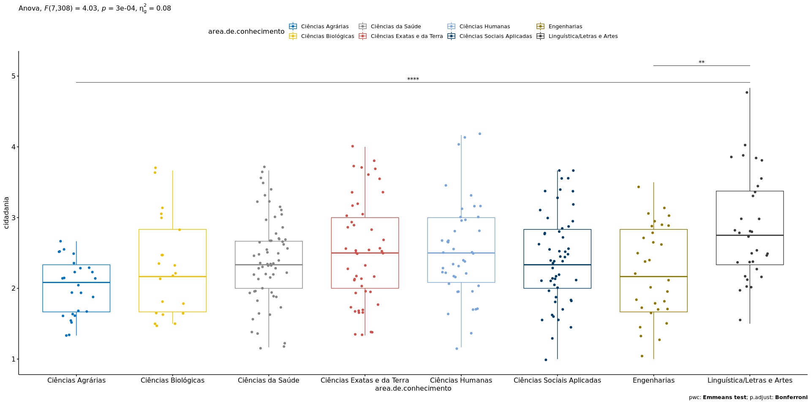

ANOVA `cidadania` ~ `area.de.conhecimento`
================
Geiser C. Challco <geiser@usp.br>

  - Report as Word format: [factorialAnova.docx](factorialAnova.docx)
  - Report as LaTex format: [factorialAnova.tex](factorialAnova.tex)

## Initial Data and Preprocessing

R script: [factorialAnova.R](factorialAnova.R) Inital data:
[data.csv](data.csv)

### Summary statistics of the initial data

``` r
get_summary_stats(group_by(dat, `area.de.conhecimento`), type ="common")
```

    ## # A tibble: 8 x 11
    ##   area.de.conheci… variable     n   min   max median   iqr  mean    sd
    ##   <fct>            <chr>    <dbl> <dbl> <dbl>  <dbl> <dbl> <dbl> <dbl>
    ## 1 Ciências Agrári… cidadan…    28  1.33  4.5    2.17 0.708  2.15 0.659
    ## 2 Ciências Biológ… cidadan…    22  1.5   3.67   2.17 1.08   2.28 0.693
    ## 3 Ciências da Saú… cidadan…    65  1.17  4.83   2.33 0.833  2.50 0.75 
    ## 4 Ciências Exatas… cidadan…    48  1.33  4      2.5  1      2.50 0.737
    ## 5 Ciências Humanas cidadan…    45  1.17  4.5    2.5  0.833  2.61 0.781
    ## 6 Ciências Sociai… cidadan…    53  1     3.67   2.33 0.833  2.43 0.642
    ## 7 Engenharias      cidadan…    31  1     3.5    2.17 1.17   2.24 0.644
    ## 8 Linguística/Let… cidadan…    32  1.5   4.83   2.75 1.04   2.85 0.751
    ## # … with 2 more variables: se <dbl>, ci <dbl>

## Check Assumptions

### Identifying outliers

Outliers tend to increase type-I error probability, and they decrease
the calculated F statistic in ANOVA resulting in a lower chance of
reject the null hypothesis.

  - Identified outliers using rstatix

<!-- end list -->

``` r
identify_outliers(group_by(dat, `area.de.conhecimento`), `cidadania`)
```

    ## # A tibble: 7 x 5
    ##   area.de.conhecimento ID     cidadania is.outlier is.extreme
    ##   <fct>                <fct>      <dbl> <lgl>      <lgl>     
    ## 1 Ciências Agrárias    Obs160      3.5  TRUE       FALSE     
    ## 2 Ciências Agrárias    Obs166      4.5  TRUE       TRUE      
    ## 3 Ciências da Saúde    Obs282      4.5  TRUE       FALSE     
    ## 4 Ciências da Saúde    Obs283      4.17 TRUE       FALSE     
    ## 5 Ciências da Saúde    Obs322      4.83 TRUE       FALSE     
    ## 6 Ciências Humanas     Obs20       4.33 TRUE       FALSE     
    ## 7 Ciências Humanas     Obs188      4.5  TRUE       FALSE

  - Identified outliers through
Boxplots

<!-- end list -->

``` r
Boxplot(`cidadania` ~ `area.de.conhecimento`, data = dat, id = list(n = Inf))
```

<!-- -->

    ## [1] "Obs166" "Obs282" "Obs283" "Obs322" "Obs20"  "Obs188"

### Removing outliers from the data

``` r
outliers <- c("Obs20","Obs160","Obs166","Obs188","Obs282","Obs283","Obs322")
rdat <- dat[!dat[["ID"]] %in% outliers,]   # table without outliers
```

|        | ID     | area.de.conhecimento | cidadania |
| ------ | :----- | :------------------- | --------: |
| Obs20  | Obs20  | Ciências Humanas     |  4.333333 |
| Obs160 | Obs160 | Ciências Agrárias    |  3.500000 |
| Obs166 | Obs166 | Ciências Agrárias    |  4.500000 |
| Obs188 | Obs188 | Ciências Humanas     |  4.500000 |
| Obs282 | Obs282 | Ciências da Saúde    |  4.500000 |
| Obs283 | Obs283 | Ciências da Saúde    |  4.166667 |
| Obs322 | Obs322 | Ciências da Saúde    |  4.833333 |

Outliers table

### Normality assumption

**Observation**:

As sample sizes increase, ANOVA remains a valid test even with the
violation of normality <sup>\[[1](#references),
[2](#references)\]</sup>. According to the central limit theorem, the
sampling distribution tends to be normal if the sample is large enough
(`n > 30`). Therefore, we performed ANOVA with large samples as follows:

  - In cases with the sample size greater than 30 (`n > 30`), we adopted
    a significance level of `p < 0.01` instead a significance level of
    `p < 0.05`.

  - For samples with `n > 50` observation, we adopted D’Agostino-Pearson
    test that offers better accuracy for larger samples
    <sup>\[[3](#references)\]</sup>.

  - For samples’ size between `n > 100` and `n <= 200`, we ignored both
    tests (Shapiro and D’Agostino-Persons), and our decision of
    normality were based only in the interpretation of QQ-plots and
    histograms because these tests tend to be too sensitive with values
    greater than 200 <sup>\[[3](#references)\]</sup>.

  - For samples with `n > 200` observation, we ignore the normality
    assumption based on the central theorem limit, and taking only into
    account the homogeneity assumption.

#### Checking normality assumption in the residual model

``` r
mdl <- lm(`cidadania` ~ `area.de.conhecimento`, data = rdat)
normality_test(residuals(mdl))
```

    ##     n statistic     method          p p.signif normality
    ## 1 317   6.10095 D'Agostino 0.04733643       ns         -

The QQ plot used to evaluate normality assumption

``` r
qqPlot(residuals(mdl))
```

<!-- -->

    ## Obs28 Obs17 
    ##    25    15

#### Checking normality assumption for each group

``` r
normality_test_at(group_by(rdat, `area.de.conhecimento`), "cidadania")
```

    ##                 variable       area.de.conhecimento  n statistic
    ## 1              cidadania          Ciências Agrárias 26 0.9402270
    ## 2              cidadania        Ciências Biológicas 22 0.9053438
    ## Omnibus  Test  cidadania          Ciências da Saúde 62 0.1232339
    ## 11             cidadania Ciências Exatas e da Terra 48 0.9582129
    ## 12             cidadania           Ciências Humanas 43 0.9648051
    ## Omnibus  Test1 cidadania Ciências Sociais Aplicadas 53 1.1306457
    ## 13             cidadania                Engenharias 31 0.9617330
    ## 14             cidadania Linguística/Letras e Artes 32 0.9480897
    ##                      method          p p.signif normality
    ## 1              Shapiro-Wilk 0.13599788       ns       YES
    ## 2              Shapiro-Wilk 0.03807448        *        NO
    ## Omnibus  Test    D'Agostino 0.94024297       ns       YES
    ## 11             Shapiro-Wilk 0.08548516       ns       YES
    ## 12             Shapiro-Wilk 0.20727100       ns       YES
    ## Omnibus  Test1   D'Agostino 0.56817669       ns       YES
    ## 13             Shapiro-Wilk 0.32402466       ns       YES
    ## 14             Shapiro-Wilk 0.12718163       ns       YES

  - QQ plot in the **area.de.conhecimento**: “Ciências
Agrárias”

<!-- end list -->

``` r
qqPlot( ~ `cidadania`, data = rdat[which(rdat["area.de.conhecimento"] == "Ciências Agrárias"),])
```

<!-- -->

    ## Obs202 Obs303 
    ##     19     24

  - QQ plot in the **area.de.conhecimento**: “Ciências
Biológicas”

<!-- end list -->

``` r
qqPlot( ~ `cidadania`, data = rdat[which(rdat["area.de.conhecimento"] == "Ciências Biológicas"),])
```

<!-- -->

    ## Obs122 Obs161 
    ##      6     10

  - QQ plot in the **area.de.conhecimento**: “Ciências da
Saúde”

<!-- end list -->

``` r
qqPlot( ~ `cidadania`, data = rdat[which(rdat["area.de.conhecimento"] == "Ciências da Saúde"),])
```

<!-- -->

    ## Obs165 Obs205 
    ##     23     35

  - QQ plot in the **area.de.conhecimento**: “Ciências Exatas e da
    Terra”

<!-- end list -->

``` r
qqPlot( ~ `cidadania`, data = rdat[which(rdat["area.de.conhecimento"] == "Ciências Exatas e da Terra"),])
```

<!-- -->

    ## Obs255  Obs70 
    ##     36     11

  - QQ plot in the **area.de.conhecimento**: “Ciências
Humanas”

<!-- end list -->

``` r
qqPlot( ~ `cidadania`, data = rdat[which(rdat["area.de.conhecimento"] == "Ciências Humanas"),])
```

<!-- -->

    ## Obs17 Obs98 
    ##     2    19

  - QQ plot in the **area.de.conhecimento**: “Ciências Sociais
    Aplicadas”

<!-- end list -->

``` r
qqPlot( ~ `cidadania`, data = rdat[which(rdat["area.de.conhecimento"] == "Ciências Sociais Aplicadas"),])
```

<!-- -->

    ## Obs288  Obs58 
    ##     46     18

  - QQ plot in the **area.de.conhecimento**:
“Engenharias”

<!-- end list -->

``` r
qqPlot( ~ `cidadania`, data = rdat[which(rdat["area.de.conhecimento"] == "Engenharias"),])
```

<!-- -->

    ## Obs37 Obs35 
    ##     4     2

  - QQ plot in the **area.de.conhecimento**: “Linguística/Letras e
    Artes”

<!-- end list -->

``` r
qqPlot( ~ `cidadania`, data = rdat[which(rdat["area.de.conhecimento"] == "Linguística/Letras e Artes"),])
```

<!-- -->

    ## Obs28 Obs18 
    ##     3     2

#### Removing data that affect normality

``` r
non.normal <- c("Obs133")
sdat <- rdat[!rdat[["ID"]] %in% non.normal,]   # table without non-normal and outliers
```

|        | ID     | area.de.conhecimento | cidadania |
| ------ | :----- | :------------------- | --------: |
| Obs133 | Obs133 | Ciências Biológicas  |       1.5 |

Non-normal data table

#### Performing normality test without data that affect normality

``` r
mdl <- lm(`cidadania` ~ `area.de.conhecimento`, data = sdat)
normality_test(residuals(mdl))
```

|   n | statistic | method     | p      | p.signif | normality |
| --: | --------: | :--------- | :----- | :------- | :-------- |
| 316 |    5.9405 | D’Agostino | 0.0513 | ns       | \-        |

``` r
normality_test_at(group_by(sdat, `area.de.conhecimento`), "cidadania")
```

| variable  | area.de.conhecimento       |  n | statistic | method       | p      | p.signif | normality |
| :-------- | :------------------------- | -: | --------: | :----------- | :----- | :------- | :-------- |
| cidadania | Ciências Agrárias          | 26 |    0.9402 | Shapiro-Wilk | 0.136  | ns       | YES       |
| cidadania | Ciências Biológicas        | 21 |    0.9161 | Shapiro-Wilk | 0.0724 | ns       | YES       |
| cidadania | Ciências da Saúde          | 62 |    0.1232 | D’Agostino   | 0.9402 | ns       | YES       |
| cidadania | Ciências Exatas e da Terra | 48 |    0.9582 | Shapiro-Wilk | 0.0855 | ns       | YES       |
| cidadania | Ciências Humanas           | 43 |    0.9648 | Shapiro-Wilk | 0.2073 | ns       | YES       |
| cidadania | Ciências Sociais Aplicadas | 53 |    1.1306 | D’Agostino   | 0.5682 | ns       | YES       |
| cidadania | Engenharias                | 31 |    0.9617 | Shapiro-Wilk | 0.324  | ns       | YES       |
| cidadania | Linguística/Letras e Artes | 32 |    0.9481 | Shapiro-Wilk | 0.1272 | ns       | YES       |

QQ plot in the residual model without data that affect normality

``` r
qqPlot(residuals(mdl))
```

<!-- -->

    ## Obs28 Obs17 
    ##    25    15

  - QQ plot in the **area.de.conhecimento**: “Ciências
Agrárias”

<!-- end list -->

``` r
qqPlot( ~ `cidadania`, data = sdat[which(sdat["area.de.conhecimento"] == "Ciências Agrárias"),])
```

<!-- -->

    ## Obs202 Obs303 
    ##     19     24

  - QQ plot in the **area.de.conhecimento**: “Ciências
Biológicas”

<!-- end list -->

``` r
qqPlot( ~ `cidadania`, data = sdat[which(sdat["area.de.conhecimento"] == "Ciências Biológicas"),])
```

<!-- -->

    ## Obs122 Obs161 
    ##      6      9

  - QQ plot in the **area.de.conhecimento**: “Ciências da
Saúde”

<!-- end list -->

``` r
qqPlot( ~ `cidadania`, data = sdat[which(sdat["area.de.conhecimento"] == "Ciências da Saúde"),])
```

<!-- -->

    ## Obs165 Obs205 
    ##     23     35

  - QQ plot in the **area.de.conhecimento**: “Ciências Exatas e da
    Terra”

<!-- end list -->

``` r
qqPlot( ~ `cidadania`, data = sdat[which(sdat["area.de.conhecimento"] == "Ciências Exatas e da Terra"),])
```

<!-- -->

    ## Obs255  Obs70 
    ##     36     11

  - QQ plot in the **area.de.conhecimento**: “Ciências
Humanas”

<!-- end list -->

``` r
qqPlot( ~ `cidadania`, data = sdat[which(sdat["area.de.conhecimento"] == "Ciências Humanas"),])
```

<!-- -->

    ## Obs17 Obs98 
    ##     2    19

  - QQ plot in the **area.de.conhecimento**: “Ciências Sociais
    Aplicadas”

<!-- end list -->

``` r
qqPlot( ~ `cidadania`, data = sdat[which(sdat["area.de.conhecimento"] == "Ciências Sociais Aplicadas"),])
```

<!-- -->

    ## Obs288  Obs58 
    ##     46     18

  - QQ plot in the **area.de.conhecimento**:
“Engenharias”

<!-- end list -->

``` r
qqPlot( ~ `cidadania`, data = sdat[which(sdat["area.de.conhecimento"] == "Engenharias"),])
```

<!-- -->

    ## Obs37 Obs35 
    ##     4     2

  - QQ plot in the **area.de.conhecimento**: “Linguística/Letras e
    Artes”

<!-- end list -->

``` r
qqPlot( ~ `cidadania`, data = sdat[which(sdat["area.de.conhecimento"] == "Linguística/Letras e Artes"),])
```

<!-- -->

    ## Obs28 Obs18 
    ##     3     2

### Homogeneity of variance assumption

``` r
levene_test(sdat, `cidadania` ~ `area.de.conhecimento`)
```

| df1 | df2 | statistic | p      | p.signif |
| --: | --: | --------: | :----- | :------- |
|   7 | 308 |     1.417 | 0.1977 | ns       |

From the output above, non-significant difference indicates homogeneity
of variance in the different groups (Signif. codes: 0 \*\*\*\* 0.0001
\*\*\* 0.001 \*\* 0.01 \* 0.05 ns
1).

## Computation ANOVA

``` r
res.aov <- anova_test(sdat, `cidadania` ~ `area.de.conhecimento`, type = 2, effect.size = 'ges', detailed = T)
get_anova_table(res.aov)
```

    ## Coefficient covariances computed by hccm()

| Effect               |    SSn |     SSd | DFn | DFd |     F | p     | p\<.05 |   ges |
| :------------------- | -----: | ------: | --: | --: | ----: | :---- | :----- | ----: |
| area.de.conhecimento | 12.222 | 133.352 |   7 | 308 | 4.033 | 3e-04 | \*     | 0.084 |

## Post-hoct Tests (Pairwise Comparisons)

  - Estimated marginal means for
**area.de.conhecimento**

<!-- end list -->

``` r
(emm[["area.de.conhecimento"]] <- emmeans_test(sdat, `cidadania` ~ `area.de.conhecimento`, p.adjust.method = "bonferroni", detailed = T))
```

| .y.       | group1                     | group2                     | estimate |     se |  df | conf.low | conf.high | statistic |      p | p.adj  | p.adj.signif |
| :-------- | :------------------------- | :------------------------- | -------: | -----: | --: | -------: | --------: | --------: | -----: | :----- | :----------- |
| cidadania | Ciências Agrárias          | Ciências Biológicas        | \-0.3046 | 0.1931 | 308 | \-0.6845 |    0.0752 |  \-1.5780 | 0.1156 | 1      | ns           |
| cidadania | Ciências Agrárias          | Ciências da Saúde          | \-0.3931 | 0.1537 | 308 | \-0.6956 |  \-0.0906 |  \-2.5569 | 0.0110 | 0.3091 | ns           |
| cidadania | Ciências Agrárias          | Ciências Exatas e da Terra | \-0.4837 | 0.1602 | 308 | \-0.7990 |  \-0.1684 |  \-3.0189 | 0.0027 | 0.077  | ns           |
| cidadania | Ciências Agrárias          | Ciências Humanas           | \-0.5143 | 0.1635 | 308 | \-0.8360 |  \-0.1927 |  \-3.1463 | 0.0018 | 0.0508 | ns           |
| cidadania | Ciências Agrárias          | Ciências Sociais Aplicadas | \-0.4211 | 0.1575 | 308 | \-0.7311 |  \-0.1111 |  \-2.6731 | 0.0079 | 0.2216 | ns           |
| cidadania | Ciências Agrárias          | Engenharias                | \-0.2237 | 0.1750 | 308 | \-0.5681 |    0.1206 |  \-1.2786 | 0.2020 | 1      | ns           |
| cidadania | Ciências Agrárias          | Linguística/Letras e Artes | \-0.8361 | 0.1737 | 308 | \-1.1780 |  \-0.4943 |  \-4.8128 | 0.0000 | 1e-04  | \*\*\*\*     |
| cidadania | Ciências Biológicas        | Ciências da Saúde          | \-0.0885 | 0.1661 | 308 | \-0.4154 |    0.2384 |  \-0.5324 | 0.5948 | 1      | ns           |
| cidadania | Ciências Biológicas        | Ciências Exatas e da Terra | \-0.1791 | 0.1722 | 308 | \-0.5178 |    0.1597 |  \-1.0402 | 0.2991 | 1      | ns           |
| cidadania | Ciências Biológicas        | Ciências Humanas           | \-0.2097 | 0.1752 | 308 | \-0.5544 |    0.1350 |  \-1.1969 | 0.2323 | 1      | ns           |
| cidadania | Ciências Biológicas        | Ciências Sociais Aplicadas | \-0.1165 | 0.1697 | 308 | \-0.4504 |    0.2173 |  \-0.6867 | 0.4928 | 1      | ns           |
| cidadania | Ciências Biológicas        | Engenharias                |   0.0809 | 0.1860 | 308 | \-0.2850 |    0.4468 |    0.4350 | 0.6638 | 1      | ns           |
| cidadania | Ciências Biológicas        | Linguística/Letras e Artes | \-0.5315 | 0.1848 | 308 | \-0.8951 |  \-0.1679 |  \-2.8762 | 0.0043 | 0.1205 | ns           |
| cidadania | Ciências da Saúde          | Ciências Exatas e da Terra | \-0.0906 | 0.1265 | 308 | \-0.3395 |    0.1583 |  \-0.7163 | 0.4744 | 1      | ns           |
| cidadania | Ciências da Saúde          | Ciências Humanas           | \-0.1212 | 0.1306 | 308 | \-0.3782 |    0.1357 |  \-0.9283 | 0.3540 | 1      | ns           |
| cidadania | Ciências da Saúde          | Ciências Sociais Aplicadas | \-0.0280 | 0.1231 | 308 | \-0.2703 |    0.2142 |  \-0.2279 | 0.8199 | 1      | ns           |
| cidadania | Ciências da Saúde          | Engenharias                |   0.1694 | 0.1447 | 308 | \-0.1155 |    0.4542 |    1.1701 | 0.2429 | 1      | ns           |
| cidadania | Ciências da Saúde          | Linguística/Letras e Artes | \-0.4430 | 0.1432 | 308 | \-0.7249 |  \-0.1612 |  \-3.0934 | 0.0022 | 0.0605 | ns           |
| cidadania | Ciências Exatas e da Terra | Ciências Humanas           | \-0.0306 | 0.1382 | 308 | \-0.3025 |    0.2413 |  \-0.2215 | 0.8248 | 1      | ns           |
| cidadania | Ciências Exatas e da Terra | Ciências Sociais Aplicadas |   0.0626 | 0.1311 | 308 | \-0.1954 |    0.3205 |    0.4772 | 0.6336 | 1      | ns           |
| cidadania | Ciências Exatas e da Terra | Engenharias                |   0.2600 | 0.1516 | 308 | \-0.0384 |    0.5583 |    1.7147 | 0.0874 | 1      | ns           |
| cidadania | Ciências Exatas e da Terra | Linguística/Letras e Artes | \-0.3524 | 0.1502 | 308 | \-0.6479 |  \-0.0569 |  \-2.3469 | 0.0196 | 0.5477 | ns           |
| cidadania | Ciências Humanas           | Ciências Sociais Aplicadas |   0.0932 | 0.1350 | 308 | \-0.1726 |    0.3589 |    0.6899 | 0.4908 | 1      | ns           |
| cidadania | Ciências Humanas           | Engenharias                |   0.2906 | 0.1550 | 308 | \-0.0145 |    0.5956 |    1.8743 | 0.0618 | 1      | ns           |
| cidadania | Ciências Humanas           | Linguística/Letras e Artes | \-0.3218 | 0.1536 | 308 | \-0.6241 |  \-0.0196 |  \-2.0950 | 0.0370 | 1      | ns           |
| cidadania | Ciências Sociais Aplicadas | Engenharias                |   0.1974 | 0.1488 | 308 | \-0.0954 |    0.4902 |    1.3268 | 0.1856 | 1      | ns           |
| cidadania | Ciências Sociais Aplicadas | Linguística/Letras e Artes | \-0.4150 | 0.1473 | 308 | \-0.7049 |  \-0.1251 |  \-2.8172 | 0.0052 | 0.1444 | ns           |
| cidadania | Engenharias                | Linguística/Letras e Artes | \-0.6124 | 0.1658 | 308 | \-0.9387 |  \-0.2861 |  \-3.6931 | 0.0003 | 0.0073 | \*\*         |

## Descriptive Statistic and ANOVA Plots

``` r
get_summary_stats(group_by(sdat, `area.de.conhecimento`), type ="common")
```

| area.de.conhecimento       | variable  |  n |  mean | median |   min |   max |    sd |    se |    ci |   iqr |
| :------------------------- | :-------- | -: | ----: | -----: | ----: | ----: | ----: | ----: | ----: | ----: |
| Ciências Agrárias          | cidadania | 26 | 2.013 |  2.083 | 1.333 | 2.667 | 0.394 | 0.077 | 0.159 | 0.667 |
| Ciências Biológicas        | cidadania | 21 | 2.317 |  2.167 | 1.500 | 3.667 | 0.687 | 0.150 | 0.313 | 1.167 |
| Ciências da Saúde          | cidadania | 62 | 2.406 |  2.333 | 1.167 | 3.667 | 0.617 | 0.078 | 0.157 | 0.667 |
| Ciências Exatas e da Terra | cidadania | 48 | 2.497 |  2.500 | 1.333 | 4.000 | 0.737 | 0.106 | 0.214 | 1.000 |
| Ciências Humanas           | cidadania | 43 | 2.527 |  2.500 | 1.167 | 4.167 | 0.690 | 0.105 | 0.212 | 0.917 |
| Ciências Sociais Aplicadas | cidadania | 53 | 2.434 |  2.333 | 1.000 | 3.667 | 0.642 | 0.088 | 0.177 | 0.833 |
| Engenharias                | cidadania | 31 | 2.237 |  2.167 | 1.000 | 3.500 | 0.644 | 0.116 | 0.236 | 1.167 |
| Linguística/Letras e Artes | cidadania | 32 | 2.849 |  2.750 | 1.500 | 4.833 | 0.751 | 0.133 | 0.271 | 1.042 |

``` r
ggPlotAoV(sdat, "area.de.conhecimento", "cidadania", aov=res.aov, pwc=emm[["area.de.conhecimento"]], addParam=c("jitter"))
```

<!-- -->

## References

<sup>\[1\]</sup>: Blanca, M. J., Alarcón, R., Arnau, J., Bono, R., &
Bendayan, R. (2017). Non-normal data: Is ANOVA still a valid option?.
Psicothema, 29(4), 552-557.

<sup>\[2\]</sup>: Ghasemi, A., & Zahediasl, S. (2012). Normality tests
for statistical analysis: a guide for non-statisticians. International
journal of endocrinology and metabolism, 10(2), 486.

<sup>\[3\]</sup>: Miot, H. A. (2017). Assessing normality of data in
clinical and experimental trials. J Vasc Bras, 16(2), 88-91.
