ANOVA `desenvolvimento` ~ `area.de.conhecimento`
================
Geiser C. Challco <geiser@usp.br>

## Initial Data and Preprocessing

R script: [factorialAnova.R](factorialAnova.R) Inital data:
[data.csv](data.csv)

### Summary statistics of the initial data

``` r
get_summary_stats(group_by(dat, `area.de.conhecimento`), type ="common")
```

    ## # A tibble: 8 x 11
    ##   area.de.conheci… variable     n   min   max median   iqr  mean    sd
    ##   <fct>            <chr>    <dbl> <dbl> <dbl>  <dbl> <dbl> <dbl> <dbl>
    ## 1 Ciências Agrári… desenvo…    28  1.33  4.33   2.33  1     2.56 0.72 
    ## 2 Ciências Biológ… desenvo…    22  1     4.33   2.33  1.33  2.32 0.832
    ## 3 Ciências da Saú… desenvo…    65  1.33  5      3     1     2.83 0.802
    ## 4 Ciências Exatas… desenvo…    48  1     4.33   2.67  1.42  2.57 0.891
    ## 5 Ciências Humanas desenvo…    45  1     4.33   2.67  1.33  2.66 0.812
    ## 6 Ciências Sociai… desenvo…    53  1     4.33   2.67  1.33  2.65 0.867
    ## 7 Engenharias      desenvo…    31  1     4.67   2.67  1.33  2.67 0.873
    ## 8 Linguística/Let… desenvo…    32  1     4.33   3     1.42  2.99 0.906
    ## # … with 2 more variables: se <dbl>, ci <dbl>

## Check Assumptions

### Identifying outliers

Outliers tend to increase type-I error probability, and they decrease
the calculated F statistic in ANOVA resulting in a lower chance of
reject the null hypothesis.

  - Identified outliers using
rstatix

<!-- end list -->

``` r
identify_outliers(group_by(dat, `area.de.conhecimento`), `desenvolvimento`)
```

    ## # A tibble: 1 x 5
    ##   area.de.conhecimento ID     desenvolvimento is.outlier is.extreme
    ##   <fct>                <fct>            <dbl> <lgl>      <lgl>     
    ## 1 Ciências da Saúde    Obs322               5 TRUE       FALSE

  - Identified outliers through
Boxplots

<!-- end list -->

``` r
Boxplot(`desenvolvimento` ~ `area.de.conhecimento`, data = dat, id = list(n = Inf))
```

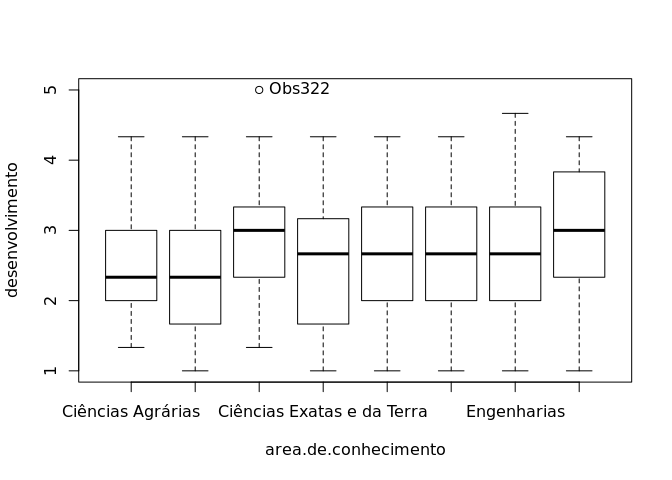<!-- -->

    ## [1] "Obs322"

### Removing outliers from the data

``` r
outliers <- c("Obs322")
rdat <- dat[!dat[["ID"]] %in% outliers,]   # table without outliers
```

|        | ID     | area.de.conhecimento | desenvolvimento |
| ------ | :----- | :------------------- | --------------: |
| Obs322 | Obs322 | Ciências da Saúde    |               5 |

Outliers table

### Normality assumption

**Observation**:

As sample sizes increase, ANOVA remains a valid test even with the
violation of normality <sup>\[[1](#references),
[2](#references)\]</sup>. According to the central limit theorem, the
sampling distribution tends to be normal if the sample is large enough
(`n > 30`). Therefore, we performed ANOVA with large samples as follows:

  - In cases with the sample size greater than 30 (`n > 30`), we adopted
    a significance level of `p < 0.01` instead a significance level of
    `p < 0.05`.

  - For samples with `n > 50` observation, we adopted D’Agostino-Pearson
    test that offers better accuracy for larger samples
    <sup>\[[3](#references)\]</sup>.

  - For samples’ size between `n > 100` and `n <= 200`, we ignored both
    tests (Shapiro and D’Agostino-Persons), and our decision of
    normality were based only in the interpretation of QQ-plots and
    histograms because these tests tend to be too sensitive with values
    greater than 200 <sup>\[[3](#references)\]</sup>.

  - For samples with `n > 200` observation, we ignore the normality
    assumption based on the central theorem limit, and taking only into
    account the homogeneity assumption.

#### Checking normality assumption in the residual model

``` r
mdl <- lm(`desenvolvimento` ~ `area.de.conhecimento`, data = rdat)
normality_test(residuals(mdl))
```

    ##     n statistic     method           p p.signif normality
    ## 1 323  10.27096 D'Agostino 0.005884222        *         -

The QQ plot used to evaluate normality assumption

``` r
qqPlot(residuals(mdl))
```

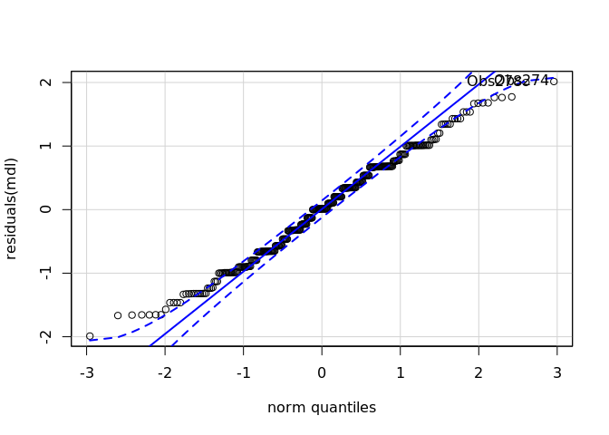<!-- -->

    ## Obs274 Obs278 
    ##    268    272

#### Checking normality assumption for each group

``` r
normality_test_at(group_by(rdat, `area.de.conhecimento`), "desenvolvimento")
```

    ##                       variable       area.de.conhecimento  n statistic
    ## 1              desenvolvimento          Ciências Agrárias 28 0.9597002
    ## 2              desenvolvimento        Ciências Biológicas 22 0.9298277
    ## Omnibus  Test  desenvolvimento          Ciências da Saúde 64 0.6215602
    ## 11             desenvolvimento Ciências Exatas e da Terra 48 0.9474154
    ## 12             desenvolvimento           Ciências Humanas 45 0.9642608
    ## Omnibus  Test1 desenvolvimento Ciências Sociais Aplicadas 53 1.7440391
    ## 13             desenvolvimento                Engenharias 31 0.9685706
    ## 14             desenvolvimento Linguística/Letras e Artes 32 0.9358006
    ##                      method          p p.signif normality
    ## 1              Shapiro-Wilk 0.34300413       ns       YES
    ## 2              Shapiro-Wilk 0.12168686       ns       YES
    ## Omnibus  Test    D'Agostino 0.73287501       ns       YES
    ## 11             Shapiro-Wilk 0.03157974       ns       YES
    ## 12             Shapiro-Wilk 0.17733217       ns       YES
    ## Omnibus  Test1   D'Agostino 0.41810630       ns       YES
    ## 13             Shapiro-Wilk 0.48060883       ns       YES
    ## 14             Shapiro-Wilk 0.05694906       ns       YES

  - QQ plot in the **area.de.conhecimento**: “Ciências
Agrárias”

<!-- end list -->

``` r
qqPlot( ~ `desenvolvimento`, data = rdat[which(rdat["area.de.conhecimento"] == "Ciências Agrárias"),])
```

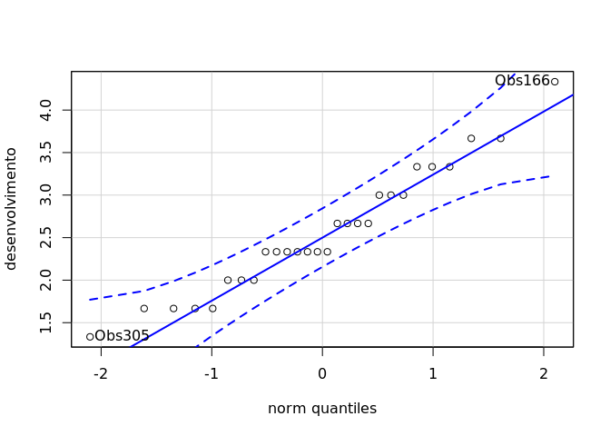<!-- -->

    ## Obs166 Obs305 
    ##     15     27

  - QQ plot in the **area.de.conhecimento**: “Ciências
Biológicas”

<!-- end list -->

``` r
qqPlot( ~ `desenvolvimento`, data = rdat[which(rdat["area.de.conhecimento"] == "Ciências Biológicas"),])
```

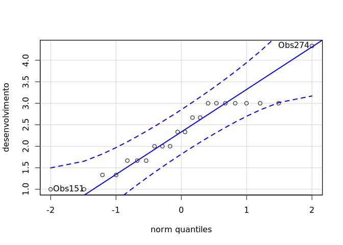<!-- -->

    ## Obs274 Obs151 
    ##     20      9

  - QQ plot in the **area.de.conhecimento**: “Ciências da
Saúde”

<!-- end list -->

``` r
qqPlot( ~ `desenvolvimento`, data = rdat[which(rdat["area.de.conhecimento"] == "Ciências da Saúde"),])
```

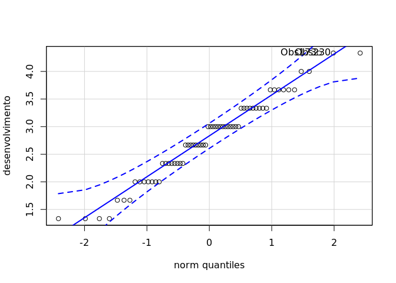<!-- -->

    ## Obs173 Obs230 
    ##     27     37

  - QQ plot in the **area.de.conhecimento**: “Ciências Exatas e da
    Terra”

<!-- end list -->

``` r
qqPlot( ~ `desenvolvimento`, data = rdat[which(rdat["area.de.conhecimento"] == "Ciências Exatas e da Terra"),])
```

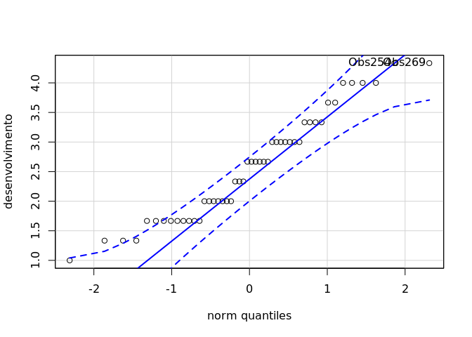<!-- -->

    ## Obs254 Obs269 
    ##     35     38

  - QQ plot in the **area.de.conhecimento**: “Ciências
Humanas”

<!-- end list -->

``` r
qqPlot( ~ `desenvolvimento`, data = rdat[which(rdat["area.de.conhecimento"] == "Ciências Humanas"),])
```

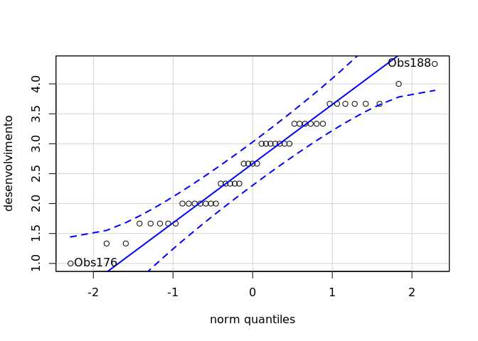<!-- -->

    ## Obs188 Obs176 
    ##     33     30

  - QQ plot in the **area.de.conhecimento**: “Ciências Sociais
    Aplicadas”

<!-- end list -->

``` r
qqPlot( ~ `desenvolvimento`, data = rdat[which(rdat["area.de.conhecimento"] == "Ciências Sociais Aplicadas"),])
```

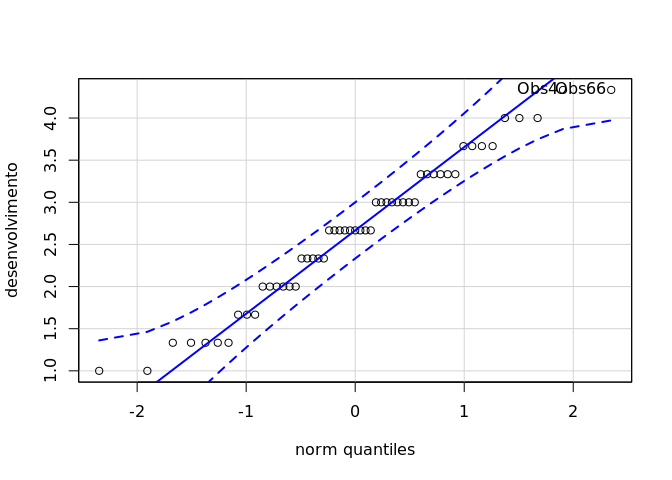<!-- -->

    ##  Obs4 Obs66 
    ##     2    22

  - QQ plot in the **area.de.conhecimento**:
“Engenharias”

<!-- end list -->

``` r
qqPlot( ~ `desenvolvimento`, data = rdat[which(rdat["area.de.conhecimento"] == "Engenharias"),])
```

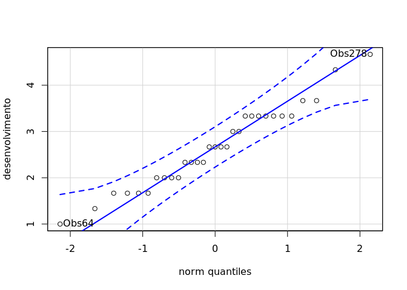<!-- -->

    ## Obs278  Obs64 
    ##     24      7

  - QQ plot in the **area.de.conhecimento**: “Linguística/Letras e
    Artes”

<!-- end list -->

``` r
qqPlot( ~ `desenvolvimento`, data = rdat[which(rdat["area.de.conhecimento"] == "Linguística/Letras e Artes"),])
```

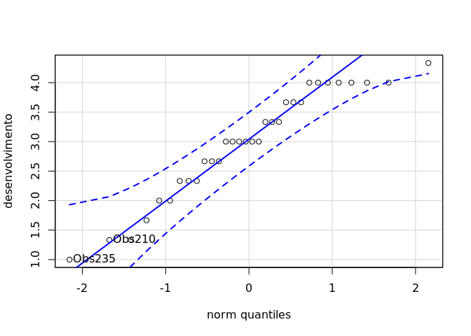<!-- -->

    ## Obs235 Obs210 
    ##     24     13

#### Removing data that affect normality

``` r
non.normal <- c("")
sdat <- rdat[!rdat[["ID"]] %in% non.normal,]   # table without non-normal and outliers
```

| ID | area.de.conhecimento | desenvolvimento |
| :- | :------------------- | --------------: |

Non-normal data table

#### Performing normality test without data that affect normality

``` r
mdl <- lm(`desenvolvimento` ~ `area.de.conhecimento`, data = sdat)
normality_test(residuals(mdl))
```

|   n | statistic | method     | p      | p.signif | normality |
| --: | --------: | :--------- | :----- | :------- | :-------- |
| 323 |    10.271 | D’Agostino | 0.0059 | \*       | \-        |

``` r
normality_test_at(group_by(sdat, `area.de.conhecimento`), "desenvolvimento")
```

| variable        | area.de.conhecimento       |  n | statistic | method       | p      | p.signif | normality |
| :-------------- | :------------------------- | -: | --------: | :----------- | :----- | :------- | :-------- |
| desenvolvimento | Ciências Agrárias          | 28 |    0.9597 | Shapiro-Wilk | 0.343  | ns       | YES       |
| desenvolvimento | Ciências Biológicas        | 22 |    0.9298 | Shapiro-Wilk | 0.1217 | ns       | YES       |
| desenvolvimento | Ciências da Saúde          | 64 |    0.6216 | D’Agostino   | 0.7329 | ns       | YES       |
| desenvolvimento | Ciências Exatas e da Terra | 48 |    0.9474 | Shapiro-Wilk | 0.0316 | \*       | YES       |
| desenvolvimento | Ciências Humanas           | 45 |    0.9643 | Shapiro-Wilk | 0.1773 | ns       | YES       |
| desenvolvimento | Ciências Sociais Aplicadas | 53 |    1.7440 | D’Agostino   | 0.4181 | ns       | YES       |
| desenvolvimento | Engenharias                | 31 |    0.9686 | Shapiro-Wilk | 0.4806 | ns       | YES       |
| desenvolvimento | Linguística/Letras e Artes | 32 |    0.9358 | Shapiro-Wilk | 0.0569 | ns       | YES       |

QQ plot in the residual model without data that affect normality

``` r
qqPlot(residuals(mdl))
```

<!-- -->

    ## Obs274 Obs278 
    ##    268    272

  - QQ plot in the **area.de.conhecimento**: “Ciências
Agrárias”

<!-- end list -->

``` r
qqPlot( ~ `desenvolvimento`, data = sdat[which(sdat["area.de.conhecimento"] == "Ciências Agrárias"),])
```

<!-- -->

    ## Obs166 Obs305 
    ##     15     27

  - QQ plot in the **area.de.conhecimento**: “Ciências
Biológicas”

<!-- end list -->

``` r
qqPlot( ~ `desenvolvimento`, data = sdat[which(sdat["area.de.conhecimento"] == "Ciências Biológicas"),])
```

<!-- -->

    ## Obs274 Obs151 
    ##     20      9

  - QQ plot in the **area.de.conhecimento**: “Ciências da
Saúde”

<!-- end list -->

``` r
qqPlot( ~ `desenvolvimento`, data = sdat[which(sdat["area.de.conhecimento"] == "Ciências da Saúde"),])
```

<!-- -->

    ## Obs173 Obs230 
    ##     27     37

  - QQ plot in the **area.de.conhecimento**: “Ciências Exatas e da
    Terra”

<!-- end list -->

``` r
qqPlot( ~ `desenvolvimento`, data = sdat[which(sdat["area.de.conhecimento"] == "Ciências Exatas e da Terra"),])
```

<!-- -->

    ## Obs254 Obs269 
    ##     35     38

  - QQ plot in the **area.de.conhecimento**: “Ciências
Humanas”

<!-- end list -->

``` r
qqPlot( ~ `desenvolvimento`, data = sdat[which(sdat["area.de.conhecimento"] == "Ciências Humanas"),])
```

<!-- -->

    ## Obs188 Obs176 
    ##     33     30

  - QQ plot in the **area.de.conhecimento**: “Ciências Sociais
    Aplicadas”

<!-- end list -->

``` r
qqPlot( ~ `desenvolvimento`, data = sdat[which(sdat["area.de.conhecimento"] == "Ciências Sociais Aplicadas"),])
```

<!-- -->

    ##  Obs4 Obs66 
    ##     2    22

  - QQ plot in the **area.de.conhecimento**:
“Engenharias”

<!-- end list -->

``` r
qqPlot( ~ `desenvolvimento`, data = sdat[which(sdat["area.de.conhecimento"] == "Engenharias"),])
```

<!-- -->

    ## Obs278  Obs64 
    ##     24      7

  - QQ plot in the **area.de.conhecimento**: “Linguística/Letras e
    Artes”

<!-- end list -->

``` r
qqPlot( ~ `desenvolvimento`, data = sdat[which(sdat["area.de.conhecimento"] == "Linguística/Letras e Artes"),])
```

<!-- -->

    ## Obs235 Obs210 
    ##     24     13

### Homogeneity of variance assumption

``` r
levene_test(sdat, `desenvolvimento` ~ `area.de.conhecimento`)
```

| df1 | df2 | statistic | p      | p.signif |
| --: | --: | --------: | :----- | :------- |
|   7 | 315 |    0.6285 | 0.7323 | ns       |

From the output above, non-significant difference indicates homogeneity
of variance in the different groups (Signif. codes: 0 \*\*\*\* 0.0001
\*\*\* 0.001 \*\* 0.01 \* 0.05 ns
1).

## Computation ANOVA

``` r
res.aov <- anova_test(sdat, `desenvolvimento` ~ `area.de.conhecimento`, type = 2, effect.size = 'ges', detailed = T)
get_anova_table(res.aov)
```

    ## Coefficient covariances computed by hccm()

| Effect               |   SSn |     SSd | DFn | DFd |     F | p    | p\<.05 |   ges |
| :------------------- | ----: | ------: | --: | --: | ----: | :--- | :----- | ----: |
| area.de.conhecimento | 7.863 | 218.676 |   7 | 315 | 1.618 | 0.13 |        | 0.035 |

## Post-hoct Tests (Pairwise Comparisons)

  - Estimated marginal means for
**area.de.conhecimento**

<!-- end list -->

``` r
(emm[["area.de.conhecimento"]] <- emmeans_test(sdat, `desenvolvimento` ~ `area.de.conhecimento`, p.adjust.method = "bonferroni", detailed = T))
```

| .y.             | group1                     | group2                     | estimate |     se |  df | conf.low | conf.high | statistic |      p | p.adj  | p.adj.signif |
| :-------------- | :------------------------- | :------------------------- | -------: | -----: | --: | -------: | --------: | --------: | -----: | :----- | :----------- |
| desenvolvimento | Ciências Agrárias          | Ciências Biológicas        |   0.2413 | 0.2374 | 315 | \-0.2257 |    0.7084 |    1.0167 | 0.3101 | 1      | ns           |
| desenvolvimento | Ciências Agrárias          | Ciências da Saúde          | \-0.2374 | 0.1888 | 315 | \-0.6088 |    0.1341 |  \-1.2572 | 0.2096 | 1      | ns           |
| desenvolvimento | Ciências Agrárias          | Ciências Exatas e da Terra | \-0.0099 | 0.1981 | 315 | \-0.3997 |    0.3799 |  \-0.0501 | 0.9601 | 1      | ns           |
| desenvolvimento | Ciências Agrárias          | Ciências Humanas           | \-0.0997 | 0.2005 | 315 | \-0.4943 |    0.2949 |  \-0.4973 | 0.6193 | 1      | ns           |
| desenvolvimento | Ciências Agrárias          | Ciências Sociais Aplicadas | \-0.0946 | 0.1947 | 315 | \-0.4776 |    0.2884 |  \-0.4858 | 0.6274 | 1      | ns           |
| desenvolvimento | Ciências Agrárias          | Engenharias                | \-0.1071 | 0.2172 | 315 | \-0.5345 |    0.3203 |  \-0.4932 | 0.6222 | 1      | ns           |
| desenvolvimento | Ciências Agrárias          | Linguística/Letras e Artes | \-0.4301 | 0.2156 | 315 | \-0.8543 |  \-0.0058 |  \-1.9946 | 0.0469 | 1      | ns           |
| desenvolvimento | Ciências Biológicas        | Ciências da Saúde          | \-0.4787 | 0.2059 | 315 | \-0.8838 |  \-0.0735 |  \-2.3247 | 0.0207 | 0.5803 | ns           |
| desenvolvimento | Ciências Biológicas        | Ciências Exatas e da Terra | \-0.2513 | 0.2145 | 315 | \-0.6733 |    0.1708 |  \-1.1713 | 0.2424 | 1      | ns           |
| desenvolvimento | Ciências Biológicas        | Ciências Humanas           | \-0.3411 | 0.2168 | 315 | \-0.7675 |    0.0854 |  \-1.5736 | 0.1166 | 1      | ns           |
| desenvolvimento | Ciências Biológicas        | Ciências Sociais Aplicadas | \-0.3359 | 0.2113 | 315 | \-0.7517 |    0.0799 |  \-1.5896 | 0.1129 | 1      | ns           |
| desenvolvimento | Ciências Biológicas        | Engenharias                | \-0.3485 | 0.2323 | 315 | \-0.8055 |    0.1085 |  \-1.5004 | 0.1345 | 1      | ns           |
| desenvolvimento | Ciências Biológicas        | Linguística/Letras e Artes | \-0.6714 | 0.2308 | 315 | \-1.1254 |  \-0.2174 |  \-2.9096 | 0.0039 | 0.1086 | ns           |
| desenvolvimento | Ciências da Saúde          | Ciências Exatas e da Terra |   0.2274 | 0.1591 | 315 | \-0.0856 |    0.5404 |    1.4296 | 0.1538 | 1      | ns           |
| desenvolvimento | Ciências da Saúde          | Ciências Humanas           |   0.1376 | 0.1621 | 315 | \-0.1813 |    0.4565 |    0.8490 | 0.3965 | 1      | ns           |
| desenvolvimento | Ciências da Saúde          | Ciências Sociais Aplicadas |   0.1428 | 0.1547 | 315 | \-0.1617 |    0.4472 |    0.9227 | 0.3569 | 1      | ns           |
| desenvolvimento | Ciências da Saúde          | Engenharias                |   0.1302 | 0.1823 | 315 | \-0.2285 |    0.4889 |    0.7142 | 0.4756 | 1      | ns           |
| desenvolvimento | Ciências da Saúde          | Linguística/Letras e Artes | \-0.1927 | 0.1804 | 315 | \-0.5476 |    0.1622 |  \-1.0683 | 0.2862 | 1      | ns           |
| desenvolvimento | Ciências Exatas e da Terra | Ciências Humanas           | \-0.0898 | 0.1729 | 315 | \-0.4300 |    0.2503 |  \-0.5195 | 0.6038 | 1      | ns           |
| desenvolvimento | Ciências Exatas e da Terra | Ciências Sociais Aplicadas | \-0.0846 | 0.1660 | 315 | \-0.4113 |    0.2420 |  \-0.5099 | 0.6105 | 1      | ns           |
| desenvolvimento | Ciências Exatas e da Terra | Engenharias                | \-0.0972 | 0.1920 | 315 | \-0.4749 |    0.2805 |  \-0.5064 | 0.6129 | 1      | ns           |
| desenvolvimento | Ciências Exatas e da Terra | Linguística/Letras e Artes | \-0.4201 | 0.1901 | 315 | \-0.7943 |  \-0.0460 |  \-2.2095 | 0.0279 | 0.78   | ns           |
| desenvolvimento | Ciências Humanas           | Ciências Sociais Aplicadas |   0.0052 | 0.1689 | 315 | \-0.3271 |    0.3375 |    0.0306 | 0.9756 | 1      | ns           |
| desenvolvimento | Ciências Humanas           | Engenharias                | \-0.0074 | 0.1945 | 315 | \-0.3900 |    0.3752 |  \-0.0381 | 0.9696 | 1      | ns           |
| desenvolvimento | Ciências Humanas           | Linguística/Letras e Artes | \-0.3303 | 0.1927 | 315 | \-0.7094 |    0.0488 |  \-1.7145 | 0.0874 | 1      | ns           |
| desenvolvimento | Ciências Sociais Aplicadas | Engenharias                | \-0.0126 | 0.1884 | 315 | \-0.3832 |    0.3581 |  \-0.0668 | 0.9468 | 1      | ns           |
| desenvolvimento | Ciências Sociais Aplicadas | Linguística/Letras e Artes | \-0.3355 | 0.1865 | 315 | \-0.7025 |    0.0315 |  \-1.7986 | 0.0730 | 1      | ns           |
| desenvolvimento | Engenharias                | Linguística/Letras e Artes | \-0.3229 | 0.2100 | 315 | \-0.7360 |    0.0902 |  \-1.5379 | 0.1251 | 1      | ns           |

## Descriptive Statistic and ANOVA Plots

``` r
get_summary_stats(group_by(sdat, `area.de.conhecimento`), type ="common")
```

| area.de.conhecimento       | variable        |  n |  mean | median |   min |   max |    sd |    se |    ci |   iqr |
| :------------------------- | :-------------- | -: | ----: | -----: | ----: | ----: | ----: | ----: | ----: | ----: |
| Ciências Agrárias          | desenvolvimento | 28 | 2.560 |  2.333 | 1.333 | 4.333 | 0.720 | 0.136 | 0.279 | 1.000 |
| Ciências Biológicas        | desenvolvimento | 22 | 2.318 |  2.333 | 1.000 | 4.333 | 0.832 | 0.177 | 0.369 | 1.333 |
| Ciências da Saúde          | desenvolvimento | 64 | 2.797 |  3.000 | 1.333 | 4.333 | 0.760 | 0.095 | 0.190 | 1.000 |
| Ciências Exatas e da Terra | desenvolvimento | 48 | 2.569 |  2.667 | 1.000 | 4.333 | 0.891 | 0.129 | 0.259 | 1.417 |
| Ciências Humanas           | desenvolvimento | 45 | 2.659 |  2.667 | 1.000 | 4.333 | 0.812 | 0.121 | 0.244 | 1.333 |
| Ciências Sociais Aplicadas | desenvolvimento | 53 | 2.654 |  2.667 | 1.000 | 4.333 | 0.867 | 0.119 | 0.239 | 1.333 |
| Engenharias                | desenvolvimento | 31 | 2.667 |  2.667 | 1.000 | 4.667 | 0.873 | 0.157 | 0.320 | 1.333 |
| Linguística/Letras e Artes | desenvolvimento | 32 | 2.990 |  3.000 | 1.000 | 4.333 | 0.906 | 0.160 | 0.327 | 1.417 |

``` r
ggPlotAoV(sdat, "area.de.conhecimento", "desenvolvimento", aov=res.aov, pwc=emm[["area.de.conhecimento"]], addParam=c("jitter"))
```

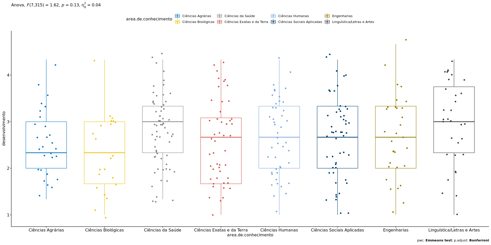<!-- -->

## References

<sup>\[1\]</sup>: Blanca, M. J., Alarcón, R., Arnau, J., Bono, R., &
Bendayan, R. (2017). Non-normal data: Is ANOVA still a valid option?.
Psicothema, 29(4), 552-557.

<sup>\[2\]</sup>: Ghasemi, A., & Zahediasl, S. (2012). Normality tests
for statistical analysis: a guide for non-statisticians. International
journal of endocrinology and metabolism, 10(2), 486.

<sup>\[3\]</sup>: Miot, H. A. (2017). Assessing normality of data in
clinical and experimental trials. J Vasc Bras, 16(2), 88-91.
