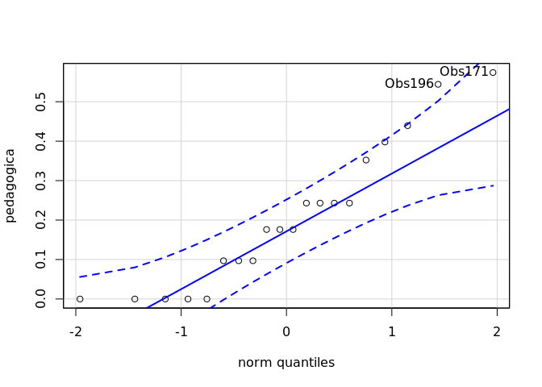

ANOVA `pedagogica` ~ `area.de.conhecimento`
================
Geiser C. Challco <geiser@usp.br>

  - Report as Word format: [factorialAnova.docx](factorialAnova.docx)
  - Report as LaTex format: [factorialAnova.tex](factorialAnova.tex)

## Initial Data and Preprocessing

R script: [factorialAnova.R](factorialAnova.R) Inital data:
[data.csv](data.csv)

### Visualization of data distribution

``` r
ggdensity(dat, x = "pedagogica", fill = "lightgray", title= "Density of pedagogica before transformation") +
 stat_overlay_normal_density(color = "red", linetype = "dashed")
```

<!-- -->

### Dealing with positive greater skewness in pedagogica

``` r
dat[["pedagogica"]] <- log10(dat[["pedagogica"]])
```

``` r
ggdensity(dat, x = "pedagogica", fill = "lightgray", title= "Density of pedagogica after transformation") +
 stat_overlay_normal_density(color = "red", linetype = "dashed")
```

<!-- -->

### Summary statistics of the initial data

``` r
get_summary_stats(group_by(dat, `area.de.conhecimento`), type ="common")
```

    ## # A tibble: 8 x 11
    ##   area.de.conheci… variable     n   min   max median   iqr  mean    sd
    ##   <fct>            <chr>    <dbl> <dbl> <dbl>  <dbl> <dbl> <dbl> <dbl>
    ## 1 Ciências Agrári… pedagog…    28     0 0.628  0.243 0.242 0.264 0.184
    ## 2 Ciências Biológ… pedagog…    22     0 0.574  0.176 0.301 0.211 0.192
    ## 3 Ciências da Saú… pedagog…    65     0 0.699  0.243 0.301 0.257 0.18 
    ## 4 Ciências Exatas… pedagog…    48     0 0.653  0.301 0.263 0.318 0.172
    ## 5 Ciências Humanas pedagog…    45     0 0.699  0.352 0.336 0.329 0.197
    ## 6 Ciências Sociai… pedagog…    53     0 0.653  0.301 0.336 0.322 0.199
    ## 7 Engenharias      pedagog…    31     0 0.628  0.301 0.155 0.297 0.163
    ## 8 Linguística/Let… pedagog…    32     0 0.677  0.398 0.271 0.338 0.201
    ## # … with 2 more variables: se <dbl>, ci <dbl>

## Check Assumptions

### Identifying outliers

Outliers tend to increase type-I error probability, and they decrease
the calculated F statistic in ANOVA resulting in a lower chance of
reject the null hypothesis.

  - Identified outliers using rstatix

<!-- end list -->

``` r
identify_outliers(group_by(dat, `area.de.conhecimento`), `pedagogica`)
```

    ## # A tibble: 3 x 5
    ##   area.de.conhecimento ID     pedagogica is.outlier is.extreme
    ##   <fct>                <fct>       <dbl> <lgl>      <lgl>     
    ## 1 Engenharias          Obs50           0 TRUE       FALSE     
    ## 2 Engenharias          Obs141          0 TRUE       FALSE     
    ## 3 Engenharias          Obs286          0 TRUE       FALSE

  - Identified outliers through
Boxplots

<!-- end list -->

``` r
Boxplot(`pedagogica` ~ `area.de.conhecimento`, data = dat, id = list(n = Inf))
```

<!-- -->

    ## [1] "Obs50"  "Obs141" "Obs286"

### Removing outliers from the data

``` r
outliers <- c("Obs50","Obs141","Obs286")
rdat <- dat[!dat[["ID"]] %in% outliers,]   # table without outliers
```

|        | ID     | area.de.conhecimento | pedagogica |
| ------ | :----- | :------------------- | ---------: |
| Obs50  | Obs50  | Engenharias          |          0 |
| Obs141 | Obs141 | Engenharias          |          0 |
| Obs286 | Obs286 | Engenharias          |          0 |

Outliers table

### Normality assumption

**Observation**:

As sample sizes increase, ANOVA remains a valid test even with the
violation of normality <sup>\[[1](#references),
[2](#references)\]</sup>. According to the central limit theorem, the
sampling distribution tends to be normal if the sample is large enough
(`n > 30`). Therefore, we performed ANOVA with large samples as follows:

  - In cases with the sample size greater than 30 (`n > 30`), we adopted
    a significance level of `p < 0.01` instead a significance level of
    `p < 0.05`.

  - For samples with `n > 50` observation, we adopted D’Agostino-Pearson
    test that offers better accuracy for larger samples
    <sup>\[[3](#references)\]</sup>.

  - For samples’ size between `n > 100` and `n <= 200`, we ignored both
    tests (Shapiro and D’Agostino-Persons), and our decision of
    normality were based only in the interpretation of QQ-plots and
    histograms because these tests tend to be too sensitive with values
    greater than 200 <sup>\[[3](#references)\]</sup>.

  - For samples with `n > 200` observation, we ignore the normality
    assumption based on the central theorem limit, and taking only into
    account the homogeneity assumption.

#### Checking normality assumption in the residual model

``` r
mdl <- lm(`pedagogica` ~ `area.de.conhecimento`, data = rdat)
normality_test(residuals(mdl))
```

    ##     n statistic     method            p p.signif normality
    ## 1 321  36.25437 D'Agostino 1.341109e-08     ****         -

The QQ plot used to evaluate normality assumption

``` r
qqPlot(residuals(mdl))
```

<!-- -->

    ## Obs322 Obs188 
    ##    313    182

#### Checking normality assumption for each group

``` r
normality_test_at(group_by(rdat, `area.de.conhecimento`), "pedagogica")
```

    ##                  variable       area.de.conhecimento  n  statistic
    ## 1              pedagogica          Ciências Agrárias 28  0.9498630
    ## 2              pedagogica        Ciências Biológicas 22  0.8900311
    ## Omnibus  Test  pedagogica          Ciências da Saúde 65  3.4534213
    ## 11             pedagogica Ciências Exatas e da Terra 48  0.9501681
    ## 12             pedagogica           Ciências Humanas 45  0.9549532
    ## Omnibus  Test1 pedagogica Ciências Sociais Aplicadas 53 13.8151630
    ## 13             pedagogica                Engenharias 28  0.9577111
    ## 14             pedagogica Linguística/Letras e Artes 32  0.9279369
    ##                      method           p p.signif normality
    ## 1              Shapiro-Wilk 0.196565111       ns       YES
    ## 2              Shapiro-Wilk 0.018876425        *        NO
    ## Omnibus  Test    D'Agostino 0.177868523       ns       YES
    ## 11             Shapiro-Wilk 0.040607637       ns       YES
    ## 12             Shapiro-Wilk 0.078371098       ns       YES
    ## Omnibus  Test1   D'Agostino 0.001000174        *        NO
    ## 13             Shapiro-Wilk 0.307318051       ns       YES
    ## 14             Shapiro-Wilk 0.034319484       ns       YES

  - QQ plot in the **area.de.conhecimento**: “Ciências
Agrárias”

<!-- end list -->

``` r
qqPlot( ~ `pedagogica`, data = rdat[which(rdat["area.de.conhecimento"] == "Ciências Agrárias"),])
```

<!-- -->

    ## Obs160 Obs166 
    ##     14     15

  - QQ plot in the **area.de.conhecimento**: “Ciências
Biológicas”

<!-- end list -->

``` r
qqPlot( ~ `pedagogica`, data = rdat[which(rdat["area.de.conhecimento"] == "Ciências Biológicas"),])
```

<!-- -->

    ## Obs171 Obs178 
    ##     12     13

  - QQ plot in the **area.de.conhecimento**: “Ciências da
Saúde”

<!-- end list -->

``` r
qqPlot( ~ `pedagogica`, data = rdat[which(rdat["area.de.conhecimento"] == "Ciências da Saúde"),])
```

<!-- -->

    ## Obs322 Obs208 
    ##     62     36

  - QQ plot in the **area.de.conhecimento**: “Ciências Exatas e da
    Terra”

<!-- end list -->

``` r
qqPlot( ~ `pedagogica`, data = rdat[which(rdat["area.de.conhecimento"] == "Ciências Exatas e da Terra"),])
```

<!-- -->

    ## Obs127  Obs52 
    ##     21      9

  - QQ plot in the **area.de.conhecimento**: “Ciências
Humanas”

<!-- end list -->

``` r
qqPlot( ~ `pedagogica`, data = rdat[which(rdat["area.de.conhecimento"] == "Ciências Humanas"),])
```

<!-- -->

    ## Obs188 Obs119 
    ##     33     22

  - QQ plot in the **area.de.conhecimento**: “Ciências Sociais
    Aplicadas”

<!-- end list -->

``` r
qqPlot( ~ `pedagogica`, data = rdat[which(rdat["area.de.conhecimento"] == "Ciências Sociais Aplicadas"),])
```

<!-- -->

    ## Obs62 Obs27 
    ##    20    11

  - QQ plot in the **area.de.conhecimento**:
“Engenharias”

<!-- end list -->

``` r
qqPlot( ~ `pedagogica`, data = rdat[which(rdat["area.de.conhecimento"] == "Engenharias"),])
```

<!-- -->

    ##  Obs74 Obs148 
    ##      8     11

  - QQ plot in the **area.de.conhecimento**: “Linguística/Letras e
    Artes”

<!-- end list -->

``` r
qqPlot( ~ `pedagogica`, data = rdat[which(rdat["area.de.conhecimento"] == "Linguística/Letras e Artes"),])
```

<!-- -->

    ## Obs234  Obs18 
    ##     23      2

#### Removing data that affect normality

``` r
non.normal <- c("Obs15","Obs27","Obs62","Obs110","Obs140","Obs178")
sdat <- rdat[!rdat[["ID"]] %in% non.normal,]   # table without non-normal and outliers
```

|        | ID     | area.de.conhecimento       | pedagogica |
| ------ | :----- | :------------------------- | ---------: |
| Obs15  | Obs15  | Ciências Sociais Aplicadas |  0.6283889 |
| Obs27  | Obs27  | Ciências Sociais Aplicadas |  0.0000000 |
| Obs62  | Obs62  | Ciências Sociais Aplicadas |  0.6532125 |
| Obs110 | Obs110 | Ciências Sociais Aplicadas |  0.0000000 |
| Obs140 | Obs140 | Ciências Biológicas        |  0.0000000 |
| Obs178 | Obs178 | Ciências Biológicas        |  0.5440680 |

Non-normal data table

#### Performing normality test without data that affect normality

``` r
mdl <- lm(`pedagogica` ~ `area.de.conhecimento`, data = sdat)
normality_test(residuals(mdl))
```

|   n | statistic | method     | p         | p.signif | normality |
| --: | --------: | :--------- | :-------- | :------- | :-------- |
| 315 |    31.015 | D’Agostino | \< 0.0001 | \*\*\*\* | \-        |

``` r
normality_test_at(group_by(sdat, `area.de.conhecimento`), "pedagogica")
```

| variable   | area.de.conhecimento       |  n | statistic | method       | p      | p.signif | normality |
| :--------- | :------------------------- | -: | --------: | :----------- | :----- | :------- | :-------- |
| pedagogica | Ciências Agrárias          | 28 |    0.9499 | Shapiro-Wilk | 0.1966 | ns       | YES       |
| pedagogica | Ciências Biológicas        | 20 |    0.9071 | Shapiro-Wilk | 0.0561 | ns       | YES       |
| pedagogica | Ciências da Saúde          | 65 |    3.4534 | D’Agostino   | 0.1779 | ns       | YES       |
| pedagogica | Ciências Exatas e da Terra | 48 |    0.9502 | Shapiro-Wilk | 0.0406 | \*       | YES       |
| pedagogica | Ciências Humanas           | 45 |    0.9550 | Shapiro-Wilk | 0.0784 | ns       | YES       |
| pedagogica | Ciências Sociais Aplicadas | 49 |    0.9446 | Shapiro-Wilk | 0.0225 | \*       | YES       |
| pedagogica | Engenharias                | 28 |    0.9577 | Shapiro-Wilk | 0.3073 | ns       | YES       |
| pedagogica | Linguística/Letras e Artes | 32 |    0.9279 | Shapiro-Wilk | 0.0343 | \*       | YES       |

QQ plot in the residual model without data that affect normality

``` r
qqPlot(residuals(mdl))
```

<!-- -->

    ## Obs322 Obs188 
    ##    307    176

  - QQ plot in the **area.de.conhecimento**: “Ciências
Agrárias”

<!-- end list -->

``` r
qqPlot( ~ `pedagogica`, data = sdat[which(sdat["area.de.conhecimento"] == "Ciências Agrárias"),])
```

<!-- -->

    ## Obs160 Obs166 
    ##     14     15

  - QQ plot in the **area.de.conhecimento**: “Ciências
Biológicas”

<!-- end list -->

``` r
qqPlot( ~ `pedagogica`, data = sdat[which(sdat["area.de.conhecimento"] == "Ciências Biológicas"),])
```

<!-- -->

    ## Obs171 Obs196 
    ##     11     13

  - QQ plot in the **area.de.conhecimento**: “Ciências da
Saúde”

<!-- end list -->

``` r
qqPlot( ~ `pedagogica`, data = sdat[which(sdat["area.de.conhecimento"] == "Ciências da Saúde"),])
```

<!-- -->

    ## Obs322 Obs208 
    ##     62     36

  - QQ plot in the **area.de.conhecimento**: “Ciências Exatas e da
    Terra”

<!-- end list -->

``` r
qqPlot( ~ `pedagogica`, data = sdat[which(sdat["area.de.conhecimento"] == "Ciências Exatas e da Terra"),])
```

<!-- -->

    ## Obs127  Obs52 
    ##     21      9

  - QQ plot in the **area.de.conhecimento**: “Ciências
Humanas”

<!-- end list -->

``` r
qqPlot( ~ `pedagogica`, data = sdat[which(sdat["area.de.conhecimento"] == "Ciências Humanas"),])
```

<!-- -->

    ## Obs188 Obs119 
    ##     33     22

  - QQ plot in the **area.de.conhecimento**: “Ciências Sociais
    Aplicadas”

<!-- end list -->

``` r
qqPlot( ~ `pedagogica`, data = sdat[which(sdat["area.de.conhecimento"] == "Ciências Sociais Aplicadas"),])
```

<!-- -->

    ## Obs147 Obs244 
    ##     30     37

  - QQ plot in the **area.de.conhecimento**:
“Engenharias”

<!-- end list -->

``` r
qqPlot( ~ `pedagogica`, data = sdat[which(sdat["area.de.conhecimento"] == "Engenharias"),])
```

<!-- -->

    ##  Obs74 Obs148 
    ##      8     11

  - QQ plot in the **area.de.conhecimento**: “Linguística/Letras e
    Artes”

<!-- end list -->

``` r
qqPlot( ~ `pedagogica`, data = sdat[which(sdat["area.de.conhecimento"] == "Linguística/Letras e Artes"),])
```

<!-- -->

    ## Obs234  Obs18 
    ##     23      2

### Homogeneity of variance assumption

``` r
levene_test(sdat, `pedagogica` ~ `area.de.conhecimento`)
```

| df1 | df2 | statistic | p      | p.signif |
| --: | --: | --------: | :----- | :------- |
|   7 | 307 |    1.0305 | 0.4096 | ns       |

From the output above, non-significant difference indicates homogeneity
of variance in the different groups (Signif. codes: 0 \*\*\*\* 0.0001
\*\*\* 0.001 \*\* 0.01 \* 0.05 ns
1).

## Computation ANOVA

``` r
res.aov <- anova_test(sdat, `pedagogica` ~ `area.de.conhecimento`, type = 2, effect.size = 'ges', detailed = T)
get_anova_table(res.aov)
```

    ## Coefficient covariances computed by hccm()

| Effect               |   SSn |    SSd | DFn | DFd |     F | p     | p\<.05 |   ges |
| :------------------- | ----: | -----: | --: | --: | ----: | :---- | :----- | ----: |
| area.de.conhecimento | 0.482 | 10.119 |   7 | 307 | 2.091 | 0.044 | \*     | 0.046 |

## Post-hoct Tests (Pairwise Comparisons)

  - Estimated marginal means for
**area.de.conhecimento**

<!-- end list -->

``` r
(emm[["area.de.conhecimento"]] <- emmeans_test(sdat, `pedagogica` ~ `area.de.conhecimento`, p.adjust.method = "bonferroni", detailed = T))
```

| .y.        | group1                     | group2                     | estimate |     se |  df | conf.low | conf.high | statistic |      p | p.adj  | p.adj.signif |
| :--------- | :------------------------- | :------------------------- | -------: | -----: | --: | -------: | --------: | --------: | -----: | :----- | :----------- |
| pedagogica | Ciências Agrárias          | Ciências Biológicas        |   0.0591 | 0.0532 | 307 | \-0.0455 |    0.1637 |    1.1116 | 0.2672 | 1      | ns           |
| pedagogica | Ciências Agrárias          | Ciências da Saúde          |   0.0068 | 0.0410 | 307 | \-0.0740 |    0.0875 |    0.1647 | 0.8693 | 1      | ns           |
| pedagogica | Ciências Agrárias          | Ciências Exatas e da Terra | \-0.0541 | 0.0432 | 307 | \-0.1390 |    0.0309 |  \-1.2520 | 0.2115 | 1      | ns           |
| pedagogica | Ciências Agrárias          | Ciências Humanas           | \-0.0648 | 0.0437 | 307 | \-0.1507 |    0.0212 |  \-1.4820 | 0.1394 | 1      | ns           |
| pedagogica | Ciências Agrárias          | Ciências Sociais Aplicadas | \-0.0580 | 0.0430 | 307 | \-0.1426 |    0.0267 |  \-1.3478 | 0.1787 | 1      | ns           |
| pedagogica | Ciências Agrárias          | Engenharias                | \-0.0652 | 0.0485 | 307 | \-0.1607 |    0.0303 |  \-1.3435 | 0.1801 | 1      | ns           |
| pedagogica | Ciências Agrárias          | Linguística/Letras e Artes | \-0.0742 | 0.0470 | 307 | \-0.1666 |    0.0182 |  \-1.5794 | 0.1153 | 1      | ns           |
| pedagogica | Ciências Biológicas        | Ciências da Saúde          | \-0.0523 | 0.0464 | 307 | \-0.1437 |    0.0390 |  \-1.1272 | 0.2606 | 1      | ns           |
| pedagogica | Ciências Biológicas        | Ciências Exatas e da Terra | \-0.1131 | 0.0483 | 307 | \-0.2082 |  \-0.0181 |  \-2.3415 | 0.0198 | 0.5558 | ns           |
| pedagogica | Ciências Biológicas        | Ciências Humanas           | \-0.1238 | 0.0488 | 307 | \-0.2198 |  \-0.0278 |  \-2.5383 | 0.0116 | 0.3257 | ns           |
| pedagogica | Ciências Biológicas        | Ciências Sociais Aplicadas | \-0.1171 | 0.0482 | 307 | \-0.2118 |  \-0.0223 |  \-2.4298 | 0.0157 | 0.439  | ns           |
| pedagogica | Ciências Biológicas        | Engenharias                | \-0.1243 | 0.0532 | 307 | \-0.2289 |  \-0.0197 |  \-2.3380 | 0.0200 | 0.5608 | ns           |
| pedagogica | Ciências Biológicas        | Linguística/Letras e Artes | \-0.1333 | 0.0517 | 307 | \-0.2351 |  \-0.0315 |  \-2.5755 | 0.0105 | 0.2933 | ns           |
| pedagogica | Ciências da Saúde          | Ciências Exatas e da Terra | \-0.0608 | 0.0346 | 307 | \-0.1288 |    0.0072 |  \-1.7600 | 0.0794 | 1      | ns           |
| pedagogica | Ciências da Saúde          | Ciências Humanas           | \-0.0715 | 0.0352 | 307 | \-0.1408 |  \-0.0022 |  \-2.0314 | 0.0431 | 1      | ns           |
| pedagogica | Ciências da Saúde          | Ciências Sociais Aplicadas | \-0.0647 | 0.0343 | 307 | \-0.1323 |    0.0029 |  \-1.8845 | 0.0604 | 1      | ns           |
| pedagogica | Ciências da Saúde          | Engenharias                | \-0.0719 | 0.0410 | 307 | \-0.1527 |    0.0088 |  \-1.7531 | 0.0806 | 1      | ns           |
| pedagogica | Ciências da Saúde          | Linguística/Letras e Artes | \-0.0810 | 0.0392 | 307 | \-0.1581 |  \-0.0038 |  \-2.0649 | 0.0398 | 1      | ns           |
| pedagogica | Ciências Exatas e da Terra | Ciências Humanas           | \-0.0107 | 0.0377 | 307 | \-0.0848 |    0.0634 |  \-0.2843 | 0.7764 | 1      | ns           |
| pedagogica | Ciências Exatas e da Terra | Ciências Sociais Aplicadas | \-0.0039 | 0.0369 | 307 | \-0.0765 |    0.0686 |  \-0.1063 | 0.9154 | 1      | ns           |
| pedagogica | Ciências Exatas e da Terra | Engenharias                | \-0.0111 | 0.0432 | 307 | \-0.0961 |    0.0738 |  \-0.2579 | 0.7966 | 1      | ns           |
| pedagogica | Ciências Exatas e da Terra | Linguística/Letras e Artes | \-0.0201 | 0.0414 | 307 | \-0.1017 |    0.0614 |  \-0.4863 | 0.6271 | 1      | ns           |
| pedagogica | Ciências Humanas           | Ciências Sociais Aplicadas |   0.0068 | 0.0375 | 307 | \-0.0670 |    0.0805 |    0.1812 | 0.8564 | 1      | ns           |
| pedagogica | Ciências Humanas           | Engenharias                | \-0.0004 | 0.0437 | 307 | \-0.0864 |    0.0856 |  \-0.0098 | 0.9922 | 1      | ns           |
| pedagogica | Ciências Humanas           | Linguística/Letras e Artes | \-0.0094 | 0.0420 | 307 | \-0.0920 |    0.0732 |  \-0.2248 | 0.8223 | 1      | ns           |
| pedagogica | Ciências Sociais Aplicadas | Engenharias                | \-0.0072 | 0.0430 | 307 | \-0.0918 |    0.0774 |  \-0.1678 | 0.8669 | 1      | ns           |
| pedagogica | Ciências Sociais Aplicadas | Linguística/Letras e Artes | \-0.0162 | 0.0413 | 307 | \-0.0974 |    0.0650 |  \-0.3933 | 0.6944 | 1      | ns           |
| pedagogica | Engenharias                | Linguística/Letras e Artes | \-0.0090 | 0.0470 | 307 | \-0.1015 |    0.0834 |  \-0.1918 | 0.8480 | 1      | ns           |

## Descriptive Statistic and ANOVA Plots

``` r
get_summary_stats(group_by(sdat, `area.de.conhecimento`), type ="common")
```

| area.de.conhecimento       | variable   |  n |  mean | median |   min |   max |    sd |    se |    ci |   iqr |
| :------------------------- | :--------- | -: | ----: | -----: | ----: | ----: | ----: | ----: | ----: | ----: |
| Ciências Agrárias          | pedagogica | 28 | 0.264 |  0.243 | 0.000 | 0.628 | 0.184 | 0.035 | 0.071 | 0.242 |
| Ciências Biológicas        | pedagogica | 20 | 0.205 |  0.176 | 0.000 | 0.574 | 0.180 | 0.040 | 0.084 | 0.198 |
| Ciências da Saúde          | pedagogica | 65 | 0.257 |  0.243 | 0.000 | 0.699 | 0.180 | 0.022 | 0.045 | 0.301 |
| Ciências Exatas e da Terra | pedagogica | 48 | 0.318 |  0.301 | 0.000 | 0.653 | 0.172 | 0.025 | 0.050 | 0.263 |
| Ciências Humanas           | pedagogica | 45 | 0.329 |  0.352 | 0.000 | 0.699 | 0.197 | 0.029 | 0.059 | 0.336 |
| Ciências Sociais Aplicadas | pedagogica | 49 | 0.322 |  0.301 | 0.000 | 0.628 | 0.185 | 0.026 | 0.053 | 0.301 |
| Engenharias                | pedagogica | 28 | 0.329 |  0.301 | 0.097 | 0.628 | 0.137 | 0.026 | 0.053 | 0.155 |
| Linguística/Letras e Artes | pedagogica | 32 | 0.338 |  0.398 | 0.000 | 0.677 | 0.201 | 0.035 | 0.072 | 0.271 |

``` r
ggPlotAoV(sdat, "area.de.conhecimento", "pedagogica", aov=res.aov, pwc=emm[["area.de.conhecimento"]], addParam=c("jitter"))
```

<!-- -->

## References

<sup>\[1\]</sup>: Blanca, M. J., Alarcón, R., Arnau, J., Bono, R., &
Bendayan, R. (2017). Non-normal data: Is ANOVA still a valid option?.
Psicothema, 29(4), 552-557.

<sup>\[2\]</sup>: Ghasemi, A., & Zahediasl, S. (2012). Normality tests
for statistical analysis: a guide for non-statisticians. International
journal of endocrinology and metabolism, 10(2), 486.

<sup>\[3\]</sup>: Miot, H. A. (2017). Assessing normality of data in
clinical and experimental trials. J Vasc Bras, 16(2), 88-91.
