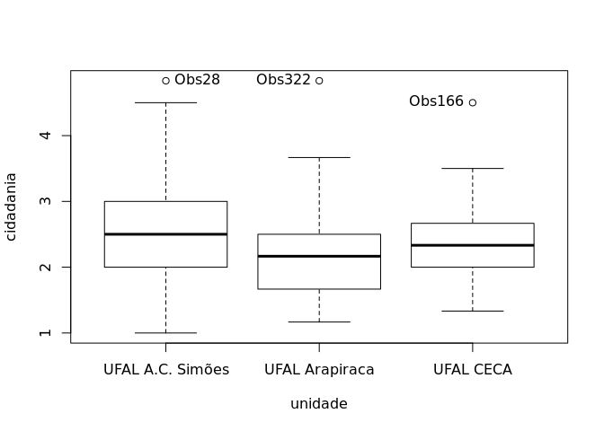
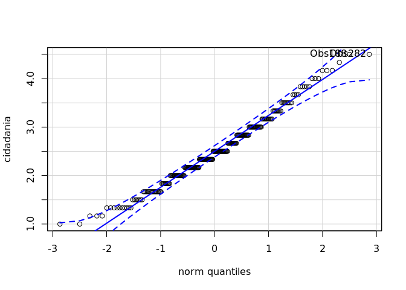
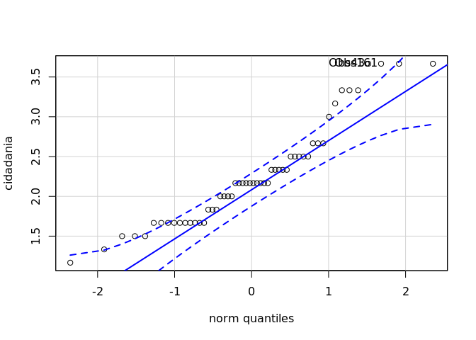
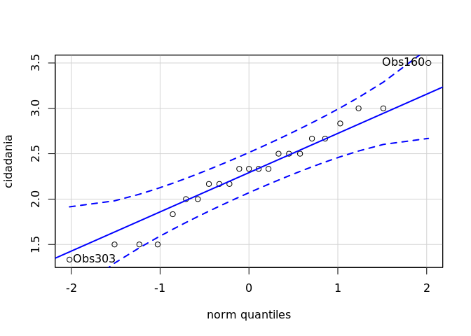
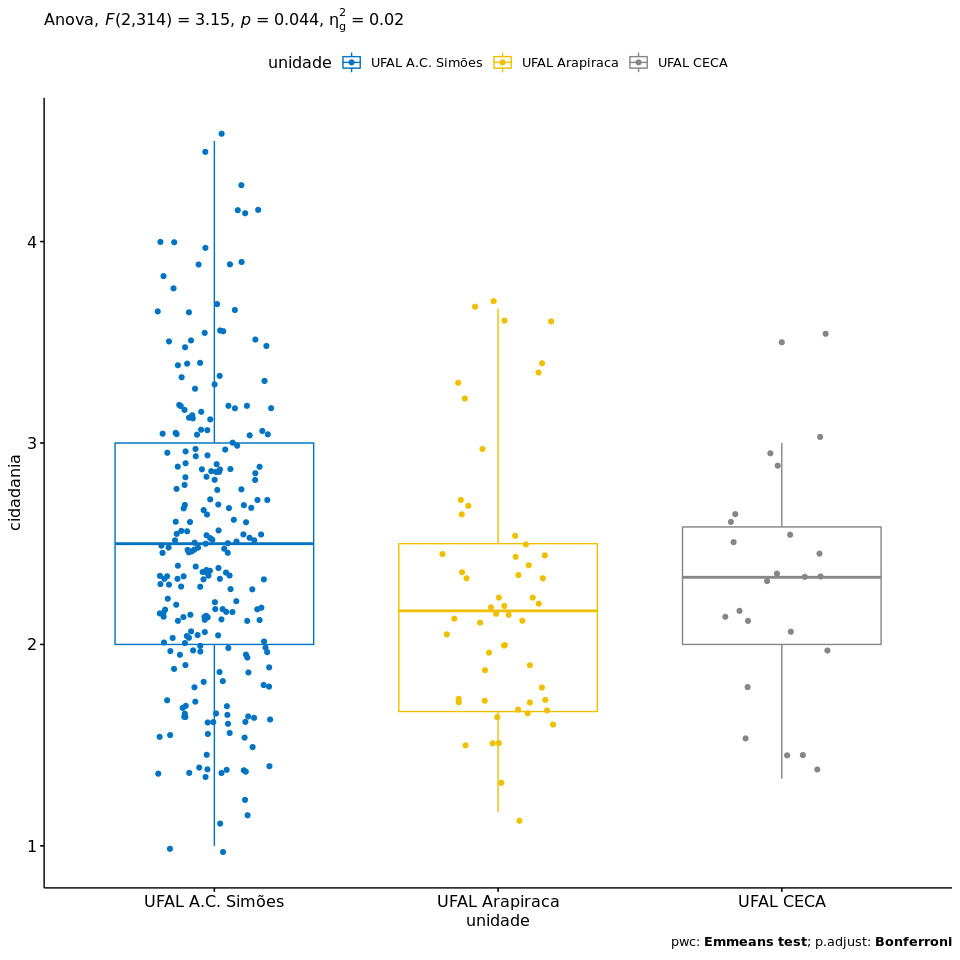

ANOVA `cidadania` ~ `unidade`
================
Geiser C. Challco <geiser@usp.br>

  - Report as Word format: [factorialAnova.docx](factorialAnova.docx)
  - Report as LaTex format: [factorialAnova.tex](factorialAnova.tex)

## Initial Data and Preprocessing

R script: [factorialAnova.R](factorialAnova.R) Inital data:
[data.csv](data.csv)

### Summary statistics of the initial data

``` r
get_summary_stats(group_by(dat, `unidade`), type ="common")
```

    ## # A tibble: 3 x 11
    ##   unidade   variable     n   min   max median   iqr  mean    sd    se    ci
    ##   <fct>     <chr>    <dbl> <dbl> <dbl>  <dbl> <dbl> <dbl> <dbl> <dbl> <dbl>
    ## 1 UFAL A.C… cidadan…   241  1     4.83   2.5  1      2.50 0.727 0.047 0.092
    ## 2 UFAL Ara… cidadan…    55  1.17  4.83   2.17 0.833  2.30 0.724 0.098 0.196
    ## 3 UFAL CECA cidadan…    24  1.33  4.5    2.33 0.667  2.38 0.694 0.142 0.293

## Check Assumptions

### Identifying outliers

Outliers tend to increase type-I error probability, and they decrease
the calculated F statistic in ANOVA resulting in a lower chance of
reject the null hypothesis.

  - Identified outliers using rstatix

<!-- end list -->

``` r
identify_outliers(group_by(dat, `unidade`), `cidadania`)
```

    ## # A tibble: 3 x 5
    ##   unidade          ID     cidadania is.outlier is.extreme
    ##   <fct>            <fct>      <dbl> <lgl>      <lgl>     
    ## 1 UFAL A.C. Simões Obs28       4.83 TRUE       FALSE     
    ## 2 UFAL Arapiraca   Obs322      4.83 TRUE       FALSE     
    ## 3 UFAL CECA        Obs166      4.5  TRUE       FALSE

  - Identified outliers through Boxplots

<!-- end list -->

``` r
Boxplot(`cidadania` ~ `unidade`, data = dat, id = list(n = Inf))
```

<!-- -->

    ## [1] "Obs28"  "Obs322" "Obs166"

### Removing outliers from the data

``` r
outliers <- c("Obs28","Obs166","Obs322")
rdat <- dat[!dat[["ID"]] %in% outliers,]   # table without outliers
```

|        | ID     | unidade          | cidadania |
| ------ | :----- | :--------------- | --------: |
| Obs28  | Obs28  | UFAL A.C. Simões |  4.833333 |
| Obs166 | Obs166 | UFAL CECA        |  4.500000 |
| Obs322 | Obs322 | UFAL Arapiraca   |  4.833333 |

Outliers table

### Normality assumption

**Observation**:

As sample sizes increase, ANOVA remains a valid test even with the
violation of normality <sup>\[[1](#references),
[2](#references)\]</sup>. According to the central limit theorem, the
sampling distribution tends to be normal if the sample is large enough
(`n > 30`). Therefore, we performed ANOVA with large samples as follows:

  - In cases with the sample size greater than 30 (`n > 30`), we adopted
    a significance level of `p < 0.01` instead a significance level of
    `p < 0.05`.

  - For samples with `n > 50` observation, we adopted D’Agostino-Pearson
    test that offers better accuracy for larger samples
    <sup>\[[3](#references)\]</sup>.

  - For samples’ size between `n > 100` and `n <= 200`, we ignored both
    tests (Shapiro and D’Agostino-Persons), and our decision of
    normality were based only in the interpretation of QQ-plots and
    histograms because these tests tend to be too sensitive with values
    greater than 200 <sup>\[[3](#references)\]</sup>.

  - For samples with `n > 200` observation, we ignore the normality
    assumption based on the central theorem limit, and taking only into
    account the homogeneity assumption.

#### Checking normality assumption in the residual model

``` r
mdl <- lm(`cidadania` ~ `unidade`, data = rdat)
normality_test(residuals(mdl))
```

    ##     n statistic     method          p p.signif normality
    ## 1 317  9.428466 D'Agostino 0.00896674        *         -

The QQ plot used to evaluate normality assumption

``` r
qqPlot(residuals(mdl))
```

<!-- -->

    ## Obs188 Obs282 
    ##    182    273

#### Checking normality assumption for each group

``` r
normality_test_at(group_by(rdat, `unidade`), "cidadania")
```

    ##                variable          unidade   n statistic       method
    ## 1             cidadania UFAL A.C. Simões 240 5.8905450   D'Agostino
    ## Omnibus  Test cidadania   UFAL Arapiraca  54 5.6331826   D'Agostino
    ## 11            cidadania        UFAL CECA  23 0.9701973 Shapiro-Wilk
    ##                        p p.signif normality
    ## 1             0.05258773       ns         -
    ## Omnibus  Test 0.05980947       ns       YES
    ## 11            0.69372956       ns       YES

  - QQ plot in the **unidade**: “UFAL A.C.
Simões”

<!-- end list -->

``` r
qqPlot( ~ `cidadania`, data = rdat[which(rdat["unidade"] == "UFAL A.C. Simões"),])
```

<!-- -->

    ## Obs188 Obs282 
    ##    140    209

  - QQ plot in the **unidade**: “UFAL
Arapiraca”

<!-- end list -->

``` r
qqPlot( ~ `cidadania`, data = rdat[which(rdat["unidade"] == "UFAL Arapiraca"),])
```

<!-- -->

    ##  Obs43 Obs161 
    ##      5     28

  - QQ plot in the **unidade**: “UFAL
CECA”

<!-- end list -->

``` r
qqPlot( ~ `cidadania`, data = rdat[which(rdat["unidade"] == "UFAL CECA"),])
```

<!-- -->

    ## Obs160 Obs303 
    ##      6     21

#### Removing data that affect normality

``` r
non.normal <- c("")
sdat <- rdat[!rdat[["ID"]] %in% non.normal,]   # table without non-normal and outliers
```

| ID | unidade | cidadania |
| :- | :------ | --------: |

Non-normal data table

#### Performing normality test without data that affect normality

``` r
mdl <- lm(`cidadania` ~ `unidade`, data = sdat)
normality_test(residuals(mdl))
```

|   n | statistic | method     | p     | p.signif | normality |
| --: | --------: | :--------- | :---- | :------- | :-------- |
| 317 |    9.4285 | D’Agostino | 0.009 | \*       | \-        |

``` r
normality_test_at(group_by(sdat, `unidade`), "cidadania")
```

| variable  | unidade          |   n | statistic | method       | p      | p.signif | normality |
| :-------- | :--------------- | --: | --------: | :----------- | :----- | :------- | :-------- |
| cidadania | UFAL A.C. Simões | 240 |    5.8905 | D’Agostino   | 0.0526 | ns       | \-        |
| cidadania | UFAL Arapiraca   |  54 |    5.6332 | D’Agostino   | 0.0598 | ns       | YES       |
| cidadania | UFAL CECA        |  23 |    0.9702 | Shapiro-Wilk | 0.6937 | ns       | YES       |

QQ plot in the residual model without data that affect normality

``` r
qqPlot(residuals(mdl))
```

<!-- -->

    ## Obs188 Obs282 
    ##    182    273

  - QQ plot in the **unidade**: “UFAL A.C.
Simões”

<!-- end list -->

``` r
qqPlot( ~ `cidadania`, data = sdat[which(sdat["unidade"] == "UFAL A.C. Simões"),])
```

<!-- -->

    ## Obs188 Obs282 
    ##    140    209

  - QQ plot in the **unidade**: “UFAL
Arapiraca”

<!-- end list -->

``` r
qqPlot( ~ `cidadania`, data = sdat[which(sdat["unidade"] == "UFAL Arapiraca"),])
```

<!-- -->

    ##  Obs43 Obs161 
    ##      5     28

  - QQ plot in the **unidade**: “UFAL
CECA”

<!-- end list -->

``` r
qqPlot( ~ `cidadania`, data = sdat[which(sdat["unidade"] == "UFAL CECA"),])
```

<!-- -->

    ## Obs160 Obs303 
    ##      6     21

### Homogeneity of variance assumption

``` r
levene_test(sdat, `cidadania` ~ `unidade`)
```

| df1 | df2 | statistic | p      | p.signif |
| --: | --: | --------: | :----- | :------- |
|   2 | 314 |     2.025 | 0.1337 | ns       |

From the output above, non-significant difference indicates homogeneity
of variance in the different groups (Signif. codes: 0 \*\*\*\* 0.0001
\*\*\* 0.001 \*\* 0.01 \* 0.05 ns
1).

## Computation ANOVA

``` r
res.aov <- anova_test(sdat, `cidadania` ~ `unidade`, type = 2, effect.size = 'ges', detailed = T)
get_anova_table(res.aov)
```

    ## Coefficient covariances computed by hccm()

| Effect  |   SSn |     SSd | DFn | DFd |     F | p     | p\<.05 |  ges |
| :------ | ----: | ------: | --: | --: | ----: | :---- | :----- | ---: |
| unidade | 2.999 | 149.621 |   2 | 314 | 3.147 | 0.044 | \*     | 0.02 |

## Post-hoct Tests (Pairwise Comparisons)

  - Estimated marginal means for
**unidade**

<!-- end list -->

``` r
(emm[["unidade"]] <- emmeans_test(sdat, `cidadania` ~ `unidade`, p.adjust.method = "bonferroni", detailed = T))
```

| .y.       | group1           | group2         | estimate |     se |  df | conf.low | conf.high | statistic |      p | p.adj  | p.adj.signif |
| :-------- | :--------------- | :------------- | -------: | -----: | --: | -------: | --------: | --------: | -----: | :----- | :----------- |
| cidadania | UFAL A.C. Simões | UFAL Arapiraca |   0.2362 | 0.1040 | 314 |   0.0316 |    0.4408 |    2.2717 | 0.0238 | 0.0713 | ns           |
| cidadania | UFAL A.C. Simões | UFAL CECA      |   0.2025 | 0.1507 | 314 | \-0.0940 |    0.4990 |    1.3440 | 0.1799 | 0.5398 | ns           |
| cidadania | UFAL Arapiraca   | UFAL CECA      | \-0.0337 | 0.1719 | 314 | \-0.3719 |    0.3045 |  \-0.1960 | 0.8448 | 1      | ns           |

## Descriptive Statistic and ANOVA Plots

``` r
get_summary_stats(group_by(sdat, `unidade`), type ="common")
```

| unidade          | variable  |   n |  mean | median |   min |   max |    sd |    se |    ci |   iqr |
| :--------------- | :-------- | --: | ----: | -----: | ----: | ----: | ----: | ----: | ----: | ----: |
| UFAL A.C. Simões | cidadania | 240 | 2.492 |  2.500 | 1.000 | 4.500 | 0.713 | 0.046 | 0.091 | 1.000 |
| UFAL Arapiraca   | cidadania |  54 | 2.256 |  2.167 | 1.167 | 3.667 | 0.641 | 0.087 | 0.175 | 0.833 |
| UFAL CECA        | cidadania |  23 | 2.290 |  2.333 | 1.333 | 3.500 | 0.539 | 0.112 | 0.233 | 0.583 |

``` r
ggPlotAoV(sdat, "unidade", "cidadania", aov=res.aov, pwc=emm[["unidade"]], addParam=c("jitter"))
```

<!-- -->

## References

<sup>\[1\]</sup>: Blanca, M. J., Alarcón, R., Arnau, J., Bono, R., &
Bendayan, R. (2017). Non-normal data: Is ANOVA still a valid option?.
Psicothema, 29(4), 552-557.

<sup>\[2\]</sup>: Ghasemi, A., & Zahediasl, S. (2012). Normality tests
for statistical analysis: a guide for non-statisticians. International
journal of endocrinology and metabolism, 10(2), 486.

<sup>\[3\]</sup>: Miot, H. A. (2017). Assessing normality of data in
clinical and experimental trials. J Vasc Bras, 16(2), 88-91.
