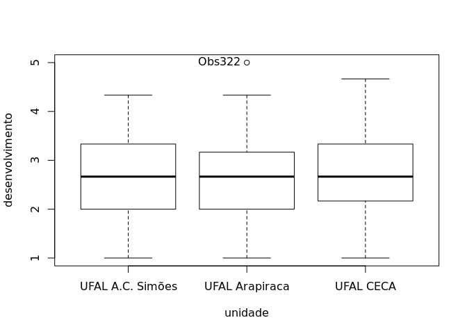
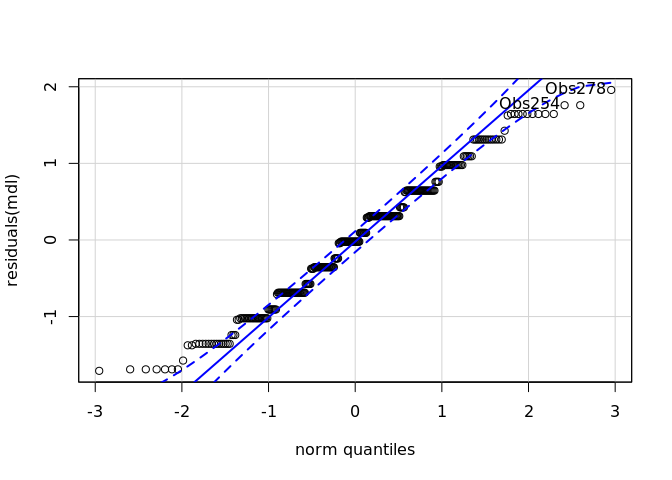
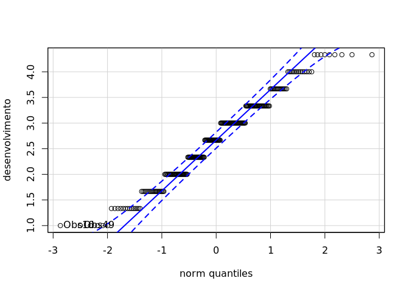
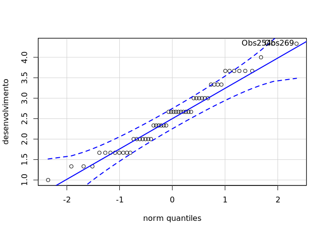
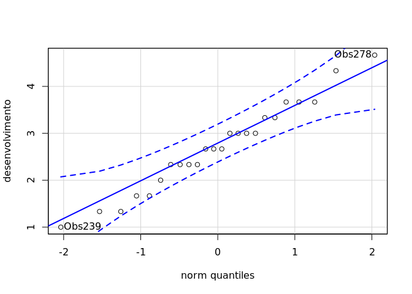
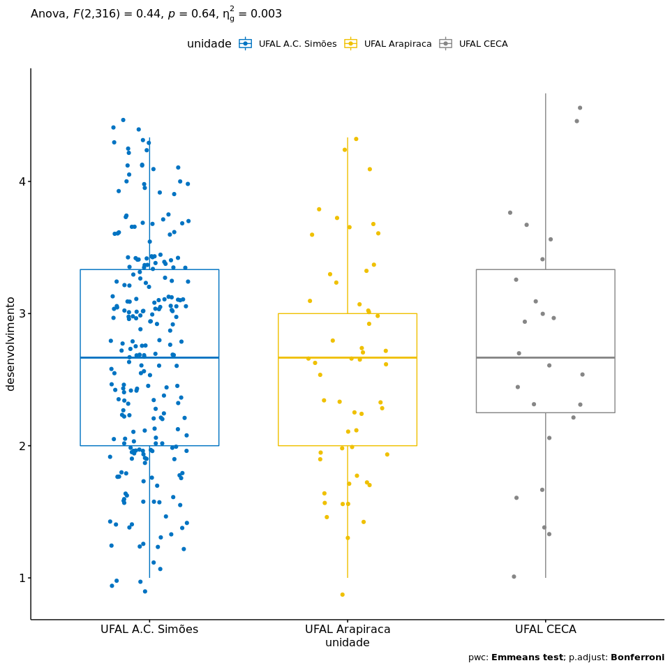

ANOVA `desenvolvimento` ~ `unidade`
================
Geiser C. Challco <geiser@usp.br>

  - Report as Word format: [factorialAnova.docx](factorialAnova.docx)
  - Report as LaTex format: [factorialAnova.tex](factorialAnova.tex)

## Initial Data and Preprocessing

R script: [factorialAnova.R](factorialAnova.R) Inital data:
[data.csv](data.csv)

### Summary statistics of the initial data

``` r
get_summary_stats(group_by(dat, `unidade`), type ="common")
```

    ## # A tibble: 3 x 11
    ##   unidade   variable     n   min   max median   iqr  mean    sd    se    ci
    ##   <fct>     <chr>    <dbl> <dbl> <dbl>  <dbl> <dbl> <dbl> <dbl> <dbl> <dbl>
    ## 1 UFAL A.C… desenvo…   241     1  4.33   2.67  1.33  2.69 0.827 0.053 0.105
    ## 2 UFAL Ara… desenvo…    55     1  5      2.67  1.17  2.62 0.871 0.117 0.236
    ## 3 UFAL CECA desenvo…    24     1  4.67   2.67  1.08  2.71 0.939 0.192 0.397

## Check Assumptions

### Identifying outliers

Outliers tend to increase type-I error probability, and they decrease
the calculated F statistic in ANOVA resulting in a lower chance of
reject the null hypothesis.

  - Identified outliers using rstatix

<!-- end list -->

``` r
identify_outliers(group_by(dat, `unidade`), `desenvolvimento`)
```

    ## # A tibble: 1 x 5
    ##   unidade        ID     desenvolvimento is.outlier is.extreme
    ##   <fct>          <fct>            <dbl> <lgl>      <lgl>     
    ## 1 UFAL Arapiraca Obs322               5 TRUE       FALSE

  - Identified outliers through Boxplots

<!-- end list -->

``` r
Boxplot(`desenvolvimento` ~ `unidade`, data = dat, id = list(n = Inf))
```

<!-- -->

    ## [1] "Obs322"

### Removing outliers from the data

``` r
outliers <- c("Obs322")
rdat <- dat[!dat[["ID"]] %in% outliers,]   # table without outliers
```

|        | ID     | unidade        | desenvolvimento |
| ------ | :----- | :------------- | --------------: |
| Obs322 | Obs322 | UFAL Arapiraca |               5 |

Outliers table

### Normality assumption

**Observation**:

As sample sizes increase, ANOVA remains a valid test even with the
violation of normality <sup>\[[1](#references),
[2](#references)\]</sup>. According to the central limit theorem, the
sampling distribution tends to be normal if the sample is large enough
(`n > 30`). Therefore, we performed ANOVA with large samples as follows:

  - In cases with the sample size greater than 30 (`n > 30`), we adopted
    a significance level of `p < 0.01` instead a significance level of
    `p < 0.05`.

  - For samples with `n > 50` observation, we adopted D’Agostino-Pearson
    test that offers better accuracy for larger samples
    <sup>\[[3](#references)\]</sup>.

  - For samples’ size between `n > 100` and `n <= 200`, we ignored both
    tests (Shapiro and D’Agostino-Persons), and our decision of
    normality were based only in the interpretation of QQ-plots and
    histograms because these tests tend to be too sensitive with values
    greater than 200 <sup>\[[3](#references)\]</sup>.

  - For samples with `n > 200` observation, we ignore the normality
    assumption based on the central theorem limit, and taking only into
    account the homogeneity assumption.

#### Checking normality assumption in the residual model

``` r
mdl <- lm(`desenvolvimento` ~ `unidade`, data = rdat)
normality_test(residuals(mdl))
```

    ##     n statistic     method            p p.signif normality
    ## 1 319  13.90795 D'Agostino 0.0009548309       **         -

The QQ plot used to evaluate normality assumption

``` r
qqPlot(residuals(mdl))
```

<!-- -->

    ## Obs278 Obs254 
    ##    271    248

#### Checking normality assumption for each group

``` r
normality_test_at(group_by(rdat, `unidade`), "desenvolvimento")
```

    ##                      variable          unidade   n  statistic       method
    ## 1             desenvolvimento UFAL A.C. Simões 241 12.1413615   D'Agostino
    ## Omnibus  Test desenvolvimento   UFAL Arapiraca  54  2.1184303   D'Agostino
    ## 11            desenvolvimento        UFAL CECA  24  0.9780299 Shapiro-Wilk
    ##                       p p.signif normality
    ## 1             0.0023096        *         -
    ## Omnibus  Test 0.3467278       ns       YES
    ## 11            0.8569623       ns       YES

  - QQ plot in the **unidade**: “UFAL A.C.
Simões”

<!-- end list -->

``` r
qqPlot( ~ `desenvolvimento`, data = rdat[which(rdat["unidade"] == "UFAL A.C. Simões"),])
```

<!-- -->

    ## Obs10 Obs49 
    ##     8    41

  - QQ plot in the **unidade**: “UFAL
Arapiraca”

<!-- end list -->

``` r
qqPlot( ~ `desenvolvimento`, data = rdat[which(rdat["unidade"] == "UFAL Arapiraca"),])
```

<!-- -->

    ## Obs254 Obs269 
    ##     42     44

  - QQ plot in the **unidade**: “UFAL
CECA”

<!-- end list -->

``` r
qqPlot( ~ `desenvolvimento`, data = rdat[which(rdat["unidade"] == "UFAL CECA"),])
```

<!-- -->

    ## Obs278 Obs239 
    ##     18     16

#### Removing data that affect normality

``` r
non.normal <- c("")
sdat <- rdat[!rdat[["ID"]] %in% non.normal,]   # table without non-normal and outliers
```

| ID | unidade | desenvolvimento |
| :- | :------ | --------------: |

Non-normal data table

#### Performing normality test without data that affect normality

``` r
mdl <- lm(`desenvolvimento` ~ `unidade`, data = sdat)
normality_test(residuals(mdl))
```

|   n | statistic | method     | p     | p.signif | normality |
| --: | --------: | :--------- | :---- | :------- | :-------- |
| 319 |    13.908 | D’Agostino | 0.001 | \*\*     | \-        |

``` r
normality_test_at(group_by(sdat, `unidade`), "desenvolvimento")
```

| variable        | unidade          |   n | statistic | method       | p      | p.signif | normality |
| :-------------- | :--------------- | --: | --------: | :----------- | :----- | :------- | :-------- |
| desenvolvimento | UFAL A.C. Simões | 241 |   12.1414 | D’Agostino   | 0.0023 | \*\*     | \-        |
| desenvolvimento | UFAL Arapiraca   |  54 |    2.1184 | D’Agostino   | 0.3467 | ns       | YES       |
| desenvolvimento | UFAL CECA        |  24 |    0.9780 | Shapiro-Wilk | 0.857  | ns       | YES       |

QQ plot in the residual model without data that affect normality

``` r
qqPlot(residuals(mdl))
```

<!-- -->

    ## Obs278 Obs254 
    ##    271    248

  - QQ plot in the **unidade**: “UFAL A.C.
Simões”

<!-- end list -->

``` r
qqPlot( ~ `desenvolvimento`, data = sdat[which(sdat["unidade"] == "UFAL A.C. Simões"),])
```

<!-- -->

    ## Obs10 Obs49 
    ##     8    41

  - QQ plot in the **unidade**: “UFAL
Arapiraca”

<!-- end list -->

``` r
qqPlot( ~ `desenvolvimento`, data = sdat[which(sdat["unidade"] == "UFAL Arapiraca"),])
```

<!-- -->

    ## Obs254 Obs269 
    ##     42     44

  - QQ plot in the **unidade**: “UFAL
CECA”

<!-- end list -->

``` r
qqPlot( ~ `desenvolvimento`, data = sdat[which(sdat["unidade"] == "UFAL CECA"),])
```

<!-- -->

    ## Obs278 Obs239 
    ##     18     16

### Homogeneity of variance assumption

``` r
levene_test(sdat, `desenvolvimento` ~ `unidade`)
```

| df1 | df2 | statistic | p      | p.signif |
| --: | --: | --------: | :----- | :------- |
|   2 | 316 |     0.211 | 0.8099 | ns       |

From the output above, non-significant difference indicates homogeneity
of variance in the different groups (Signif. codes: 0 \*\*\*\* 0.0001
\*\*\* 0.001 \*\* 0.01 \* 0.05 ns
1).

## Computation ANOVA

``` r
res.aov <- anova_test(sdat, `desenvolvimento` ~ `unidade`, type = 2, effect.size = 'ges', detailed = T)
get_anova_table(res.aov)
```

    ## Coefficient covariances computed by hccm()

| Effect  |   SSn |   SSd | DFn | DFd |     F | p     | p\<.05 |   ges |
| :------ | ----: | ----: | --: | --: | ----: | :---- | :----- | ----: |
| unidade | 0.617 | 219.6 |   2 | 316 | 0.444 | 0.642 |        | 0.003 |

## Post-hoct Tests (Pairwise Comparisons)

  - Estimated marginal means for
**unidade**

<!-- end list -->

``` r
(emm[["unidade"]] <- emmeans_test(sdat, `desenvolvimento` ~ `unidade`, p.adjust.method = "bonferroni", detailed = T))
```

| .y.             | group1           | group2         | estimate |     se |  df | conf.low | conf.high | statistic |      p | p.adj | p.adj.signif |
| :-------------- | :--------------- | :------------- | -------: | -----: | --: | -------: | --------: | --------: | -----: | :---- | :----------- |
| desenvolvimento | UFAL A.C. Simões | UFAL Arapiraca |   0.1147 | 0.1255 | 316 | \-0.1322 |    0.3617 |    0.9141 | 0.3614 | 1     | ns           |
| desenvolvimento | UFAL A.C. Simões | UFAL CECA      | \-0.0195 | 0.1784 | 316 | \-0.3706 |    0.3315 |  \-0.1095 | 0.9129 | 1     | ns           |
| desenvolvimento | UFAL Arapiraca   | UFAL CECA      | \-0.1343 | 0.2045 | 316 | \-0.5366 |    0.2681 |  \-0.6565 | 0.5120 | 1     | ns           |

## Descriptive Statistic and ANOVA Plots

``` r
get_summary_stats(group_by(sdat, `unidade`), type ="common")
```

| unidade          | variable        |   n |  mean | median | min |   max |    sd |    se |    ci |   iqr |
| :--------------- | :-------------- | --: | ----: | -----: | --: | ----: | ----: | ----: | ----: | ----: |
| UFAL A.C. Simões | desenvolvimento | 241 | 2.689 |  2.667 |   1 | 4.333 | 0.827 | 0.053 | 0.105 | 1.333 |
| UFAL Arapiraca   | desenvolvimento |  54 | 2.574 |  2.667 |   1 | 4.333 | 0.815 | 0.111 | 0.222 | 1.000 |
| UFAL CECA        | desenvolvimento |  24 | 2.708 |  2.667 |   1 | 4.667 | 0.939 | 0.192 | 0.397 | 1.083 |

``` r
ggPlotAoV(sdat, "unidade", "desenvolvimento", aov=res.aov, pwc=emm[["unidade"]], addParam=c("jitter"))
```

<!-- -->

## References

<sup>\[1\]</sup>: Blanca, M. J., Alarcón, R., Arnau, J., Bono, R., &
Bendayan, R. (2017). Non-normal data: Is ANOVA still a valid option?.
Psicothema, 29(4), 552-557.

<sup>\[2\]</sup>: Ghasemi, A., & Zahediasl, S. (2012). Normality tests
for statistical analysis: a guide for non-statisticians. International
journal of endocrinology and metabolism, 10(2), 486.

<sup>\[3\]</sup>: Miot, H. A. (2017). Assessing normality of data in
clinical and experimental trials. J Vasc Bras, 16(2), 88-91.
