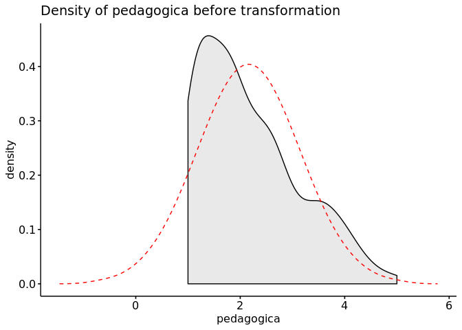
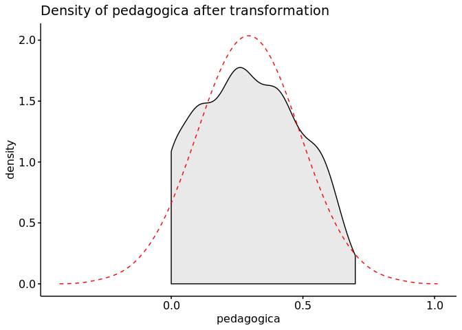
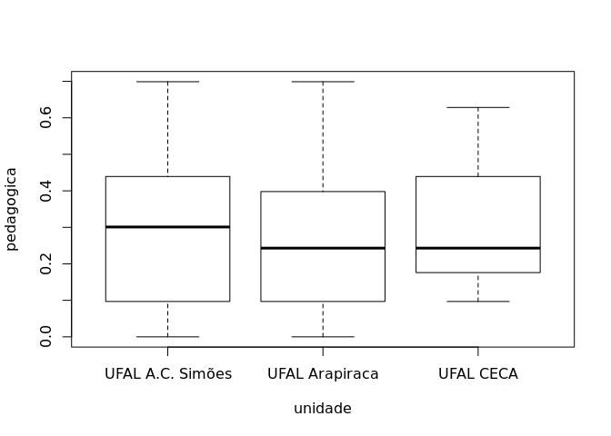
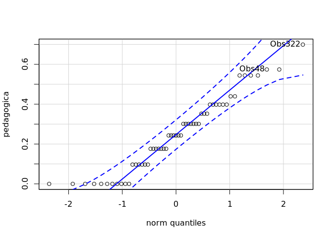
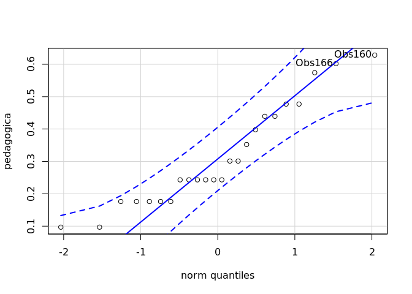
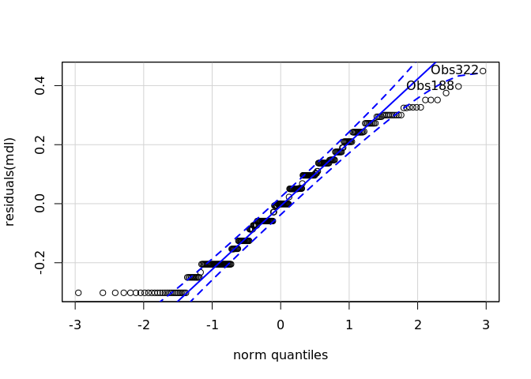
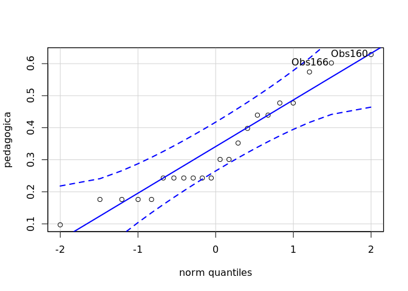
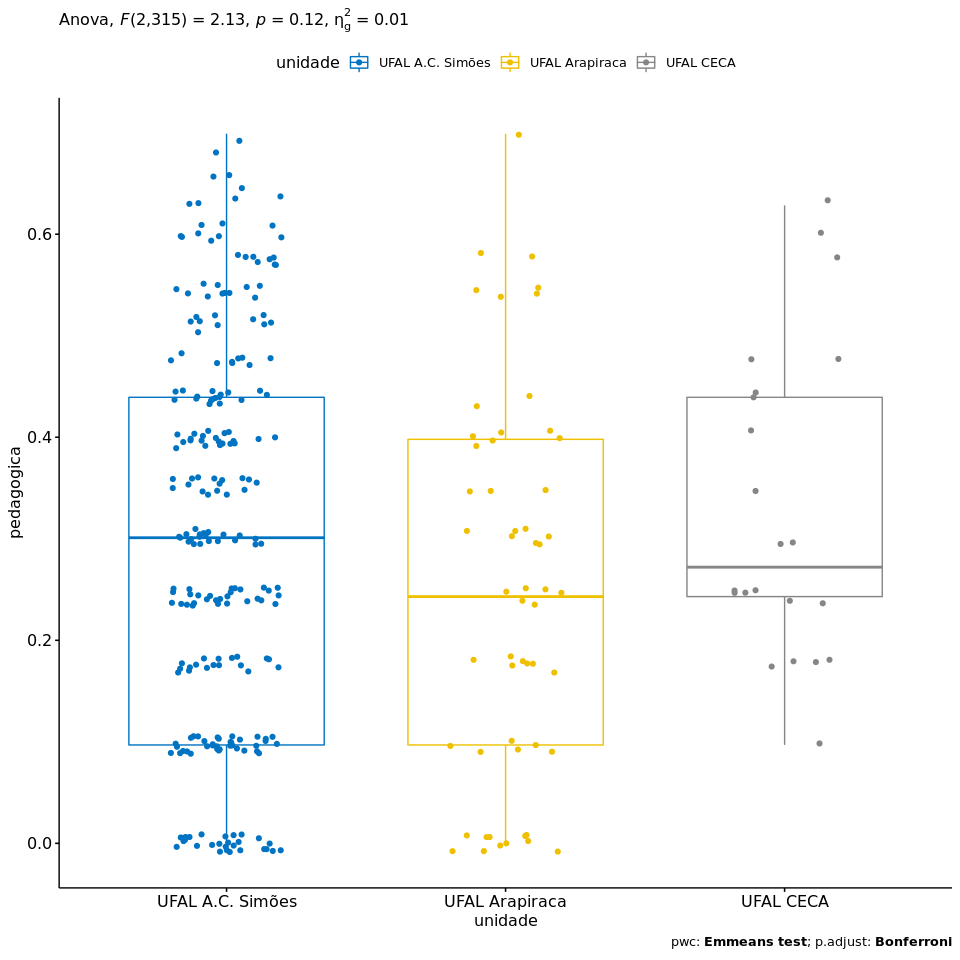

ANOVA `pedagogica` ~ `unidade`
================
Geiser C. Challco <geiser@usp.br>

  - Report as Word format: [factorialAnova.docx](factorialAnova.docx)
  - Report as LaTex format: [factorialAnova.tex](factorialAnova.tex)

## Initial Data and Preprocessing

R script: [factorialAnova.R](factorialAnova.R) Inital data:
[data.csv](data.csv)

### Visualization of data distribution

``` r
ggdensity(dat, x = "pedagogica", fill = "lightgray", title= "Density of pedagogica before transformation") +
 stat_overlay_normal_density(color = "red", linetype = "dashed")
```

<!-- -->

### Dealing with positive greater skewness in pedagogica

``` r
dat[["pedagogica"]] <- log10(dat[["pedagogica"]])
```

``` r
ggdensity(dat, x = "pedagogica", fill = "lightgray", title= "Density of pedagogica after transformation") +
 stat_overlay_normal_density(color = "red", linetype = "dashed")
```

<!-- -->

### Summary statistics of the initial data

``` r
get_summary_stats(group_by(dat, `unidade`), type ="common")
```

    ## # A tibble: 3 x 11
    ##   unidade   variable     n   min   max median   iqr  mean    sd    se    ci
    ##   <fct>     <chr>    <dbl> <dbl> <dbl>  <dbl> <dbl> <dbl> <dbl> <dbl> <dbl>
    ## 1 UFAL A.C… pedagog…   241 0     0.699  0.301 0.342 0.302 0.191 0.012 0.024
    ## 2 UFAL Ara… pedagog…    55 0     0.699  0.243 0.301 0.25  0.186 0.025 0.05 
    ## 3 UFAL CECA pedagog…    24 0.097 0.628  0.243 0.263 0.313 0.156 0.032 0.066

## Check Assumptions

### Identifying outliers

Outliers tend to increase type-I error probability, and they decrease
the calculated F statistic in ANOVA resulting in a lower chance of
reject the null hypothesis.

  - Identified outliers using rstatix

<!-- end list -->

``` r
identify_outliers(group_by(dat, `unidade`), `pedagogica`)
```

    ## [1] unidade    ID         pedagogica is.outlier is.extreme
    ## <0 rows> (or 0-length row.names)

  - Identified outliers through Boxplots

<!-- end list -->

``` r
Boxplot(`pedagogica` ~ `unidade`, data = dat, id = list(n = Inf))
```

<!-- -->

### Removing outliers from the data

``` r
outliers <- c("")
rdat <- dat[!dat[["ID"]] %in% outliers,]   # table without outliers
```

| ID | unidade | pedagogica |
| :- | :------ | ---------: |

Outliers table

### Normality assumption

**Observation**:

As sample sizes increase, ANOVA remains a valid test even with the
violation of normality <sup>\[[1](#references),
[2](#references)\]</sup>. According to the central limit theorem, the
sampling distribution tends to be normal if the sample is large enough
(`n > 30`). Therefore, we performed ANOVA with large samples as follows:

  - In cases with the sample size greater than 30 (`n > 30`), we adopted
    a significance level of `p < 0.01` instead a significance level of
    `p < 0.05`.

  - For samples with `n > 50` observation, we adopted D’Agostino-Pearson
    test that offers better accuracy for larger samples
    <sup>\[[3](#references)\]</sup>.

  - For samples’ size between `n > 100` and `n <= 200`, we ignored both
    tests (Shapiro and D’Agostino-Persons), and our decision of
    normality were based only in the interpretation of QQ-plots and
    histograms because these tests tend to be too sensitive with values
    greater than 200 <sup>\[[3](#references)\]</sup>.

  - For samples with `n > 200` observation, we ignore the normality
    assumption based on the central theorem limit, and taking only into
    account the homogeneity assumption.

#### Checking normality assumption in the residual model

``` r
mdl <- lm(`pedagogica` ~ `unidade`, data = rdat)
normality_test(residuals(mdl))
```

    ##     n statistic     method            p p.signif normality
    ## 1 320  54.94218 D'Agostino 1.173395e-12     ****         -

The QQ plot used to evaluate normality assumption

``` r
qqPlot(residuals(mdl))
```

<!-- -->

    ## Obs322 Obs188 
    ##    312    184

#### Checking normality assumption for each group

``` r
normality_test_at(group_by(rdat, `unidade`), "pedagogica")
```

    ##                 variable          unidade   n  statistic       method
    ## 1             pedagogica UFAL A.C. Simões 241 57.5426659   D'Agostino
    ## Omnibus  Test pedagogica   UFAL Arapiraca  55  2.8290093   D'Agostino
    ## 11            pedagogica        UFAL CECA  24  0.9156624 Shapiro-Wilk
    ##                          p p.signif normality
    ## 1             3.197442e-13     ****         -
    ## Omnibus  Test 2.430460e-01       ns       YES
    ## 11            4.687579e-02        *        NO

  - QQ plot in the **unidade**: “UFAL A.C.
Simões”

<!-- end list -->

``` r
qqPlot( ~ `pedagogica`, data = rdat[which(rdat["unidade"] == "UFAL A.C. Simões"),])
```

<!-- -->

    ## Obs188 Obs234 
    ##    141    173

  - QQ plot in the **unidade**: “UFAL
Arapiraca”

<!-- end list -->

``` r
qqPlot( ~ `pedagogica`, data = rdat[which(rdat["unidade"] == "UFAL Arapiraca"),])
```

<!-- -->

    ## Obs322  Obs48 
    ##     54      7

  - QQ plot in the **unidade**: “UFAL
CECA”

<!-- end list -->

``` r
qqPlot( ~ `pedagogica`, data = rdat[which(rdat["unidade"] == "UFAL CECA"),])
```

<!-- -->

    ## Obs160 Obs166 
    ##      6      7

#### Removing data that affect normality

``` r
non.normal <- c("Obs111","Obs239")
sdat <- rdat[!rdat[["ID"]] %in% non.normal,]   # table without non-normal and outliers
```

|        | ID     | unidade   | pedagogica |
| ------ | :----- | :-------- | ---------: |
| Obs111 | Obs111 | UFAL CECA |  0.1760913 |
| Obs239 | Obs239 | UFAL CECA |  0.0969100 |

Non-normal data table

#### Performing normality test without data that affect normality

``` r
mdl <- lm(`pedagogica` ~ `unidade`, data = sdat)
normality_test(residuals(mdl))
```

|   n | statistic | method     | p         | p.signif | normality |
| --: | --------: | :--------- | :-------- | :------- | :-------- |
| 318 |   54.9806 | D’Agostino | \< 0.0001 | \*\*\*\* | \-        |

``` r
normality_test_at(group_by(sdat, `unidade`), "pedagogica")
```

| variable   | unidade          |   n | statistic | method       | p         | p.signif | normality |
| :--------- | :--------------- | --: | --------: | :----------- | :-------- | :------- | :-------- |
| pedagogica | UFAL A.C. Simões | 241 |   57.5427 | D’Agostino   | \< 0.0001 | \*\*\*\* | \-        |
| pedagogica | UFAL Arapiraca   |  55 |    2.8290 | D’Agostino   | 0.243     | ns       | YES       |
| pedagogica | UFAL CECA        |  22 |    0.9191 | Shapiro-Wilk | 0.0727    | ns       | YES       |

QQ plot in the residual model without data that affect normality

``` r
qqPlot(residuals(mdl))
```

<!-- -->

    ## Obs322 Obs188 
    ##    310    183

  - QQ plot in the **unidade**: “UFAL A.C.
Simões”

<!-- end list -->

``` r
qqPlot( ~ `pedagogica`, data = sdat[which(sdat["unidade"] == "UFAL A.C. Simões"),])
```

<!-- -->

    ## Obs188 Obs234 
    ##    141    173

  - QQ plot in the **unidade**: “UFAL
Arapiraca”

<!-- end list -->

``` r
qqPlot( ~ `pedagogica`, data = sdat[which(sdat["unidade"] == "UFAL Arapiraca"),])
```

<!-- -->

    ## Obs322  Obs48 
    ##     54      7

  - QQ plot in the **unidade**: “UFAL
CECA”

<!-- end list -->

``` r
qqPlot( ~ `pedagogica`, data = sdat[which(sdat["unidade"] == "UFAL CECA"),])
```

<!-- -->

    ## Obs160 Obs166 
    ##      5      6

### Homogeneity of variance assumption

``` r
levene_test(sdat, `pedagogica` ~ `unidade`)
```

| df1 | df2 | statistic | p      | p.signif |
| --: | --: | --------: | :----- | :------- |
|   2 | 315 |    1.4606 | 0.2337 | ns       |

From the output above, non-significant difference indicates homogeneity
of variance in the different groups (Signif. codes: 0 \*\*\*\* 0.0001
\*\*\* 0.001 \*\* 0.01 \* 0.05 ns
1).

## Computation ANOVA

``` r
res.aov <- anova_test(sdat, `pedagogica` ~ `unidade`, type = 2, effect.size = 'ges', detailed = T)
get_anova_table(res.aov)
```

    ## Coefficient covariances computed by hccm()

| Effect  |   SSn |    SSd | DFn | DFd |     F | p    | p\<.05 |   ges |
| :------ | ----: | -----: | --: | --: | ----: | :--- | :----- | ----: |
| unidade | 0.151 | 11.142 |   2 | 315 | 2.135 | 0.12 |        | 0.013 |

## Post-hoct Tests (Pairwise Comparisons)

  - Estimated marginal means for
**unidade**

<!-- end list -->

``` r
(emm[["unidade"]] <- emmeans_test(sdat, `pedagogica` ~ `unidade`, p.adjust.method = "bonferroni", detailed = T))
```

| .y.        | group1           | group2         | estimate |     se |  df | conf.low | conf.high | statistic |      p | p.adj  | p.adj.signif |
| :--------- | :--------------- | :------------- | -------: | -----: | --: | -------: | --------: | --------: | -----: | :----- | :----------- |
| pedagogica | UFAL A.C. Simões | UFAL Arapiraca |   0.0523 | 0.0281 | 315 | \-0.0030 |    0.1076 |    1.8606 | 0.0637 | 0.1912 | ns           |
| pedagogica | UFAL A.C. Simões | UFAL CECA      | \-0.0277 | 0.0419 | 315 | \-0.1101 |    0.0548 |  \-0.6602 | 0.5096 | 1      | ns           |
| pedagogica | UFAL Arapiraca   | UFAL CECA      | \-0.0799 | 0.0474 | 315 | \-0.1733 |    0.0134 |  \-1.6850 | 0.0930 | 0.2789 | ns           |

## Descriptive Statistic and ANOVA Plots

``` r
get_summary_stats(group_by(sdat, `unidade`), type ="common")
```

| unidade          | variable   |   n |  mean | median |   min |   max |    sd |    se |    ci |   iqr |
| :--------------- | :--------- | --: | ----: | -----: | ----: | ----: | ----: | ----: | ----: | ----: |
| UFAL A.C. Simões | pedagogica | 241 | 0.302 |  0.301 | 0.000 | 0.699 | 0.191 | 0.012 | 0.024 | 0.342 |
| UFAL Arapiraca   | pedagogica |  55 | 0.250 |  0.243 | 0.000 | 0.699 | 0.186 | 0.025 | 0.050 | 0.301 |
| UFAL CECA        | pedagogica |  22 | 0.330 |  0.272 | 0.097 | 0.628 | 0.153 | 0.033 | 0.068 | 0.196 |

``` r
ggPlotAoV(sdat, "unidade", "pedagogica", aov=res.aov, pwc=emm[["unidade"]], addParam=c("jitter"))
```

<!-- -->

## References

<sup>\[1\]</sup>: Blanca, M. J., Alarcón, R., Arnau, J., Bono, R., &
Bendayan, R. (2017). Non-normal data: Is ANOVA still a valid option?.
Psicothema, 29(4), 552-557.

<sup>\[2\]</sup>: Ghasemi, A., & Zahediasl, S. (2012). Normality tests
for statistical analysis: a guide for non-statisticians. International
journal of endocrinology and metabolism, 10(2), 486.

<sup>\[3\]</sup>: Miot, H. A. (2017). Assessing normality of data in
clinical and experimental trials. J Vasc Bras, 16(2), 88-91.
