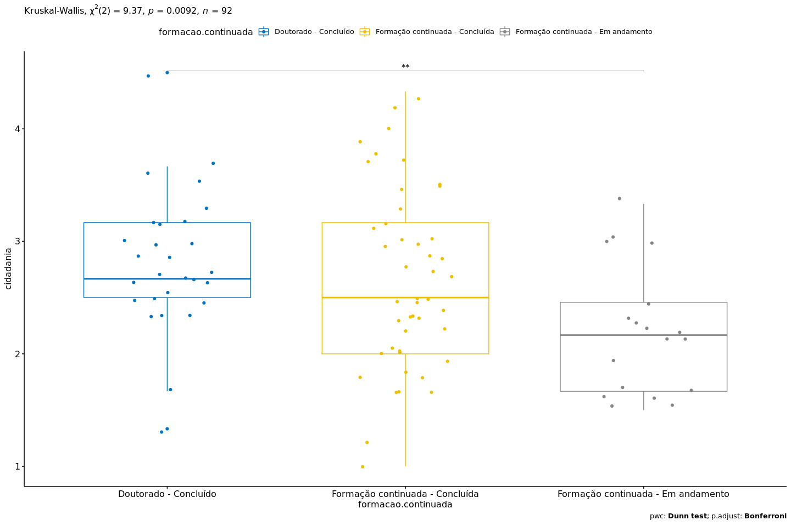

Kruskal–Wallis test `cidadania` ~ `formacao.continuada`
================
Geiser C. Challco <geiser@usp.br>

  - Report as Word format: [kruskal.docx](kruskal.docx)
  - Report as LaTex format: [kruskal.tex](kruskal.tex)

## Initial Data and Preprocessing

R script: [kruskal.R](kruskal.R) Inital data: [data.csv](data.csv)

## Computation Kruskal-Wallis test and Effect Size

``` r
(res.kruskal <- kruskal_test(dat, `cidadania` ~ `formacao.continuada`))
```

| .y.       |  n | statistic | df | p      | method         | p.signif |
| :-------- | -: | --------: | -: | :----- | :------------- | :------- |
| cidadania | 92 |    9.3735 |  2 | 0.0092 | Kruskal-Wallis | \*\*     |

``` r
(ezm <- kruskal_effsize(dat, `cidadania` ~ `formacao.continuada`, ci = TRUE))
```

| .y.       |  n | effsize | conf.low | conf.high | method    | magnitude |
| :-------- | -: | ------: | -------: | --------: | :-------- | :-------- |
| cidadania | 92 |  0.0828 |   0.0033 |      0.24 | eta2\[H\] | moderate  |

## Post-hoc Tests (Pairwise Comparisons)

``` r
pwc <- dunn_test(dat, `cidadania` ~ `formacao.continuada`, detailed=T, p.adjust.method = "bonferroni")
add_significance(pwc)
```

| .y.       | group1                          | group2                             | n1 | n2 |  estimate | statistic | p      | method    | p.adj  | p.adj.signif |
| :-------- | :------------------------------ | :--------------------------------- | -: | -: | --------: | --------: | :----- | :-------- | :----- | :----------- |
| cidadania | Doutorado - Concluído           | Formação continuada - Concluída    | 28 | 46 |  \-7.7081 |  \-1.2079 | 0.2271 | Dunn Test | 0.6813 | ns           |
| cidadania | Doutorado - Concluído           | Formação continuada - Em andamento | 28 | 18 | \-24.4762 |  \-3.0430 | 0.0023 | Dunn Test | 0.007  | \*\*         |
| cidadania | Formação continuada - Concluída | Formação continuada - Em andamento | 46 | 18 | \-16.7681 |  \-2.2654 | 0.0235 | Dunn Test | 0.0705 | ns           |

## Report Kruskal-Wallis test with Plots and Descriptive Statistic

``` r
get_summary_stats(group_by(dat, `formacao.continuada`), type ="common")
```

| formacao.continuada                | variable  |  n |  mean | median |   min |   max |    sd |    se |    ci |   iqr |
| :--------------------------------- | :-------- | -: | ----: | -----: | ----: | ----: | ----: | ----: | ----: | ----: |
| Doutorado - Concluído              | cidadania | 28 | 2.815 |  2.667 | 1.333 | 4.500 | 0.616 | 0.116 | 0.239 | 0.667 |
| Formação continuada - Concluída    | cidadania | 46 | 2.656 |  2.500 | 1.000 | 4.333 | 0.797 | 0.117 | 0.237 | 1.167 |
| Formação continuada - Em andamento | cidadania | 18 | 2.213 |  2.167 | 1.500 | 3.333 | 0.568 | 0.134 | 0.283 | 0.792 |

``` r
kruskal.plot(dat, "cidadania", "formacao.continuada", res.kruskal, pwc, c("jitter"))
```

<!-- -->
