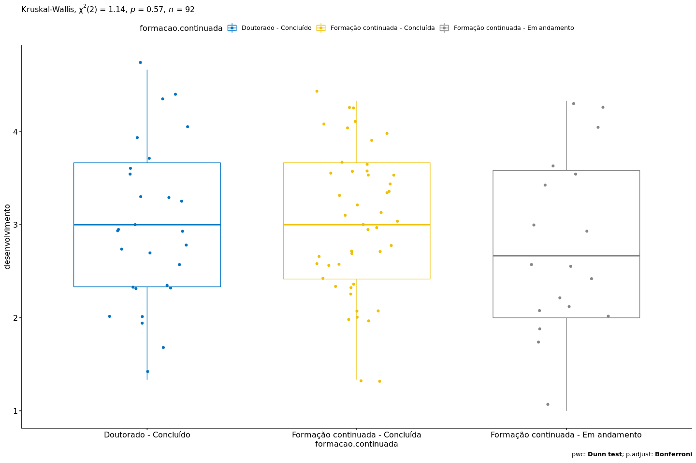

Kruskal–Wallis test `desenvolvimento` ~ `formacao.continuada`
================
Geiser C. Challco <geiser@usp.br>

  - Report as Word format: [kruskal.docx](kruskal.docx)
  - Report as LaTex format: [kruskal.tex](kruskal.tex)

## Initial Data and Preprocessing

R script: [kruskal.R](kruskal.R) Inital data:
[data.csv](data.csv)

## Computation Kruskal-Wallis test and Effect Size

``` r
(res.kruskal <- kruskal_test(dat, `desenvolvimento` ~ `formacao.continuada`))
```

| .y.             |  n | statistic | df | p     | method         | p.signif |
| :-------------- | -: | --------: | -: | :---- | :------------- | :------- |
| desenvolvimento | 92 |    1.1393 |  2 | 0.566 | Kruskal-Wallis | ns       |

``` r
(ezm <- kruskal_effsize(dat, `desenvolvimento` ~ `formacao.continuada`, ci = TRUE))
```

| .y.             |  n |  effsize | conf.low | conf.high | method    | magnitude |
| :-------------- | -: | -------: | -------: | --------: | :-------- | :-------- |
| desenvolvimento | 92 | \-0.0097 |   \-0.02 |       0.1 | eta2\[H\] | small     |

## Post-hoc Tests (Pairwise Comparisons)

``` r
pwc <- dunn_test(dat, `desenvolvimento` ~ `formacao.continuada`, detailed=T, p.adjust.method = "bonferroni")
add_significance(pwc)
```

| .y.             | group1                          | group2                             | n1 | n2 | estimate | statistic | p      | method    | p.adj  | p.adj.signif |
| :-------------- | :------------------------------ | :--------------------------------- | -: | -: | -------: | --------: | :----- | :-------- | :----- | :----------- |
| desenvolvimento | Doutorado - Concluído           | Formação continuada - Concluída    | 28 | 46 |   1.9806 |    0.3116 | 0.7553 | Dunn Test | 1      | ns           |
| desenvolvimento | Doutorado - Concluído           | Formação continuada - Em andamento | 28 | 18 | \-5.8829 |  \-0.7344 | 0.4627 | Dunn Test | 1      | ns           |
| desenvolvimento | Formação continuada - Concluída | Formação continuada - Em andamento | 46 | 18 | \-7.8635 |  \-1.0667 | 0.2861 | Dunn Test | 0.8584 | ns           |

## Report Kruskal-Wallis test with Plots and Descriptive Statistic

``` r
get_summary_stats(group_by(dat, `formacao.continuada`), type ="common")
```

| formacao.continuada                | variable        |  n |  mean | median |   min |   max |    sd |    se |    ci |   iqr |
| :--------------------------------- | :-------------- | -: | ----: | -----: | ----: | ----: | ----: | ----: | ----: | ----: |
| Doutorado - Concluído              | desenvolvimento | 28 | 2.976 |  3.000 | 1.333 | 4.667 | 0.856 | 0.162 | 0.332 | 1.333 |
| Formação continuada - Concluída    | desenvolvimento | 46 | 3.022 |  3.000 | 1.333 | 4.333 | 0.784 | 0.116 | 0.233 | 1.250 |
| Formação continuada - Em andamento | desenvolvimento | 18 | 2.778 |  2.667 | 1.000 | 4.333 | 0.957 | 0.225 | 0.476 | 1.583 |

``` r
kruskal.plot(dat, "desenvolvimento", "formacao.continuada", res.kruskal, pwc, c("jitter"))
```

<!-- -->
