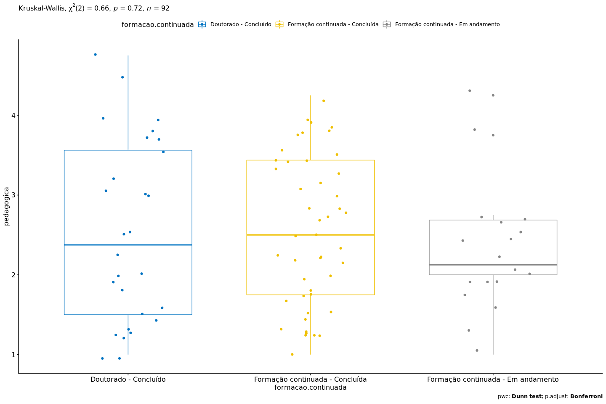

Kruskal–Wallis test `pedagogica` ~ `formacao.continuada`
================
Geiser C. Challco <geiser@usp.br>

  - Report as Word format: [kruskal.docx](kruskal.docx)
  - Report as LaTex format: [kruskal.tex](kruskal.tex)

## Initial Data and Preprocessing

R script: [kruskal.R](kruskal.R) Inital data: [data.csv](data.csv)

## Computation Kruskal-Wallis test and Effect Size

``` r
(res.kruskal <- kruskal_test(dat, `pedagogica` ~ `formacao.continuada`))
```

| .y.        |  n | statistic | df | p     | method         | p.signif |
| :--------- | -: | --------: | -: | :---- | :------------- | :------- |
| pedagogica | 92 |    0.6555 |  2 | 0.721 | Kruskal-Wallis | ns       |

``` r
(ezm <- kruskal_effsize(dat, `pedagogica` ~ `formacao.continuada`, ci = TRUE))
```

| .y.        |  n |  effsize | conf.low | conf.high | method    | magnitude |
| :--------- | -: | -------: | -------: | --------: | :-------- | :-------- |
| pedagogica | 92 | \-0.0151 |   \-0.02 |      0.08 | eta2\[H\] | small     |

## Post-hoc Tests (Pairwise Comparisons)

``` r
pwc <- dunn_test(dat, `pedagogica` ~ `formacao.continuada`, detailed=T, p.adjust.method = "bonferroni")
add_significance(pwc)
```

| .y.        | group1                          | group2                             | n1 | n2 | estimate | statistic | p      | method    | p.adj | p.adj.signif |
| :--------- | :------------------------------ | :--------------------------------- | -: | -: | -------: | --------: | :----- | :-------- | :---- | :----------- |
| pedagogica | Doutorado - Concluído           | Formação continuada - Concluída    | 28 | 46 |   1.6848 |    0.2641 | 0.7917 | Dunn Test | 1     | ns           |
| pedagogica | Doutorado - Concluído           | Formação continuada - Em andamento | 28 | 18 | \-4.3056 |  \-0.5355 | 0.5923 | Dunn Test | 1     | ns           |
| pedagogica | Formação continuada - Concluída | Formação continuada - Em andamento | 46 | 18 | \-5.9903 |  \-0.8096 | 0.4181 | Dunn Test | 1     | ns           |

## Report Kruskal-Wallis test with Plots and Descriptive Statistic

``` r
get_summary_stats(group_by(dat, `formacao.continuada`), type ="common")
```

| formacao.continuada                | variable   |  n |  mean | median | min |  max |    sd |    se |    ci |   iqr |
| :--------------------------------- | :--------- | -: | ----: | -----: | --: | ---: | ----: | ----: | ----: | ----: |
| Doutorado - Concluído              | pedagogica | 28 | 2.527 |  2.375 |   1 | 4.75 | 1.149 | 0.217 | 0.446 | 2.062 |
| Formação continuada - Concluída    | pedagogica | 46 | 2.538 |  2.500 |   1 | 4.25 | 0.931 | 0.137 | 0.276 | 1.688 |
| Formação continuada - Em andamento | pedagogica | 18 | 2.306 |  2.125 |   1 | 4.25 | 0.798 | 0.188 | 0.397 | 0.688 |

``` r
kruskal.plot(dat, "pedagogica", "formacao.continuada", res.kruskal, pwc, c("jitter"))
```

<!-- -->
